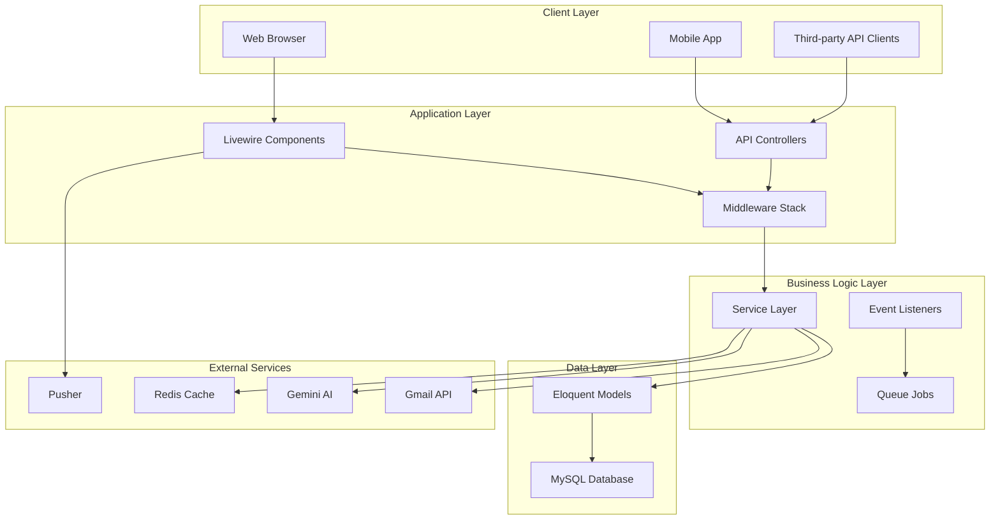
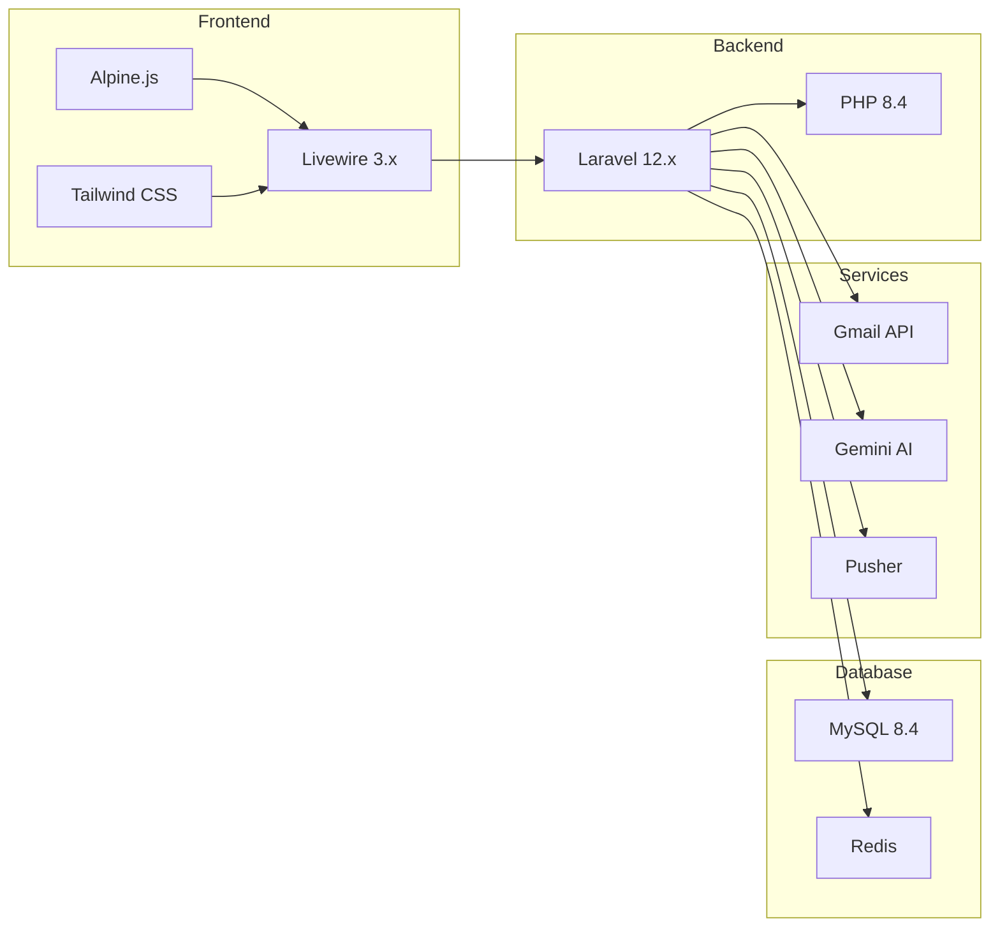
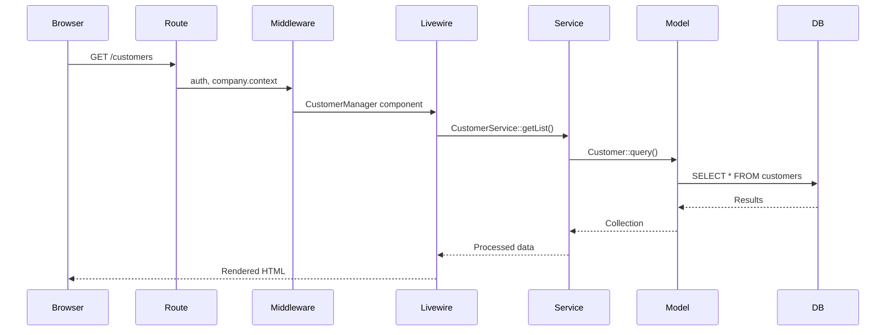
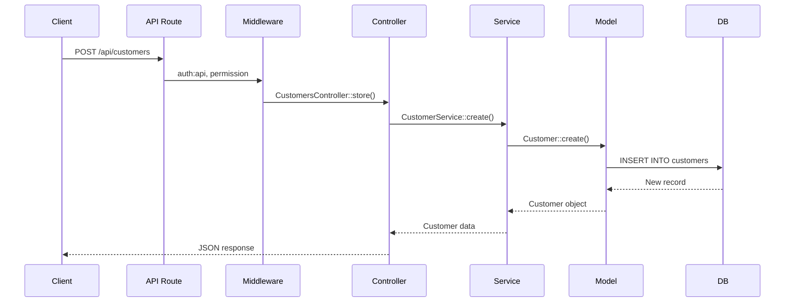
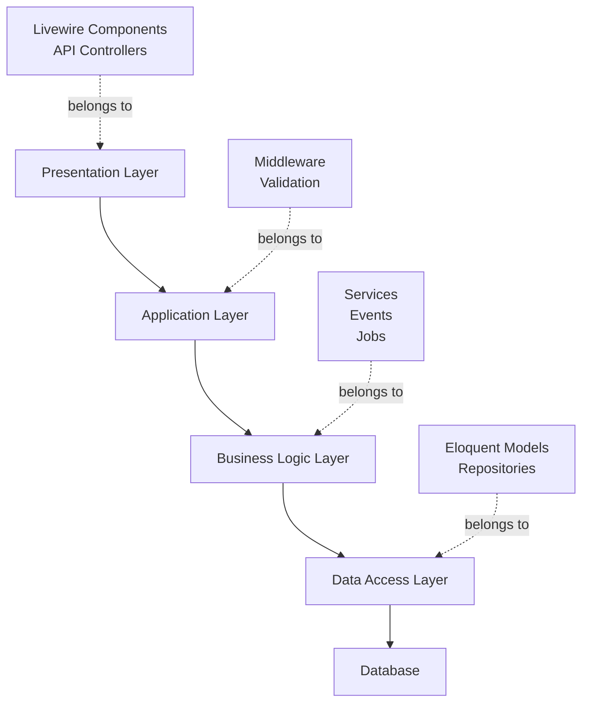
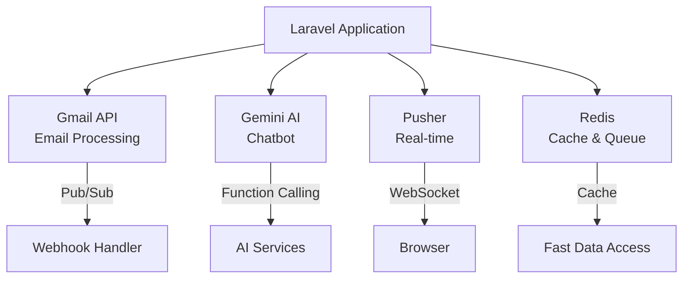

# 02 - Kiến trúc tổng quan

> Kiến trúc tổng quan của hệ thống QLHoaDonWebVer2

**Yêu cầu:** Đã setup xong theo [Setup Guide](01-setup-and-installation.md)

---

## 📋 Mục lục

- [Kiến trúc tổng quan](#kiến-trúc-tổng-quan)
- [MVC + Livewire Pattern](#mvc--livewire-pattern)
- [Cấu trúc thư mục](#cấu-trúc-thư-mục)
- [Chu kỳ xử lý yêu cầu](#chu-kỳ-xử-lý-yêu-cầu)
- [Cấu trúc multi-tenancy](#cấu-trúc-multi-tenancy)
- [Trách nhiệm các tầng](#trách-nhiệm-các-tầng)
- [Tích hợp bên thứ ba](#tích-hợp-bên-thứ-ba)
- [Các mẫu thiết kế](#các-mẫu-thiết-kế)

---

## Kiến trúc tổng quan

### Tổng quan



### Công nghệ sử dụng



---

## MVC + Livewire Pattern

### Traditional MVC

```
Request → Route → Controller → View
                      ↓
                   Model → DB
```

### Livewire Enhanced MVC

```
Browser
  ↓
Livewire Component (combines Controller + View)
  ↓
Service Layer (Business Logic)
  ↓
Model (Data Access)
  ↓
Database
```

### Example Flow

**Traditional (API):**

```php
// Route
Route::get('/customers', [CustomerController::class, 'index']);

// Controller
public function index() {
    $customers = Customer::paginate(15);
    return response()->json($customers);
}

// Frontend makes AJAX request
fetch('/api/customers')
    .then(res => res.json())
    .then(data => updateTable(data))
```

**Livewire (Full-stack):**

```php
// Component
class CustomerTable extends Component {
    public function render() {
        return view('livewire.customer-table', [
            'customers' => Customer::paginate(15)
        ]);
    }
}

// Blade (reactive)
<div>
    @foreach($customers as $customer)
        <tr wire:click="edit({{ $customer->id }})">
            ...
        </tr>
    @endforeach
</div>
```

**No AJAX needed!** Livewire tự động xử lý mấy cái này!

---

## Cấu trúc thư mục

```
QLHoaDonWebVer2/
├── app/
│   ├── Console/              # Artisan commands
│   │   └── Commands/
│   ├── Events/               # Application events
│   ├── Exports/              # Excel/PDF exports
│   ├── Http/
│   │   ├── Controllers/
│   │   │   └── Api/          # RESTful API controllers
│   │   ├── Middleware/       # HTTP middleware
│   │   └── Requests/         # Form validation
│   ├── Jobs/                 # Queue jobs
│   ├── Livewire/             # ⭐ Livewire components
│   │   ├── Auth/             # Login, Register
│   │   ├── Components/       # Reusable components
│   │   ├── Main/             # Main app modules
│   │   │   ├── Customers/
│   │   │   ├── Suppliers/
│   │   │   ├── Invoices/
│   │   │   └── ...
│   │   └── Partner/          # Partner portal
│   ├── Mail/                 # Email templates
│   ├── Models/               # Eloquent models
│   ├── Notifications/        # Notification classes
│   ├── Observers/            # Model observers
│   ├── Providers/            # Service providers
│   ├── Rules/                # Custom validation rules
│   ├── Services/             # ⭐ Business logic
│   │   ├── App/              # Core services
│   │   ├── AI/               # AI features
│   │   ├── Payments/         # Payment processing
│   │   └── Utils/            # Utilities
│   └── Support/              # Helper classes
├── database/
│   ├── factories/            # Model factories
│   ├── migrations/           # Database migrations
│   └── seeders/              # Data seeders
├── resources/
│   ├── css/                  # Tailwind source
│   ├── js/                   # Alpine.js code
│   └── views/                # Blade templates
│       ├── components/       # Blade components
│       ├── layouts/          # Layout templates
│       └── livewire/         # Livewire views
├── routes/
│   ├── api.php               # API routes
│   ├── channels.php          # Broadcast channels
│   ├── console.php           # Console routes
│   └── web.php               # Web routes
├── storage/
│   ├── app/                  # File storage
│   │   ├── public/           # Public files
│   │   └── private/          # Secure files
│   └── logs/                 # Application logs
└── tests/
    ├── Feature/              # Feature tests
    └── Unit/                 # Unit tests
```

### Cấu trúc thư mục chính

**`app/Livewire/`** - Full-stack components

- Mỗi component = Controller logic + View template
- Real-time reactive without writing JavaScript
- Example: `CustomerForm.php` + `customer-form.blade.php`

**`app/Services/`** - Business logic layer

- Tách logic phức tạp ra khỏi controller
- Tái sử dụng logic trong Livewire & API
- Ví dụ: `CustomerService.php` xử lý tất cả các thao tác với khách hàng

**`app/Models/`** - Data models

- Eloquent ORM
- Relationships, scopes, accessors
- Ví dụ: `Customer.php`, `Invoice.php`

**`resources/views/livewire/`** - Livewire templates

- Blade syntax with `wire:` directives
- Real-time updates
- Ví dụ: `<div wire:click="save">`

---

## Chu kỳ xử lý yêu cầu

### Web Request (Livewire)



### API Request



### So sánh

| Stage | Web (Livewire) | API (REST) |
|-------|----------------|------------|
| Auth | Session-based | JWT token |
| Route | `web.php` | `api.php` |
| Handler | Livewire Component | Controller |
| Response | Rendered HTML | JSON |
| State | Stateful (session) | Stateless |

---

## Cấu trúc Multi-tenancy

### Cách ly cấp cơ sở dữ liệu

Every table has `company_id`:
```sql
CREATE TABLE customers (
    id BIGINT UNSIGNED PRIMARY KEY,
    company_id BIGINT UNSIGNED NOT NULL,  -- Tenant ID
    customer_name VARCHAR(255),
    ...
    
    FOREIGN KEY (company_id) REFERENCES companies(id)
);
```

### Tự động phân vùng

**Model Trait:**

```php
// app/Models/Customer.php
use App\Models\Concerns\HasCompanyScope;

class Customer extends Model {
    use HasCompanyScope;  // Auto-adds WHERE company_id = ?
}

// Usage - automatically scoped!
$customers = Customer::all();
// SQL: SELECT * FROM customers WHERE company_id = 1
```

**Global Scope:**

```php
// Applied in HasCompanyScope trait
protected static function booted() {
    static::addGlobalScope(new CompanyScope);
}

// CompanyScope.php
public function apply(Builder $builder, Model $model) {
    $builder->where('company_id', Auth::user()->company_id);
}
```

### Chuỗi Middleware

```php
// routes/web.php
Route::middleware(['auth', 'company.context'])->group(function() {
    Route::get('/customers', CustomerManager::class);
});
```

**Middleware order:**

1. `auth` - Người dùng đã đăng nhập
2. `company.context` - Cấu hình ngữ cảnh công ty
3. `ensure.not_customer` - Ngăn chặn người dùng khách hàng
4. `permission:customers.view` - Kiểm tra quyền hạn

### Ngữ cảnh công ty

```php
// app/Http/Middleware/EnsureCompanyContext.php
public function handle($request, Closure $next) {
    if (!Auth::check()) {
        return redirect('/login');
    }
    
    $user = Auth::user();
    
    // Partner users can only see their own company
    if ($user->role->name === 'customer') {
        abort(403);
    }
    
    // Set current company in session
    session(['current_company_id' => $user->company_id]);
    
    return $next($request);
}
```

---

## Trách nhiệm các tầng



### 1. Tầng trình diễn (Presentation Layer)

**Responsibility:** Handle HTTP requests/responses, UI logic

**Components:**
- Livewire components (`app/Livewire/`)
- API controllers (`app/Http/Controllers/Api/`)
- Blade views (`resources/views/`)

**What it does:**
- ✅ Validate input from user
- ✅ Call Service layer methods
- ✅ Format response for display
- ❌ NO business logic
- ❌ NO database queries

**Example:**
```php
// CustomerForm.php (Livewire Component)
public function save() {
    $this->validate();  // Input validation only
    
    $service = app(CustomerService::class);
    
    // Delegate to service layer
    if ($this->customerId) {
        $service->update($this->customerId, $this->getFormData());
    } else {
        $service->create($this->getFormData());
    }
    
    // Redirect with message
    return $this->redirect(route('customers'));
}
```

### 2. Tầng logic nghiệp vụ (Business Logic Layer)

**Responsibility:** Core business rules, workflows

**Components:**
- Services (`app/Services/App/`)
- Events (`app/Events/`)
- Jobs (`app/Jobs/`)

**What it does:**
- ✅ Implement business rules
- ✅ Complex calculations
- ✅ Workflow orchestration
- ✅ Currency conversion
- ✅ Inventory calculations
- ✅ Call external APIs

**Example:**
```php
// CustomerService.php
public function create(array $data): Customer {
    // Business logic
    $companyId = Auth::user()->company_id;
    
    // Validate business rules
    $this->validateBusinessRules($data);
    
    // Create customer
    $customer = Customer::create([
        'company_id' => $companyId,
        ...$data
    ]);
    
    // Trigger event
    event(new CustomerCreated($customer));
    
    // Log activity
    $this->logActivity('created', $customer);
    
    return $customer;
}
```

### 3. Tầng truy cập dữ liệu (Data Access Layer)

**Responsibility:** Database interactions

**Components:**
- Eloquent Models (`app/Models/`)

**What it does:**
- ✅ CRUD operations
- ✅ Relationships
- ✅ Query scopes
- ❌ NO business logic

**Example:**
```php
// Customer.php (Model)
class Customer extends Model {
    use HasCompanyScope;
    
    // Relationships only
    public function invoices() {
        return $this->hasMany(SaleInvoice::class);
    }
    
    public function contracts() {
        return $this->hasMany(SaleContract::class);
    }
    
    // Query scopes
    public function scopeActive($query) {
        return $query->where('is_active', true);
    }
}
```

---

## Tích hợp bên thứ ba



### 1. Gmail API

**Purpose:** Auto-scan emails for invoices

**Components:**
- `GmailService.php` - API wrapper
- `GmailScanJob.php` - Queue job
- `EmailController.php` - Webhook handler

**Flow:**
```
1. User connects Gmail account (OAuth)
2. Set up Pub/Sub watch
3. New email arrives → Webhook triggered
4. Parse email & attachments
5. Create invoice in system
```

### 2. Gemini AI

**Purpose:** Intelligent chatbot

**Components:**
- `GeminiService.php` - API client
- `Functions/` - Function calling
- `data/system-guide.md` - Knowledge base

**Flow:**
```
1. User asks question
2. Gemini processes with context
3. Function calling (search products, invoices, etc.)
4. Return formatted response
```

### 3. Pusher (Real-time)

**Purpose:** Live notifications, inventory updates

**Components:**
- `Broadcasting/` - Channel authorization
- `Events/` - Broadcastable events
- Livewire components - Listen to events

**Flow:**
```
1. Event triggered (e.g., InvoiceApproved)
2. Broadcast to Pusher
3. Frontend receives via Laravel Echo
4. Update UI without refresh
```

---

## Các mẫu thiết kế

### 1. Mẫu Service Layer

**Problem:** Business logic scattered in controllers

**Solution:** Centralize in Services

```php
// ❌ BAD: Logic in Controller
class CustomerController {
    public function store(Request $request) {
        $customer = Customer::create($request->all());
        Mail::to($customer->email)->send(new Welcome($customer));
        AuditLog::create([...]);
        Cache::forget('customers_count');
        return response()->json($customer);
    }
}

// ✅ GOOD: Logic in Service
class CustomerService {
    public function create(array $data): Customer {
        $customer = Customer::create($data);
        $this->sendWelcomeEmail($customer);
        $this->logActivity('created', $customer);
        $this->clearCache();
        return $customer;
    }
}
```

### 2. Mẫu Repository (Ngầm định)

Services act as repositories:
```php
interface CustomerServiceInterface {
    public function findById(int $id): Customer;
    public function getList(array $filters): Collection;
    public function create(array $data): Customer;
    public function update(int $id, array $data): Customer;
    public function delete(int $id): void;
}
```

### 3. Mẫu Observer

**For model events:**
```php
// CustomerObserver.php
class CustomerObserver {
    public function created(Customer $customer) {
        // Send welcome email
        // Create audit log
        // Update statistics
    }
    
    public function deleting(Customer $customer) {
        // Delete related records
        // Send notification
    }
}

// Register in AppServiceProvider
Customer::observe(CustomerObserver::class);
```

### 4. Kiến trúc hướng sự kiện (Event-Driven)

```php
// Dispatch event
event(new InvoiceApproved($invoice));

// Multiple listeners
class UpdateInventory implements ShouldQueue {
    public function handle(InvoiceApproved $event) {
        // Update stock
    }
}

class SendNotification implements ShouldQueue {
    public function handle(InvoiceApproved $event) {
        // Notify user
    }
}

class BroadcastUpdate implements ShouldQueue {
    public function handle(InvoiceApproved $event) {
        // Real-time update
    }
}
```

---

## Các bước tiếp theo

✅ Architecture understood!

**Continue to:**
- [Development Workflow](03-development-workflow.md) - Start building
- [Auth & Middleware](04-auth-and-middleware.md) - Security deep dive
- [Core Modules](05-core-modules.md) - Explore existing modules

---

<p align="center">
  <strong>Architecture Mastered! 🎓</strong><br>
  Next: <a href="03-development-workflow.md">Learn Development Workflow</a>
</p>
