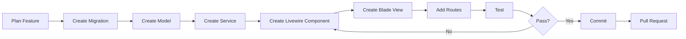
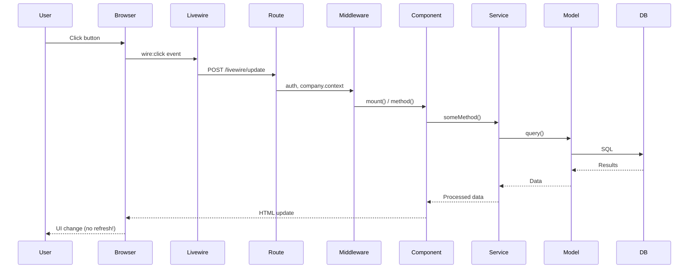
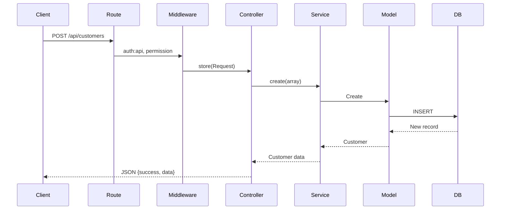

# 03 - Development Workflow

> Quy trình phát triển và hướng dẫn tạo module mới trong QLHoaDonWebVer2

---

## 📋 Mục lục

- [Quy trình phát triển](#quy-trình-phát-triển)
- [Luồng xử lý yêu cầu](#luồng-xử-lý-yêu-cầu)
- [Tạo module mới](#tạo-module-mới)
- [Tổ chức code](#tổ-chức-code)

---

## Quy trình phát triển



### Các bước chuẩn

1. **Lập kế hoạch** - Xác định yêu cầu, schema cơ sở dữ liệu
2. **Cơ sở dữ liệu** - Migration + Model với quan hệ
3. **Logic nghiệp vụ** - Các phương thức trong Service layer
4. **Giao diện** - Livewire components + Blade views
5. **Định tuyến** - Web/API routes với middleware
6. **Kiểm thử** - Kiểm thử thủ công + tự động
7. **Đánh giá** - Code review, tái cấu trúc nếu cần
8. **Triển khai** - Merge vào develop, sau đó staging, rồi production

---

## Luồng xử lý yêu cầu

### Livewire Request (Web UI)



### API Request



---

## Tạo module mới

### Ví dụ: Tạo module "Projects"

**Yêu cầu:**
- Quản lý dự án cho công ty
- Các thao tác CRUD
- Gán nhân viên vào dự án
- Theo dõi tiến độ

### Bước 1: Migration cơ sở dữ liệu

```bash
php artisan make:migration create_projects_table
```

**File migration:**
```php
// database/migrations/2025_01_01_000000_create_projects_table.php
public function up() {
    Schema::create('projects', function (Blueprint $table) {
        $table->id();
        $table->foreignId('company_id')->constrained()->cascadeOnDelete();
        $table->string('name');
        $table->string('code')->unique();
        $table->text('description')->nullable();
        $table->enum('status', ['planning', 'in_progress', 'completed', 'on_hold']);
        $table->date('start_date')->nullable();
        $table->date('end_date')->nullable();
        $table->decimal('budget', 15, 2)->default(0);
        $table->foreignId('manager_id')->nullable()->constrained('users');
        $table->timestamps();
        $table->softDeletes();
        
        // Indexes
        $table->index(['company_id', 'status']);
    });
}

public function down() {
    Schema::dropIfExists('projects');
}
```

**Chạy migration:**
```bash
php artisan migrate
```

### Bước 2: Tạo Model

```bash
php artisan make:model Project
```

**Model:**
```php
// app/Models/Project.php
namespace App\Models;

use App\Models\Concerns\HasCompanyScope;
use Illuminate\Database\Eloquent\Model;
use Illuminate\Database\Eloquent\SoftDeletes;

class Project extends Model
{
    use HasCompanyScope, SoftDeletes;
    
    protected $fillable = [
        'company_id',
        'name',
        'code',
        'description',
        'status',
        'start_date',
        'end_date',
        'budget',
        'manager_id',
    ];
    
    protected $casts = [
        'start_date' => 'date',
        'end_date' => 'date',
        'budget' => 'decimal:2',
    ];
    
    // Relationships
    public function company() {
        return $this->belongsTo(Company::class);
    }
    
    public function manager() {
        return $this->belongsTo(User::class, 'manager_id');
    }
    
    public function employees() {
        return $this->belongsToMany(User::class, 'project_user')
            ->withTimestamps();
    }
    
    // Scopes
    public function scopeActive($query) {
        return $query->where('status', 'in_progress');
    }
    
    public function scopeCompleted($query) {
        return $query->where('status', 'completed');
    }
}
```

### Bước 3: Tạo Service

```bash
mkdir -p app/Services/App
touch app/Services/App/ProjectService.php
```

**Service:**
```php
// app/Services/App/ProjectService.php
namespace App\Services\App;

use App\Models\Project;
use Illuminate\Database\Eloquent\Builder;
use Illuminate\Support\Facades\Auth;

class ProjectService
{
    // Query Builder
    public function getQueryBuilder(): Builder {
        return Project::query();
    }
    
    public function getFilteredQuery(array $filters = []): Builder {
        $query = $this->getQueryBuilder();
        
        if (!empty($filters['search'])) {
            $search = $filters['search'];
            $query->where(function($q) use ($search) {
                $q->where('name', 'like', "%{$search}%")
                  ->orWhere('code', 'like', "%{$search}%");
            });
        }
        
        if (!empty($filters['status'])) {
            $query->where('status', $filters['status']);
        }
        
        return $query;
    }
    
    // CRUD
    public function findById(int $id): Project {
        return Project::findOrFail($id);
    }
    
    public function create(array $data): Project {
        $companyId = Auth::user()->company_id;
        
        return Project::create([
            'company_id' => $companyId,
            ...$data
        ]);
    }
    
    public function update(int $id, array $data): Project {
        $project = $this->findById($id);
        $project->update($data);
        
        return $project->fresh();
    }
    
    public function delete(int $id): void {
        $project = $this->findById($id);
        $project->delete();
    }
    
    // Business Logic
    public function assignEmployee(int $projectId, int $userId): void {
        $project = $this->findById($projectId);
        $project->employees()->attach($userId);
    }
    
    public function removeEmployee(int $projectId, int $userId): void {
        $project = $this->findById($projectId);
        $project->employees()->detach($userId);
    }
    
    public function updateStatus(int $projectId, string $status): Project {
        $project = $this->findById($projectId);
        $project->update(['status' => $status]);
        
        // Trigger event if completed
        if ($status === 'completed') {
            event(new ProjectCompleted($project));
        }
        
        return $project->fresh();
    }
}
```

### Bước 4: Tạo Livewire Components

**a) Component Quản lý (Danh sách)**


```bash
php artisan make:livewire Main/Projects/ProjectManager
```

```php
// app/Livewire/Main/Projects/ProjectManager.php
namespace App\Livewire\Main\Projects;

use Livewire\Component;
use Livewire\Attributes\Title;
use Livewire\Attributes\Layout;

#[Title('Quản lý dự án')]
#[Layout('layouts.main')]
class ProjectManager extends Component
{
    public string $message = '';
    public string $alertType = 'success';
    public int $alertKey = 0;
    
    public function mount() {
        // Read message from query params
        if (request()->has('message')) {
            $this->message = urldecode(request()->get('message'));
            $this->alertType = request()->get('alert', 'success');
            $this->alertKey++;
        }
    }
    
    public function render() {
        return view('livewire.main.projects.project-manager');
    }
}
```

**b) Component Bảng**


```bash
php artisan make:livewire Main/Projects/ProjectTable
```

```php
// app/Livewire/Main/Projects/ProjectTable.php
namespace App\Livewire\Main\Projects;

use App\Models\Project;
use App\Services\App\ProjectService;
use Rappasoft\LaravelLivewireTables\DataTableComponent;
use Rappasoft\LaravelLivewireTables\Views\Column;

class ProjectTable extends DataTableComponent
{
    protected $model = Project::class;
    
    public function configure(): void {
        $this->setPrimaryKey('id')
            ->setSearchEnabled()
            ->setPerPageAccepted([10, 25, 50]);
    }
    
    public function builder(): Builder {
        $service = app(ProjectService::class);
        return $service->getQueryBuilder()
            ->with(['manager']);
    }
    
    public function columns(): array {
        return [
            Column::make('Tên dự án', 'name')
                ->sortable()
                ->searchable()
                ->format(fn($value, $row) => 
                    '<a href="'.route('projects.detail', $row->id).'" 
                        class="text-blue-600 hover:underline" wire:navigate>'
                        .htmlspecialchars($value).'</a>'
                )
                ->html(),
                
            Column::make('Mã', 'code')
                ->sortable()
                ->searchable(),
                
            Column::make('Trạng thái', 'status')
                ->sortable()
                ->format(fn($value) => $this->formatStatus($value))
                ->html(),
                
            Column::make('Quản lý', 'manager.name')
                ->sortable(),
                
            Column::make('Ngân sách', 'budget')
                ->sortable()
                ->format(fn($value) => number_format($value, 0, ',', '.').' ₫'),
        ];
    }
    
    private function formatStatus($status) {
        $badges = [
            'planning' => '<span class="badge bg-gray-500">Lập kế hoạch</span>',
            'in_progress' => '<span class="badge bg-blue-500">Đang thực hiện</span>',
            'completed' => '<span class="badge bg-green-500">Hoàn thành</span>',
            'on_hold' => '<span class="badge bg-yellow-500">Tạm dừng</span>',
        ];
        
        return $badges[$status] ?? $status;
    }
}
```

**c) Component Form**

```bash
php artisan make:livewire Main/Projects/ProjectForm
```

```php
// app/Livewire/Main/Projects/ProjectForm.php
namespace App\Livewire\Main\Projects;

use App\Services\App\ProjectService;
use Livewire\Component;
use Livewire\Attributes\Title;
use Livewire\Attributes\Layout;

#[Title('Tạo/Sửa dự án')]
#[Layout('layouts.main')]
class ProjectForm extends Component
{
    public ?int $projectId = null;
    public string $name = '';
    public string $code = '';
    public string $description = '';
    public string $status = 'planning';
    public $startDate = null;
    public $endDate = null;
    public $budget = 0;
    public $managerId = null;
    
    protected $rules = [
        'name' => 'required|string|max:255',
        'code' => 'required|string|max:50|unique:projects,code',
        'description' => 'nullable|string',
        'status' => 'required|in:planning,in_progress,completed,on_hold',
        'startDate' => 'nullable|date',
        'endDate' => 'nullable|date|after_or_equal:startDate',
        'budget' => 'nullable|numeric|min:0',
        'managerId' => 'nullable|exists:users,id',
    ];
    
    public function mount($id = null) {
        if ($id) {
            $this->loadProject($id);
        }
    }
    
    private function loadProject($id) {
        $service = app(ProjectService::class);
        $project = $service->findById($id);
        
        $this->projectId = $project->id;
        $this->name = $project->name;
        $this->code = $project->code;
        $this->description = $project->description ?? '';
        $this->status = $project->status;
        $this->startDate = $project->start_date?->format('Y-m-d');
        $this->endDate = $project->end_date?->format('Y-m-d');
        $this->budget = $project->budget;
        $this->managerId = $project->manager_id;
    }
    
    public function save() {
        // Update validation rule for edit
        if ($this->projectId) {
            $this->rules['code'] = 'required|string|max:50|unique:projects,code,'.$this->projectId;
        }
        
        $this->validate();
        
        $service = app(ProjectService::class);
        $data = [
            'name' => $this->name,
            'code' => $this->code,
            'description' => $this->description,
            'status' => $this->status,
            'start_date' => $this->startDate,
            'end_date' => $this->endDate,
            'budget' => $this->budget,
            'manager_id' => $this->managerId,
        ];
        
        if ($this->projectId) {
            $service->update($this->projectId, $data);
            $message = urlencode('Cập nhật dự án thành công!');
        } else {
            $service->create($data);
            $message = urlencode('Tạo dự án thành công!');
        }
        
        return $this->redirect(route('projects')."?message={$message}&alert=success", navigate: true);
    }
    
    public function render() {
        return view('livewire.main.projects.project-form');
    }
}
```

### Bước 5: Tạo Blade Views

**a) View Quản lý**

```blade
{{-- resources/views/livewire/main/projects/project-manager.blade.php --}}
<div class="p-2">
    {{-- Alert Message --}}
    @if($message)
    <div class="mb-6" wire:key="alert-{{ $alertKey }}">
        <x-ui.alert :type="$alertType" :close="true" :timeout="5000">
            {{ $message }}
        </x-ui.alert>
    </div>
    @endif
    
    {{-- Page Header --}}
    <div class="mb-6">
        <h1 class="text-xl font-bold text-gray-900 dark:text-white">Quản lý dự án</h1>
        <p class="text-gray-600 dark:text-gray-400 mt-2">Quản lý các dự án của công ty</p>
    </div>
    
    {{-- Action Buttons --}}
    <div class="mb-6 flex justify-end">
        <a href="{{ route('projects.create') }}" wire:navigate
           class="inline-flex items-center px-4 py-2 bg-blue-600 hover:bg-blue-700 text-white rounded-md">
            <i class="bi bi-plus-lg mr-2"></i> Tạo mới
        </a>
    </div>
    
    {{-- DataTable --}}
    <div class="bg-white dark:bg-gray-800 rounded-lg shadow overflow-hidden p-6">
        <livewire:main.projects.project-table />
    </div>
</div>
```

**b) View Form**

```blade
{{-- resources/views/livewire/main/projects/project-form.blade.php --}}
<div class="p-2">
    <div class="mb-6">
        <h1 class="text-xl font-bold">{{ $projectId ? 'Sửa dự án' : 'Tạo dự án mới' }}</h1>
    </div>
    
    <form wire:submit="save" class="bg-white dark:bg-gray-800 rounded-lg shadow p-6">
        <div class="grid grid-cols-1 md:grid-cols-2 gap-6">
            {{-- Name --}}
            <div>
                <label class="block text-sm font-medium mb-2">Tên dự án *</label>
                <input type="text" wire:model="name" class="input" />
                @error('name') <span class="text-red-500 text-sm">{{ $message }}</span> @enderror
            </div>
            
            {{-- Code --}}
            <div>
                <label class="block text-sm font-medium mb-2">Mã dự án *</label>
                <input type="text" wire:model="code" class="input" />
                @error('code') <span class="text-red-500 text-sm">{{ $message }}</span> @enderror
            </div>
            
            {{-- Status --}}
            <div>
                <label class="block text-sm font-medium mb-2">Trạng thái *</label>
                <select wire:model="status" class="input">
                    <option value="planning">Lập kế hoạch</option>
                    <option value="in_progress">Đang thực hiện</option>
                    <option value="completed">Hoàn thành</option>
                    <option value="on_hold">Tạm dừng</option>
                </select>
                @error('status') <span class="text-red-500 text-sm">{{ $message }}</span> @enderror
            </div>
            
            {{-- Budget --}}
            <div>
                <label class="block text-sm font-medium mb-2">Ngân sách</label>
                <input type="number" wire:model="budget" class="input" step="0.01" />
                @error('budget') <span class="text-red-500 text-sm">{{ $message }}</span> @enderror
            </div>
            
            {{-- Description (full width) --}}
            <div class="md:col-span-2">
                <label class="block text-sm font-medium mb-2">Mô tả</label>
                <textarea wire:model="description" rows="4" class="input"></textarea>
                @error('description') <span class="text-red-500 text-sm">{{ $message }}</span> @enderror
            </div>
        </div>
        
        {{-- Actions --}}
        <div class="mt-6 flex justify-end gap-2">
            <a href="{{ route('projects') }}" wire:navigate class="btn btn-secondary">Hủy</a>
            <button type="submit" class="btn btn-primary">
                {{ $projectId ? 'Cập nhật' : 'Tạo mới' }}
            </button>
        </div>
    </form>
</div>
```

### Bước 6: Thêm Routes

```php
// routes/company.php (hoặc web.php)
use App\Livewire\Main\Projects\ProjectManager;
use App\Livewire\Main\Projects\ProjectForm;

Route::middleware(['auth', 'company.context', 'ensure.not_customer'])
    ->prefix('projects')
    ->name('projects.')
    ->group(function() {
        Route::get('/', ProjectManager::class)->name('index')
            ->middleware('permission:projects.view');
            
        Route::get('/create', ProjectForm::class)->name('create')
            ->middleware('permission:projects.create');
            
        Route::get('/{id}/edit', ProjectForm::class)->name('edit')
            ->middleware('permission:projects.edit');
    });
```

### Bước 7: Thêm Permissions (Tùy chọn)

```php
// database/seeders/PermissionSeeder.php
$permissions = [
    'projects.view',
    'projects.create',
    'projects.edit',
    'projects.delete',
];

foreach ($permissions as $permission) {
    Permission::create(['name' => $permission]);
}
```

### Bước 8: Kiểm thử

```bash
# Run the app
php artisan serve

# Visit endpoints
http://localhost:8000/projects
http://localhost:8000/projects/create

# Test CRUD operations
1. Create project
2. Edit project
3. View list
4. Delete project
```

---

## Tổ chức code

### Quy ước đặt tên file

```
Models:          PascalCase          Customer.php, SaleInvoice.php
Services:        PascalCase+Service  CustomerService.php
Livewire:        PascalCase          CustomerForm.php, CustomerTable.php
Blade Views:     kebab-case          customer-form.blade.php
Migrations:      snake_case          create_customers_table.php
```

### Cấu trúc thư mục cho Module

```
app/
├── Livewire/Main/Projects/
│   ├── ProjectManager.php
│   ├── ProjectTable.php
│   ├── ProjectForm.php
│   └── ProjectDetail.php
├── Models/
│   └── Project.php
├── Services/App/
│   └── ProjectService.php
└── Http/Controllers/Api/  (if needed)
    └── ProjectsController.php

resources/views/livewire/main/projects/
├── project-manager.blade.php
├── project-form.blade.php
└── project-detail.blade.php

database/migrations/
└── 2025_01_01_000000_create_projects_table.php
```

---

## Các lệnh tham khảo nhanh

```bash
# Create migration
php artisan make:migration create_projects_table

# Create model
php artisan make:model Project

# Create Livewire component
php artisan make:livewire Main/Projects/ProjectForm

# Run migrations
php artisan migrate

# Rollback
php artisan migrate:rollback

# Fresh migration (⚠️ deletes all data!)
php artisan migrate:fresh --seed

# Clear caches
php artisan optimize:clear

# Generate IDE helper (for autocomplete)
php artisan ide-helper:models

# Run tests
php artisan test

# Code formatting
./vendor/bin/pint
```

---

## Các bước tiếp theo

✅ Development workflow learned!

**Tiếp tục với:**
- [Auth & Middleware](04-auth-and-middleware.md) - Triển khai bảo mật
- [Core Modules](05-core-modules.md) - Nghiên cứu các module hiện có
- [Invoice System](07-invoice-system.md) - Ví dụ module phức tạp

---
