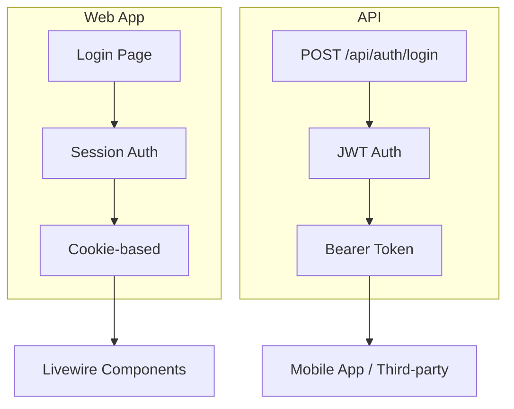
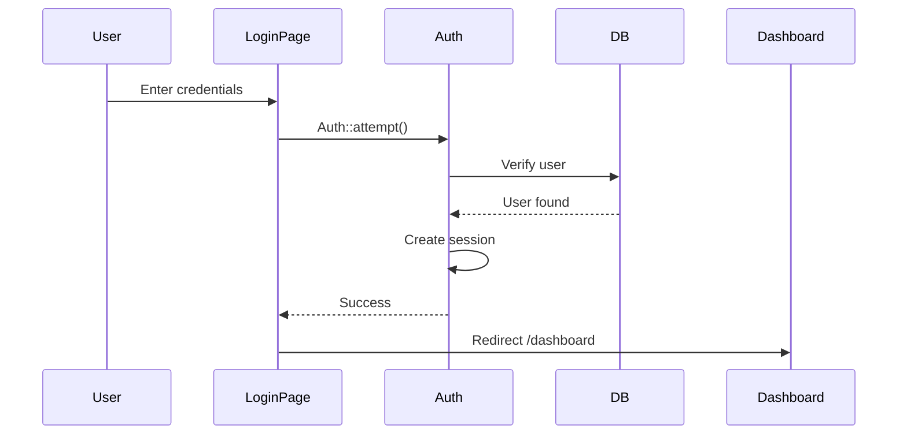
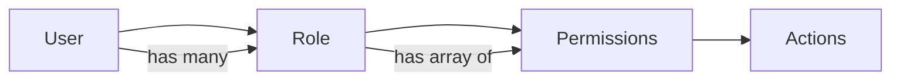

# 04 - Authentication & Middleware

> Hệ thống xác thực và phân quyền trong QLHoaDonWebVer2

---

## 📋 Mục lục

- [Tổng quan xác thực](#tổng-quan-xác-thực)
- [Xác thực Web](#xác-thực-web)
- [Xác thực API](#xác-thực-api)
- [Chuỗi Middleware](#chuỗi-middleware)
- [Hệ thống phân quyền](#hệ-thống-phân-quyền)
- [Bảo mật Multi-tenancy](#bảo-mật-multi-tenancy)
- [Quản lý phiên](#quản-lý-phiên)

---

## Tổng quan xác thực

### Hai hệ thống xác thực



| Tính năng | Web | API |
|---------|-----|-----|
| **Phương thức xác thực** | Laravel Session | JWT Token |
| **Storage** | Cookie (encrypted) | Bearer header |
| **Trạng thái** | Stateful | Stateless |
| **Hết hạn** | 120 phút (có thể cấu hình) | 60 phút (refresh token) |
| **Guard** | `web` | `api` |

---

## Xác thực Web

### Quy trình đăng nhập



### Login Controller

```php
// app/Livewire/Auth/Login.php
class Login extends Component
{
    public string $email = '';
    public string $password = '';
    public bool $remember = false;
    
    protected $rules = [
        'email' => 'required|email',
        'password' => 'required',
    ];
    
    public function login()
    {
        $this->validate();
        
        // Attempt login
        if (Auth::attempt([
            'email' => $this->email,
            'password' => $this->password
        ], $this->remember)) {
            // Regenerate session (prevent fixation)
            request()->session()->regenerate();
            
            // Check company context
            $user = Auth::user();
            if (!$user->company_id && !$user->customer_id) {
                return redirect()->route('company.onboarding');
            }
            
            // Redirect based on role
            if ($user->isCustomerAccount()) {
                return redirect()->route('partner.dashboard');
            }
            
            return redirect()->intended('/dashboard');
        }
        
        // Login failed
        $this->addError('email', 'Thông tin đăng nhập không chính xác.');
    }
}
```

### Đăng xuất

```php
// app/Livewire/Main/Logout.php
class Logout extends Component
{
    public function mount()
    {
        Auth::guard('web')->logout();
        request()->session()->invalidate();
        request()->session()->regenerateToken();
        
        return redirect('/login');
    }
}
```

### Đăng ký (nếu bật)

```php
// app/Livewire/Auth/Register.php
public function register()
{
    $this->validate([
        'firstName' => 'required|string|max:255',
        'lastName' => 'required|string|max:255',
        'email' => 'required|email|unique:users',
        'password' => 'required|min:8|confirmed',
    ]);
    
    // Create user
    $user = User::create([
        'first_name' => $this->firstName,
        'last_name' => $this->lastName,
        'email' => $this->email,
        'password' => Hash::make($this->password),
        'is_active' => true,
    ]);
    
    // Auto-login
    Auth::login($user);
    
    // Redirect to onboarding (no company yet)
    return redirect()->route('company.onboarding');
}
```

---

## Xác thực API

### Cài đặt JWT

**Config (`config/jwt.php`):**
```php
'ttl' => env('JWT_TTL', 60), // 60 minutes
'refresh_ttl' => env('JWT_REFRESH_TTL', 20160), // 2 weeks
'algo' => 'HS256',
'secret' => env('JWT_SECRET'),
```

### Endpoint đăng nhập

```php
// app/Http/Controllers/Api/AuthController.php
public function login(Request $request)
{
    $credentials = $request->only('email', 'password');
    
    if (!$token = Auth::guard('api')->attempt($credentials)) {
        return response()->json([
            'success' => false,
            'message' => 'Invalid credentials'
        ], 401);
    }
    
    $user = Auth::guard('api')->user();
    
    return response()->json([
        'success' => true,
        'data' => [
            'access_token' => $token,
            'token_type' => 'bearer',
            'expires_in' => Auth::guard('api')->factory()->getTTL() * 60,
            'user' => [
                'id' => $user->id,
                'email' => $user->email,
                'fullname' => $user->fullname,
                'company_id' => $user->company_id,
                'role' => $user->role_name,
            ]
        ]
    ]);
}
```

### Sử dụng Token

**Yêu cầu từ Client:**
```bash
curl -H "Authorization: Bearer {token}" \
     https://api.example.com/api/customers
```

**Phía Server:**
```php
// Tự động xác thực qua middleware
$user = Auth::guard('api')->user();
$companyId = $user->company_id;
```

### Làm mới Token

```php
public function refresh()
{
    try {
        $newToken = Auth::guard('api')->refresh();
        
        return response()->json([
            'success' => true,
            'data' => [
                'access_token' => $newToken,
                'token_type' => 'bearer',
                'expires_in' => Auth::guard('api')->factory()->getTTL() * 60,
            ]
        ]);
    } catch (\Exception $e) {
        return response()->json([
            'success' => false,
            'message' => 'Token refresh failed'
        ], 401);
    }
}
```

### API đăng xuất

```php
public function logout()
{
    Auth::guard('api')->logout();
    
    return response()->json([
        'success' => true,
        'message' => 'Successfully logged out'
    ]);
}
```

---

## Chuỗi Middleware

### Middleware cho Web Routes

```php
// routes/company.php
Route::middleware([
    'auth',              // 1. User must be logged in
    'company.context',   // 2. Must have company
    'ensure.not_customer', // 3. Not a customer/partner account
    'permission:customers.view' // 4. Has specific permission
])->group(function() {
    Route::get('/customers', CustomerManager::class);
});
```

### Middleware cho API Routes

```php
// routes/api.php
Route::middleware([
    'auth:api',          // JWT authentication
    'json.response',     // Force JSON response
])->group(function() {
    Route::get('/customers', [CustomersController::class, 'index'])
        ->middleware('permission:customers.view');
});
```

### Thứ tự Middleware quan trọng!

```
Request
  ↓
1. auth / auth:api         ← Verify user logged in
  ↓
2. company.context         ← Check has company
  ↓
3. ensure.not_customer     ← Prevent partner access to main app
  ↓
4. permission:*            ← Check specific permission
  ↓
Controller/Component
```

---

## Tìm hiểu sâu về Middleware

### 1. Authenticate

**Mục đích:** Xác minh user đã đăng nhập

```php
// app/Http/Middleware/Authenticate.php
protected function redirectTo(Request $request): ?string
{
    if (!$request->expectsJson()) {
        return route('login');
    }
    
    return null; // API returns 401
}
```

### 2. EnsureCompanyContext

**Mục đích:** Bắt buộc đăng ký công ty nếu chưa có công ty

```php
// app/Http/Middleware/EnsureCompanyContext.php
public function handle(Request $request, Closure $next): Response
{
    $user = Auth::user();
    if (!$user) {
        return $next($request);
    }
    
    $companyId = (int) ($user['company_id'] ?? 0);
    if ($companyId > 0) {
        return $next($request);
    }
    
    // Allow partner accounts (customer_id)
    if (!empty($user->customer_id)) {
        return $next($request);
    }
    
    // Allow onboarding route itself
    if ($request->routeIs('company.onboarding')) {
        return $next($request);
    }
    
    // Force onboarding
    return redirect()->route('company.onboarding');
}
```

### 3. EnsureNotCustomer

**Mục đích:** Ngăn chặn tài khoản partner truy cập ứng dụng chính

```php
// app/Http/Middleware/EnsureNotCustomer.php
public function handle(Request $request, Closure $next): Response
{
    $user = Auth::user();
    
    if ($user && $user->isCustomerAccount()) {
        abort(403, 'Tài khoản đối tác không có quyền truy cập.');
    }
    
    return $next($request);
}
```

### 4. CheckPermission

**Mục đích:** Xác minh quyền cụ thể

```php
// app/Http/Middleware/CheckPermission.php
public function handle(Request $request, Closure $next, string $permission): Response
{
    $user = auth()->user();
    
    if (!$user) {
        abort(403, 'Unauthorized');
    }
    
    // Admin has all permissions
    if ($user->hasRole('admin') || $user->is_admin) {
        return $next($request);
    }
    
    // Check permission
    if (!$user->hasPermission($permission)) {
        abort(403, 'Bạn không có quyền truy cập trang này.');
    }
    
    return $next($request);
}
```

### 5. ForceJsonResponse (Chỉ cho API)

**Mục đích:** Đảm bảo API luôn trả về JSON

```php
// app/Http/Middleware/ForceJsonResponse.php
public function handle(Request $request, Closure $next): Response
{
    $request->headers->set('Accept', 'application/json');
    return $next($request);
}
```

---

## Hệ thống phân quyền

### Kiến trúc RBAC



### Lược đồ cơ sở dữ liệu

```sql
-- users table
users
  - id
  - role_id          -- Foreign key to roles
  - is_admin         -- Legacy admin flag
  - company_id       -- Tenant isolation
  - customer_id      -- Partner account (if not null)

-- roles table
roles
  - id
  - company_id       -- Each company has own roles
  - code             -- admin, manager, staff, etc.
  - name
  - permissions      -- JSON array: ["customers.view", "invoices.edit"]

-- NO separate permissions table!
-- Permissions stored as JSON array in roles.permissions
```

### Model Role

```php
// app/Models/Role.php
class Role extends Model
{
    use HasCompanyScope;
    
    protected $fillable = [
        'company_id',
        'code',
        'name',
        'description',
        'permissions',  // JSON cast
    ];
    
    protected $casts = [
        'permissions' => 'array',
    ];
    
    public function users() {
        return $this->hasMany(User::class);
    }
    
    public function hasPermission(string $permission): bool {
        return in_array($permission, $this->permissions ?? []);
    }
}
```

### Kiểm tra phân quyền User

```php
// app/Models/User.php
public function hasPermission(string $permission): bool
{
    // 1. Legacy admin flag
    if ($this->is_admin ?? false) {
        return true;
    }
    
    // 2. Load role (cached if already loaded)
    $role = $this->role;
    if (!$role) {
        return false;
    }
    
    // 3. Admin role code
    if ($role->code === 'admin') {
        return true;
    }
    
    // 4. Check permission array
    $permissions = $role->permissions ?? [];
    return in_array($permission, $permissions);
}
```

### Các quyền có sẵn

**Format:** `{module}.{action}`

```php
// Customers
'customers.view'
'customers.create'
'customers.edit'
'customers.delete'

// Suppliers
'suppliers.view'
'suppliers.create'
'suppliers.edit'
'suppliers.delete'

// Invoices
'invoices.sale.view'
'invoices.sale.create'
'invoices.sale.approve'
'invoices.purchase.view'
'invoices.purchase.create'
'invoices.purchase.approve'

// Products
'products.view'
'products.create'
'products.edit'
'products.delete'

// Inventory
'inventory.view'
'inventory.adjust'

// Settings
'settings.view'
'settings.edit'

// Roles
'roles.view'
'roles.create'
'roles.edit'
'roles.delete'

// Users
'users.view'
'users.create'
'users.edit'
'users.delete'

// ... 50+ total permissions
```

### Sử dụng trong Code

**Trong Livewire:**
```php
class CustomerForm extends Component
{
    public function mount($id = null)
    {
        // Kiểm tra thủ công nếu cần
        if ($id && !Auth::user()->hasPermission('customers.edit')) {
            abort(403);
        }
        
        // ... rest of code
    }
}
```

**Trong Blade:**
```blade
@can('customers.create')
    <a href="{{ route('customers.create') }}">Tạo mới</a>
@endcan
```

**Trong Routes:**
```php
Route::get('/customers', CustomerManager::class)
    ->middleware('permission:customers.view');
```

---

## Bảo mật Multi-tenancy

### Phân vùng theo công ty

**Mọi query tự động được phân vùng:**
```php
// Model trait
trait HasCompanyScope
{
    protected static function booted()
    {
        static::addGlobalScope(new CompanyScope);
        
        static::creating(function ($model) {
            if (!$model->company_id) {
                $model->company_id = Auth::user()->company_id;
            }
        });
    }
}

// Global scope
class CompanyScope implements Scope
{
    public function apply(Builder $builder, Model $model)
    {
        if (Auth::check() && Auth::user()->company_id) {
            $builder->where($model->getTable().'.company_id', Auth::user()->company_id);
        }
    }
}
```

**Ví dụ:**
```php
// This query
$customers = Customer::all();

// Automatically becomes
$customers = Customer::where('company_id', Auth::user()->company_id)->get();
```

### Ngăn chặn truy cập xuyên công ty

```php
// Trying to access another company's data
$customer = Customer::find(999);  // Other company's customer

// Returns null! (filtered by scope)
// Even if ID exists in DB
```

### Bảo mật API

```php
// API controller
public function show(int $id)
{
    $user = Auth::guard('api')->user();
    
    // Find with scope
    $customer = Customer::find($id);
    
    if (!$customer) {
        return response()->json(['success' => false], 404);
    }
    
    // Double-check (paranoid security)
    if ($customer->company_id !== $user->company_id) {
        return response()->json(['success' => false], 404);
    }
    
    return response()->json(['success' => true, 'data' => $customer]);
}
```

---

## Quản lý phiên

### Cấu hình Session

```dotenv
SESSION_DRIVER=database  # Store in DB
SESSION_LIFETIME=120     # 120 minutes
SESSION_ENCRYPT=false
SESSION_PATH=/
SESSION_DOMAIN=null
```

### Bảng Session

```sql
sessions
  - id VARCHAR(255) PRIMARY KEY
  - user_id BIGINT (nullable)
  - ip_address VARCHAR(45)
  - user_agent TEXT
  - payload TEXT  -- Encrypted session data
  - last_activity INT
```

### Theo dõi phiên User

```php
// app/Http/Middleware/TrackUserSession.php
public function handle($request, Closure $next)
{
    if (Auth::check()) {
        $user = Auth::user();
        
        UserSession::updateOrCreate(
            ['session_id' => session()->getId()],
            [
                'user_id' => $user->id,
                'ip_address' => $request->ip(),
                'user_agent' => $request->userAgent(),
                'last_activity' => now(),
            ]
        );
    }
    
    return $next($request);
}
```

### Vô hiệu hóa phiên cũ

```php
// When user changes password
public function changePassword($newPassword)
{
    // Update password
    $this->user->update([
        'password' => Hash::make($newPassword)
    ]);
    
    // Kill all sessions except current
    UserSession::where('user_id', $this->user->id)
        ->where('session_id', '!=', session()->getId())
        ->delete();
    
    Session::getHandler()->destroy(session()->getId());
}
```

---

## Thực hành bảo mật tốt nhất

### 1. Yêu cầu mật khẩu

```php
protected $rules = [
    'password' => [
        'required',
        'string',
        'min:8',
        'regex:/[a-z]/',      // lowercase
        'regex:/[A-Z]/',      // uppercase
        'regex:/[0-9]/',      // number
        'regex:/[@$!%*#?&]/', // special char
        'confirmed',
    ],
];
```

### 2. Giới hạn tốc độ (Rate Limiting)

```php
// routes/api.php
Route::middleware('throttle:60,1')->group(function() {
    Route::post('/login', [AuthController::class, 'login']);
});

// Custom throttle
Route::post('/critical-action')
    ->middleware('throttle:10,1') // 10 requests per minute
```

### 3. Bảo vệ CSRF

**Tự động bật cho web routes:**
```blade
<form method="POST">
    @csrf  <!-- Required for POST/PUT/DELETE -->
    ...
</form>
```

**Livewire tự động xử lý CSRF:**
```blade
<div wire:submit="save">  <!-- CSRF automatic -->
```

### 4. Ngăn chặn SQL Injection

**✅ Eloquent tự động escape:**
```php
Customer::where('name', $userInput)->get();  // Safe!
```

**❌ Raw queries cần bindings:**
```php
// DANGEROUS
DB::select("SELECT * FROM users WHERE email = '$email'");

// SAFE
DB::select("SELECT * FROM users WHERE email = ?", [$email]);
```

### 5. Ngăn chặn XSS

**Blade tự động escape:**
```blade
{{ $userInput }}  <!-- Escaped -->
{!! $userInput !!}  <!-- NOT escaped - dangerous! -->
```

---

## Khắc phục sự cố

### Lỗi "Unauthenticated"

```bash
# Check session driver
SESSION_DRIVER=database  # Not 'file' in production

# Clear sessions
php artisan session:flush
php artisan cache:clear

# Check database
SELECT * FROM sessions WHERE user_id = ?;
```

### "Permission Denied" với Admin

```php
// Check 1: is_admin flag
$user->is_admin  // Should be true for admin

// Check 2: Role code
$user->role->code === 'admin'  // Should be true

// Check 3: Permission array
$user->role->permissions  // Should contain permission
```

### Vấn đề JWT Token

```bash
# Generate new secret
php artisan jwt:secret

# Check token expiry
JWT_TTL=60  # .env

# Test token
php artisan tinker
> Auth::guard('api')->attempt(['email' => '...', 'password' => '...'])
```

---

## Các bước tiếp theo

✅ Security understood!

**Tiếp tục với:**
- [Core Modules](05-core-modules.md) - Dashboard, Settings, etc.
- [Business Modules](06-business-modules.md) - Customers, Products
- [Invoice System](07-invoice-system.md) - Complex workflow

---

<p align="center">
  <strong>Bảo mật trước tiên! 🔐</strong><br>
  Tiếp theo: <a href="05-core-modules.md">Khám phá Core Modules</a>
</p>
