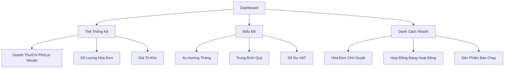
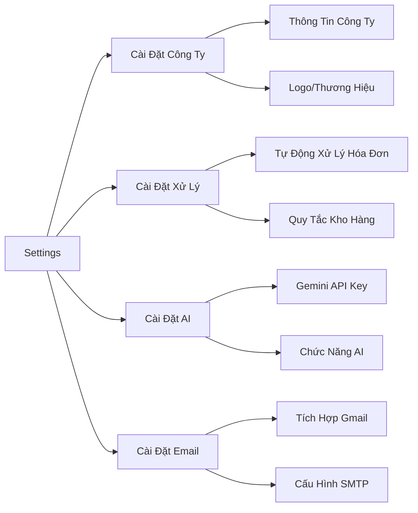

# 05 - Các Module Cốt Lõi

> Dashboard, Profile, Settings, và các module cốt lõi

---

## Module Dashboard

### Mục Đích

Tổng quan thời gian thực về hoạt động kinh doanh với thống kê, biểu đồ và các hành động nhanh.

### Tính Năng Chính



### Chiến Lược Cache

**Tất cả thống kê được cache 15 phút:**

```php
// app/Livewire/Main/Dashboard.php
public function getStats($companyId, $forceRefresh = false): array {
    $cacheKey = 'dashboard_overview';
    
    return StatisticsCache::remember($companyId, $cacheKey, function() {
        // Tính toán nặng ở đây
        return [
            'revenue' => ...,
            'cost' => ...,
            'profit' => ...,
        ];
    }, 900); // 15 phút
}

// Làm mới thủ công
public function resetStats() {
    StatisticsCache::flush($companyId);
    $this->stats = $this->getStats($companyId, true);
}
```

### Tính Toán Thống Kê

```php
// Sử dụng FinancialSummaryService để tính toán chính xác
$financials = app(FinancialSummaryService::class)
    ->summarizeRange($companyId, $startDate, $endDate);

// Trả về:
[
    'revenue' => 100000000,      // Tổng hóa đơn bán (trước VAT)
    'cost' => 80000000,          // Tổng hóa đơn mua (trước VAT)
    'profit' => 20000000,        // doanh thu - chi phí
    'sale_vat' => 10000000,      // VAT đầu ra (bán hàng)
    'purchase_vat' => 8000000,   // VAT đầu vào (mua hàng)
    'vat_balance' => 2000000,    // sale_vat - purchase_vat
]
```

---

## Module Profile

### Quản Lý Hồ Sơ Người Dùng

**Vị trí:** `app/Livewire/Main/Profile.php`

**Tính năng:**
- Chỉnh sửa thông tin cá nhân (tên, email, phone)
- Đổi mật khẩu
- Upload avatar
- Xem lịch sử hoạt động

**Bảo mật:**
```php
// Đổi mật khẩu yêu cầu mật khẩu hiện tại
protected $rules = [
    'currentPassword' => 'required',
    'newPassword' => 'required|min:8|confirmed',
];

public function changePassword() {
    $this->validate();
    
    // Xác minh mật khẩu hiện tại
    if (!Hash::check($this->currentPassword, Auth::user()->password)) {
        $this->addError('currentPassword', 'Mật khẩu hiện tại không đúng');
        return;
    }
    
    // Cập nhật mật khẩu
    Auth::user()->update([
        'password' => Hash::make($this->newPassword)
    ]);
    
    // Hủy các phiên đăng nhập khác
    $this->logoutOtherDevices();
}
```

---

## Module Settings

### Cấu Hình Hệ Thống

**Cài đặt đa cấp:**



### Lưu Trữ Cài Đặt

```php
// app/Models/CompanyConfig.php
class CompanyConfig extends Model {
    protected $casts = [
        'settings' => 'array',  // Cột JSON
    ];
    
    // Lấy cài đặt với giá trị mặc định
    public function getSetting(string $key, $default = null) {
        return data_get($this->settings, $key, $default);
    }
    
    // Cập nhật cài đặt
    public function updateSetting(string $key, $value) {
        $settings = $this->settings ?? [];
        data_set($settings, $key, $value);
        $this->update(['settings' => $settings]);
    }
}

// Sử dụng
$config = Company::find($companyId)->config;
$invoicePrefix = $config->getSetting('processing_settings.invoice_prefix', 'INV');
```

### Các Cài Đặt Có Sẵn

**Thông Tin Công Ty:**
- `company_name`, `tax_id`, `address`, `phone`, `email`
- `logo`, `website`

**Xử Lý:**
- `invoice_prefix`, `auto_generate_code`
- `auto_approve_invoices` (bool)
- `inventory_deduction_mode` (immediate | on_approve)
- `contract_warning_days` (int)

**AI:**
- `gemini_api_key`
- `ai_enabled` (bool)
- `ai_functions_enabled` (array)

**Email:**
- `gmail_oauth_token`
- `gmail_scan_enabled` (bool)
- `email_notifications_enabled` (bool)

Tất cả được thiết lập trong `config/settings.php`

---

## Vai Trò & Quyền Hạn

### Quản Lý Vai Trò

**Thao tác CRUD:**

```php
// app/Livewire/Main/Roles/RoleForm.php
public function save() {
    $validated = $this->validate([
        'code' => 'required|unique:roles,code,' . $this->roleId,
        'name' => 'required',
        'selectedPermissions' => 'array',
    ]);
    
    $roleService = app(RoleService::class);
    
    if ($this->roleId) {
        $roleService->update($this->roleId, [
            'code' => $this->code,
            'name' => $this->name,
            'permissions' => $this->selectedPermissions,
        ]);
    } else {
        $roleService->create([
            'code' => $this->code,
            'name' => $this->name,
            'permissions' => $this->selectedPermissions,
        ]);
    }
}
```

### Phân Loại Quyền

**Nhóm theo giao diện:**

```php
$permissionGroups = [
    'Khách hàng' => [
        'customers.view',
        'customers.create',
        'customers.edit',
        'customers.delete',
    ],
    'Hóa đơn' => [
        'invoices.sale.view',
        'invoices.sale.create',
        'invoices.sale.approve',
        'invoices.purchase.view',
        'invoices.purchase.create',
        'invoices.purchase.approve',
    ],
    'Sản phẩm' => [
        'products.view',
        'products.create',
        'products.edit',
        'products.delete',
    ],
    // ... nhiều nhóm hơn
];
```

---

## Module Người Dùng

### Quản Lý Người Dùng

**Tính năng:**

- CRUD người dùng với vai trò
- Kích hoạt/vô hiệu hóa tài khoản
- Reset mật khẩu
- Xem hoạt động của người dùng

**Phạm Vi Công Ty:**

```php
// Chỉ xem người dùng trong cùng công ty
$users = User::where('company_id', Auth::user()->company_id)
    ->with('role')
    ->get();
```

**Tạo Người Dùng:**

```php
public function create(array $data): User {
    // Tự động gán công ty
    $companyId = Auth::user()->company_id;
    
    return User::create([
        'company_id' => $companyId,
        'first_name' => $data['first_name'],
        'last_name' => $data['last_name'],
        'email' => $data['email'],
        'password' => Hash::make($data['password']),
        'role_id' => $data['role_id'],
        'is_active' => true,
    ]);
}
```

---

## Module Công Ty

### Onboarding Công Ty

**Thiết lập lần đầu cho người dùng mới:**

```php
// app/Livewire/Main/Company/Onboarding.php
public function save() {
    $validated = $this->validate([
        'companyName' => 'required',
        'taxId' => 'required|unique:companies',
        'address' => 'required',
        'phone' => 'required',
    ]);
    
    // Tạo công ty
    $company = Company::create($validated);
    
    // Tạo cấu hình mặc định
    CompanyConfig::create([
        'company_id' => $company->id,
        'settings' => $this->getDefaultSettings(),
    ]);
    
    // Gán cho người dùng hiện tại
    Auth::user()->update(['company_id' => $company->id]);
    
    // Tạo vai trò mặc định
    $this->createDefaultRoles($company->id);
    
    return redirect('/dashboard');
}

private function getDefaultSettings(): array {
    return [
        'processing_settings' => [
            'invoice_prefix' => 'INV',
            'auto_generate_code' => true,
            'auto_approve_invoices' => false,
        ],
        'inventory_settings' => [
            'deduction_mode' => 'on_approve',
        ],
    ];
}
```

---

## Module Nhật Ký Kiểm Toán

### Theo Dõi Hoạt Động

**Ghi log tự động:**

```php
// app/Models/Traits/HasAuditLog.php
trait HasAuditLog {
    protected static function bootHasAuditLog() {
        static::created(function ($model) {
            AuditLog::create([
                'company_id' => Auth::user()->company_id,
                'user_id' => Auth::id(),
                'model_type' => get_class($model),
                'model_id' => $model->id,
                'action' => 'created',
                'changes' => $model->getAttributes(),
            ]);
        });
        
        static::updated(function ($model) {
            AuditLog::create([
                'company_id' => Auth::user()->company_id,
                'user_id' => Auth::id(),
                'model_type' => get_class($model),
                'model_id' => $model->id,
                'action' => 'updated',
                'changes' => $model->getChanges(),
            ]);
        });
    }
}

// Sử dụng trong model
class Customer extends Model {
    use HasAuditLog;
}
```

**Xem Nhật Ký:**

```php
$logs = AuditLog::with('user')
    ->where('model_type', Customer::class)
    ->where('model_id', $customerId)
    ->orderByDesc('created_at')
    ->get();
```

---

## Module Thông Báo

### Thông Báo Thời Gian Thực

**Broadcasting:**

```php
// app/Events/InvoiceApproved.php
class InvoiceApproved implements ShouldBroadcast {
    public function broadcastOn() {
        return new PrivateChannel('company.' . $this->invoice->company_id);
    }
    
    public function broadcastWith() {
        return [
            'message' => 'Hóa đơn ' . $this->invoice->invoice_number . ' đã được duyệt',
            'invoice_id' => $this->invoice->id,
            'type' => 'invoice_approved',
        ];
    }
}

// Kích hoạt
event(new InvoiceApproved($invoice));
```

**Frontend (Livewire):**

```php
// Lắng nghe kênh
<div wire:init="$dispatch('listen-to-notifications')">
    @foreach($notifications as $notification)
        <div>{{ $notification->message }}</div>
    @endforeach
</div>

<script>
Echo.private('company.{{ Auth::user()->company_id }}')
    .listen('InvoiceApproved', (e) => {
        // Hiển thị thông báo toast
        Livewire.dispatch('notification-received', e);
    });
</script>
```

---

## Tham Khảo Nhanh

### Tóm Tắt Các Module Cốt Lõi

| Module | Mục Đích | Tính Năng Chính |
|--------|---------|-----------------|
| **Dashboard** | Tổng quan | Thống kê, biểu đồ, mục chờ xử lý |
| **Profile** | Cài đặt người dùng | Chỉnh sửa thông tin, đổi mật khẩu |
| **Settings** | Cấu hình hệ thống | Công ty, xử lý, AI, email |
| **Roles** | Phân quyền | Quản lý RBAC |
| **Users** | Quản lý nhóm | CRUD, kích hoạt/vô hiệu hóa |
| **Company** | Thiết lập tenant | Onboarding, thông tin công ty |
| **Audit Log** | Theo dõi hoạt động | Tự động log tất cả thay đổi |
| **Notifications** | Cảnh báo real-time | Pusher/Reverb broadcast |

---

## Bước Tiếp Theo

✅ Đã hiểu các module cốt lõi!

**Tiếp tục:**

- [Các Module Kinh Doanh](06-business-modules.md) - Khách hàng, Nhà cung cấp, Sản phẩm
- [Hệ Thống Hóa Đơn](07-invoice-system.md) - Quy trình phức tạp
- [Hệ Thống Kho](08-inventory-system.md) - Quản lý tồn kho

