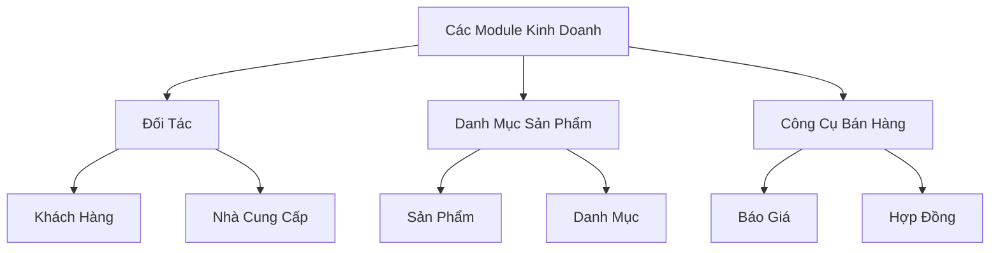
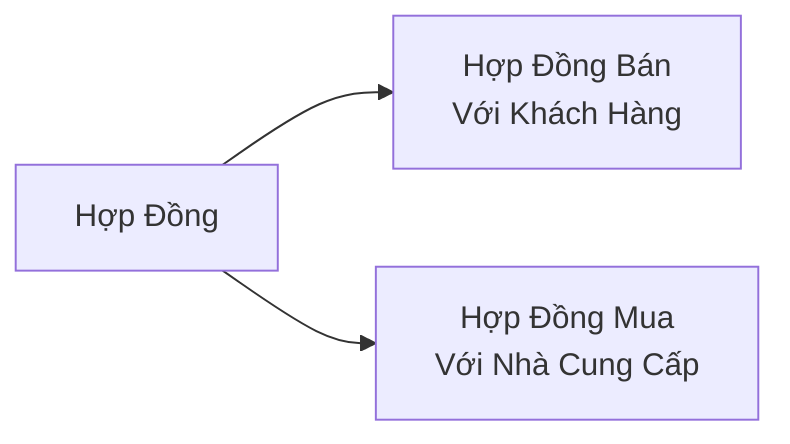

# 06 - Các Module Kinh Doanh

> Khách hàng, Nhà cung cấp, Sản phẩm, Danh mục, Hợp đồng, Báo giá

---

## Tổng Quan Module



---

## Khách Hàng & Nhà Cung Cấp

### Mẫu Chung

**Cả hai module đều tuân theo cấu trúc giống nhau:**

```
Manager → Table → Form → Detail
```

**Các phương thức Service Layer:**
- `getQueryBuilder()` - Truy vấn cơ bản
- `getFilteredQuery($filters)` - Với tìm kiếm/bộ lọc
- `findById($id)` - Lấy một
- `create($data, $avatar)` - Tạo mới
- `update($id, $data, $avatar)` - Cập nhật
- `delete($id)` - Xóa
- `getInvoiceSummary($id, $year, $quarter)` - Tóm tắt tài chính
- `getInvoiceBuilder($id, $year, $quarter)` - Truy vấn hóa đơn
- `getContractBuilder($id, $status, $year, $quarter)` - Truy vấn hợp đồng

### Sự Khác Biệt Chính: Quản Lý Tài Khoản

**Khách hàng có tài khoản đối tác, Nhà cung cấp thì không:**

```php
// ✅ CustomerService
public function createQuickAccountPartner(int $customerId): array {
    $customer = $this->findById($customerId);
    
    // Tạo mật khẩu tạm thời
    $password = Str::random(12);
    
    // Tạo tài khoản người dùng
    $user = User::create([
        'first_name' => explode(' ', $customer->customer_name)[0],
        'last_name' => implode(' ', array_slice(explode(' ', $customer->customer_name), 1)),
        'email' => $customer->email,
        'password' => Hash::make($password),
        'company_id' => $customer->company_id,
        'customer_id' => $customer->id,  // Liên kết với khách hàng
        'is_active' => true,
    ]);
    
    return ['user' => $user, 'password' => $password];
}

// ❌ SupplierService - KHÔNG có phương thức tài khoản!
```

### Xử Lý Đối Tác Nước Ngoài

**Mã số thuế tùy chọn cho đối tác nước ngoài:**

```php
// Validation trong Form
protected function rules() {
    $rules = [
        'customerName' => 'required|string|max:255',
        'email' => 'nullable|email',
        'phone' => 'nullable|string',
    ];
    
    // Mã số thuế bắt buộc cho trong nước, tùy chọn cho nước ngoài
    if (!$this->isForeign) {
        $rules['taxId'] = 'required|string|max:50|unique:customers,tax_id';
    }
    
    return $rules;
}
```

### Chuyển Đổi Tiền Tệ

**Tất cả dữ liệu tài chính hiển thị hai loại tiền tệ:**

```php
// Phương thức Service
public function formatInvoiceForDisplay($invoice): array {
    $currencyHelper = app(CurrencyHelper::class);
    $displayCurrency = 'VND';
    
    $converted = $currencyHelper->convertToDisplayCurrency(
        $invoice->grand_total,
        $invoice->currency,
        $invoice->transferCurrency,
        $invoice->company_id
    );
    
    return [
        'grand_total_raw' => $invoice->grand_total,  // Gốc
        'grand_total' => $converted,                 // Chuyển đổi sang VND
        'grand_total_formatted' => number_format($converted, 0, ',', '.') . '₫',
        'grand_total_raw_formatted' => $this->formatAmount($invoice->grand_total, $invoice->currency),
        'currency' => $invoice->currency,
        'display_currency' => $displayCurrency,
    ];
}
```

---

## Module Sản Phẩm

### Quản Lý Sản Phẩm

**Cấu trúc:**
- Danh mục (phân cấp)
- Sản phẩm (với biến thể tùy chọn)
- Theo dõi tồn kho theo kho

### Cây Danh Mục

```php
// app/Models/Category.php
class Category extends Model {
    public function parent() {
        return $this->belongsTo(Category::class, 'parent_id');
    }
    
    public function children() {
        return $this->hasMany(Category::class, 'parent_id');
    }
    
    public function products() {
        return $this->hasMany(Product::class);
    }
}

// Xây dựng cây
function buildCategoryTree($categories, $parentId = null) {
    $tree = [];
    foreach ($categories as $category) {
        if ($category->parent_id == $parentId) {
            $children = buildCategoryTree($categories, $category->id);
            if ($children) {
                $category->children = $children;
            }
            $tree[] = $category;
        }
    }
    return $tree;
}
```

### Các Trường Sản Phẩm

```php
// Trường thiết yếu
'name'           // Tên sản phẩm
'sku'            // Mã SKU (duy nhất mỗi công ty)
'category_id'    // Danh mục
'unit'           // Đơn vị (cái, kg, hộp,...)
'quantity'       // Tồn kho hiện tại
'purchase_price' // Giá mua
'sold_price'     // Giá bán
'vat_rate'       // %VAT (0, 5, 8, 10)
'description'    // Mô tả
'image'          // Ảnh sản phẩm

// Tùy chọn
'barcode'
'min_stock_level'  // Cảnh báo tồn kho thấp
'max_stock_level'
'is_active'
```

### Theo Dõi Tồn Kho

```php
// Tồn kho thời gian thực
$product = Product::find($id);
$currentStock = $product->quantity;  // Qua tất cả kho

// Theo kho (nếu được bật)
$warehouseStock = WarehouseProduct::where('product_id', $id)
    ->where('warehouse_id', $warehouseId)
    ->first()
    ->quantity;
```

---

## Module Hợp Đồng

### Loại Hợp Đồng



### Vòng Đời Hợp Đồng

```
Nháp → Đang Thực Hiện → Hoàn Thành → (Gia Hạn?)
  ↓         ↓
Hủy      Tạm Dừng
```

### Các Trường Hợp Đồng

```php
'contract_number'  // Tự động tạo hoặc thủ công
'name'             // Tên hợp đồng
'customer_id' hoặc 'supplier_id'
'start_date'       // Ngày bắt đầu
'end_date'         // Ngày kết thúc
'total_value'      // Tổng giá trị
'currency'         // Đơn vị tiền tệ
'status'           // nháp, đang_thực_hiện, hoàn_thành, v.v.
'payment_terms'    // Điều khoản thanh toán
'notes'            // Ghi chú
'attachments'      // File PDF
```

### Cảnh Báo Hết Hạn

```php
// Dashboard hiển thị hợp đồng sắp hết hạn
$warningDays = $company->config->getSetting('processing_settings.contract_warning_days', 15);

$expiringContracts = SaleContract::where('company_id', $companyId)
    ->where('status', 'in_progress')
    ->whereBetween('end_date', [Carbon::now(), Carbon::now()->addDays($warningDays)])
    ->get();
```

---

## Module Báo Giá

### Luồng Báo Giá Thành Hóa Đơn

```
Báo Giá (Đang Chờ) → Khách Hàng Chấp Thuận → Tạo Hóa Đơn
```

### Cấu Trúc Báo Giá

```php
// Tương tự hóa đơn nhưng trạng thái: đang_chờ, chấp_thuận, từ_chối
'quotation_number'  // Số báo giá
'customer_id'       // ID khách hàng
'quotation_date'    // Ngày báo giá
'expiry_date'       // Báo giá có hiệu lực đến
'status'            // đang_chờ, chấp_thuận, từ_chối, hết_hạn
'subtotal'          // Tạm tính
'vat_amount'        // Thuế VAT
'grand_total'       // Tổng cộng
'notes'             // Ghi chú

// Các mục
QuotationItem:
  - product_id
  - quantity
  - unit_price
  - vat_rate
  - total_price
```

### Chuyển Đổi Thành Hóa Đơn

```php
public function convertToInvoice($quotationId) {
    $quotation = Quotation::with('items')->findOrFail($quotationId);
    
    // Tạo hóa đơn với cùng các mục
    $invoice = SaleInvoice::create([
        'company_id' => $quotation->company_id,
        'customer_id' => $quotation->customer_id,
        'sale_number' => $this->generateInvoiceNumber(),
        'sale_date' => now(),
        'currency' => $quotation->currency,
        'status' => 'pending',
        // Sao chép tổng
    ]);
    
    // Sao chép các mục
    foreach ($quotation->items as $item) {
        SaleItem::create([
            'sale_id' => $invoice->id,
            'product_id' => $item->product_id,
            'quantity' => $item->quantity,
            'unit_price' => $item->unit_price,
            //...
        ]);
    }
    
    // Đánh dấu báo giá đã chuyển đổi
    $quotation->update(['status' => 'converted']);
    
    return $invoice;
}
```

---

## Các Mẫu Chung

### Tìm Kiếm & Lọc

**Tất cả module kinh doanh hỗ trợ:**

```php
// Trong Service
public function getFilteredQuery(array $filters = []): Builder {
    $query = $this->getQueryBuilder();
    
    // Tìm kiếm văn bản
    if (!empty($filters['search'])) {
        $search = $filters['search'];
        $query->where(function($q) use ($search) {
            $q->where('name', 'like', "%{$search}%")
              ->orWhere('code', 'like', "%{$search}%")
              ->orWhere('email', 'like', "%{$search}%");
        });
    }
    
    // Lọc trạng thái
    if (!empty($filters['status'])) {
        $query->where('status', $filters['status']);
    }
    
    // Phạm vi ngày
    if (!empty($filters['from_date'])) {
        $query->whereDate('created_at', '>=', $filters['from_date']);
    }
    
    return $query;
}
```

### Chức Năng Xuất

**Xuất Excel/PDF cho tất cả danh sách:**

```php
// app/Exports/CustomersExport.php
class CustomersExport implements FromQuery, WithHeadings {
    public function query() {
        return Customer::query()
            ->where('company_id', Auth::user()->company_id);
    }
    
    public function headings(): array {
        return ['ID', 'Tên', 'Email', 'Phone', 'Địa chỉ', 'MST'];
    }
}

// Trong Livewire
public function exportExcel() {
    return Excel::download(new CustomersExport, 'khach-hang.xlsx');
}

public function exportPDF() {
    $customers = Customer::all();
    $pdf = PDF::loadView('exports.customers-pdf', compact('customers'));
    return $pdf->download('khach-hang.pdf');
}
```

### Thao Tác Hàng Loạt

```php
// Xóa nhiều
public function bulkDelete(array $ids) {
    Customer::whereIn('id', $ids)->delete();
    $this->dispatch('refresh');
}

// Cập nhật trạng thái hàng loạt
public function bulkUpdateStatus(array $ids, string $status) {
    Product::whereIn('id', $ids)->update(['is_active' => $status === 'active']);
}
```

---

## So Sánh Module

| Tính Năng | Khách Hàng | Nhà Cung Cấp | Sản Phẩm | Hợp Đồng |
|-----------|------------|--------------|----------|----------|
| **Tài khoản đối tác** | ✅ Có | ❌ Không | N/A | N/A |
| **Hóa đơn** | Bán | Mua | Mục trong hóa đơn | Tham chiếu |
| **Hợp đồng** | Bán | Mua | N/A | Thực thể chính |
| **Tiền tệ** | Đa loại | Đa loại | Giá đơn | Đa loại |
| **Mã số thuế** | Tùy chọn (nước ngoài) | Tùy chọn (nước ngoài) | N/A | N/A |
| **Avatar/Logo** | ✅ Có | ✅ Có | ✅ Hình ảnh | ❌ Không |

---

## API Endpoints

**Tất cả module kinh doanh đều có REST APIs:**

```
GET    /api/customers              # Danh sách
POST   /api/customers              # Tạo
GET    /api/customers/{id}         # Xem
PUT    /api/customers/{id}         # Cập nhật
DELETE /api/customers/{id}         # Xóa
GET    /api/customers/{id}/invoices/summary  # Tóm tắt tài chính
```

**Cùng cấu trúc cho:**

- `/api/suppliers`
- `/api/products`
- `/api/contracts/sale`
- `/api/contracts/purchase`
- `/api/quotations`

---

## Lệnh Tham Khảo Nhanh

```bash
# Tạo module kinh doanh mới
php artisan make:livewire Main/NewModule/NewModuleManager
php artisan make:livewire Main/NewModule/NewModuleTable
php artisan make:livewire Main/NewModule/NewModuleForm

# Tạo service
touch app/Services/App/NewModuleService.php

# Tạo migration
php artisan make:migration create_new_modules_table
```

---

## Bước Tiếp Theo

✅ Đã hiểu các module kinh doanh!

**Tiếp tục:**
- [Hệ Thống Hóa Đơn](07-invoice-system.md) - Quy trình phức tạp
- [Hệ Thống Kho](08-inventory-system.md) - Quản lý tồn kho
- [Phiếu Thu Chi](09-payment-vouchers.md) - Giao dịch tài chính

