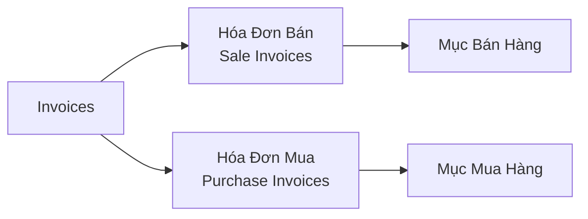
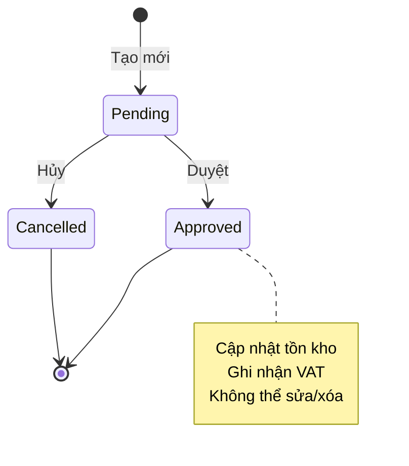
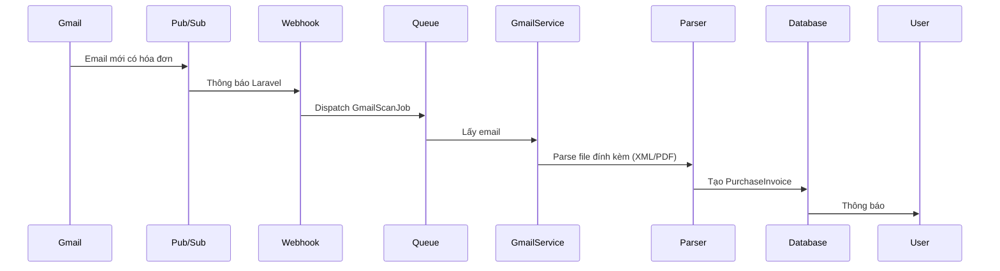

# 07 - Hệ Thống Hóa Đơn

> Hệ thống hóa đơn mua/bán - Quy trình phức tạp nhất

**Module Quan Trọng** - Quy trình kinh doanh cốt lõi

---

## Loại Hóa Đơn



---

## Vòng Đời Hóa Đơn



**Luồng Trạng Thái:**
1. **Pending** - Chờ duyệt (có thể sửa)
2. **Approved** - Đã duyệt (khóa, cập nhật tồn kho)
3. **Cancelled** - Đã hủy (khóa)

---

## Tạo Hóa Đơn

### Bước 1: Chọn Đối Tác

```php
// Chọn khách hàng (bán) hoặc nhà cung cấp (mua)
public $customerId;  // Cho hóa đơn bán
public $supplierId;  // Cho hóa đơn mua

// Load dữ liệu đối tác
public function updatedCustomerId($value) {
    $customer = Customer::find($value);
    $this->partnerName = $customer->customer_name;
    $this->partnerAddress = $customer->address;
    $this->partnerTaxId = $customer->tax_id;
}
```

### Bước 2: Thêm Sản Phẩm

```php
// Cấu trúc sản phẩm
$this->items = [
    [
        'product_id' => 1,
        'product_name' => 'Laptop Dell',
        'quantity' => 2,
        'unit_price' => 15000000,
        'vat_rate' => 10,          // %
        'total_price' => 30000000, // số_lượng * đơn_giá
        'vat_amount' => 3000000,   // tổng_giá * vat_rate / 100
    ]
];

// Thêm sản phẩm mới
public function addItem() {
    $this->items[] = [
        'product_id' => null,
        'quantity' => 1,
        'unit_price' => 0,
        'vat_rate' => 10,
    ];
}

// Tính tổng khi sản phẩm thay đổi
public function updatedItems() {
    foreach ($this->items as $index => $item) {
        $totalPrice = $item['quantity'] * $item['unit_price'];
        $vatAmount = $totalPrice * $item['vat_rate'] / 100;
        
        $this->items[$index]['total_price'] = $totalPrice;
        $this->items[$index]['vat_amount'] = $vatAmount;
    }
    
    $this->calculateTotals();
}

public function calculateTotals() {
    $subtotal = collect($this->items)->sum('total_price');
    $vatTotal = collect($this->items)->sum('vat_amount');
    
    $this->subtotal = $subtotal;
    $this->vatAmount = $vatTotal;
    $this->grandTotal = $subtotal + $vatTotal;
}
```

### Bước 3: Thông Tin Hóa Đơn

```php
// Trường bắt buộc
'invoice_number'  // ví dụ: INV-2025-001
'invoice_date'    // Ngày hóa đơn
'currency'        // VND, USD, EUR
'payment_method'  // tiền mặt, chuyển khoản, thẻ
'notes'           // Ghi chú (tùy chọn)

// Tùy chọn
'due_date'        // Hạn thanh toán
'discount_amount' // Giảm giá nếu có
'attachments'     // File XML, PDF
```

### Bước 4: Lưu

```php
public function save() {
    $this->validate();
    
    DB::transaction(function() {
        // Tạo hóa đơn
        $invoice = SaleInvoice::create([
            'company_id' => Auth::user()->company_id,
            'customer_id' => $this->customerId,
            'sale_number' => $this->generateNumber(),
            'sale_date' => $this->invoiceDate,
            'currency' => $this->currency,
            'status' => 'pending',  // Luôn pending ban đầu
            'subtotal' => $this->subtotal,
            'vat_amount' => $this->vatAmount,
            'grand_total' => $this->grandTotal,
        ]);
        
        // Tạo các mục hàng
        foreach ($this->items as $item) {
            SaleItem::create([
                'sale_id' => $invoice->id,
                'product_id' => $item['product_id'],
                'quantity' => $item['quantity'],
                'unit_price' => $item['unit_price'],
                'vat_rate' => $item['vat_rate'],
                'total_price' => $item['total_price'],
                'vat_amount' => $item['vat_amount'],
            ]);
        }
    });
    
    return redirect()->route('invoices.sale');
}
```

---

## Quy Trình Duyệt

### Quản Lý Duyệt Hóa Đơn

```php
// app/Livewire/Main/Invoices/SaleInvoiceDetail.php
public function approve() {
    // Kiểm tra quyền
    if (!Auth::user()->hasPermission('invoices.sale.approve')) {
        abort(403);
    }
    
    DB::transaction(function() {
        // Cập nhật trạng thái
        $this->invoice->update(['status' => 'approved']);
        
        // Cập nhật tồn kho (trừ kho khi bán)
        foreach ($this->invoice->items as $item) {
            $product = Product::find($item->product_id);
            $product->decrement('quantity', $item->quantity);
        }
        
        // Tạo log kiểm toán
        AuditLog::create([
            'model_type' => SaleInvoice::class,
            'model_id' => $this->invoice->id,
            'action' => 'approved',
            'user_id' => Auth::id(),
        ]);
        
        // Kích hoạt sự kiện (thông báo real-time)
        event(new InvoiceApproved($this->invoice));
    });
    
    $this->message = 'Đã duyệt hóa đơn thành công!';
}
```

### Tác Động Lên Tồn Kho: Mua vs Bán

```php
// Hóa đơn BÁN được duyệt → GIẢM tồn kho
$product->decrement('quantity', $soldQuantity);

// Hóa đơn MUA được duyệt → TĂNG tồn kho
$product->increment('quantity', $purchasedQuantity);
```

---

## Tích Hợp Email

### Tự Động Import Từ Gmail



**Các Thành Phần Chính:**

```php
// 1. Gmail webhook nhận thông báo
// app/Http/Controllers/GmailController.php
public function webhook(Request $request) {
    $message = $request->input('message');
    
    // Dispatch vào queue (bất đồng bộ)
    GmailScanJob::dispatch($message);
    
    return response()->json(['success' => true]);
}

// 2. Job xử lý email
// app/Jobs/GmailScanJob.php
public function handle() {
    $gmailService = app(GmailService::class);
    $email = $gmailService->fetchMessage($this->messageId);
    
    // Kiểm tra file đính kèm hóa đơn
    if ($this->hasInvoiceAttachment($email)) {
        $this->processInvoiceEmail($email);
    }
}

// 3. Parse XML hóa đơn
private function processInvoiceEmail($email) {
    $xml = $this->extractXML($email->attachments);
    $data = $this->parseInvoiceXML($xml);
    
    // Tạo hóa đơn mua
    PurchaseInvoice::create([
        'company_id' => $this->companyId,
        'supplier_id' => $this->findOrCreateSupplier($data['supplier']),
        'purchase_number' => $data['invoice_number'],
        'purchase_date' => $data['invoice_date'],
        'status' => 'pending',
        // ... các trường khác
    ]);
}
```

---

## Xử Lý Đa Tiền Tệ

### Hỗ Trợ Nhiều Loại Tiền

```php
// Hóa đơn bằng USD
$invoice = SaleInvoice::create([
    'currency' => 'USD',
    'grand_total' => 1000,  // $1,000
]);

// Hiển thị bằng VND
$currencyHelper = app(CurrencyHelper::class);
$convertedAmount = $currencyHelper->convertToDisplayCurrency(
    1000,
    'USD',
    $invoice->transferCurrency,  // Tỷ giá tại thời điểm
    $companyId
);
// Trả về: 24,000,000 (VND)
```

### Tỷ Giá Hối Đoái

```sql
-- Bảng transfer_currencies
id | company_id | date | from_currency | to_currency | rate
1  | 1 | 2025-01-01 | USD | VND | 24000
2  | 1 | 2025-01-01 | EUR | VND | 26000
```

---

## Tính Toán VAT

### VAT Đầu Vào vs Đầu Ra

```php
// Hóa đơn BÁN (VAT đầu ra - khách hàng trả)
$outputVAT = $subtotal * 0.10;  // Khách hàng trả

// Hóa đơn MUA (VAT đầu vào - được khấu trừ)
$inputVAT = $subtotal * 0.10;   // Được khấu trừ

// Số dư VAT
$vatBalance = $outputVAT - $inputVAT;
// Dương = phải nộp thuế
// Âm = được khấu trừ kỳ sau
```

### Báo Cáo VAT

```php
// Tóm tắt VAT theo tháng
public function getVATSummary($month, $year) {
    $sales = SaleInvoice::whereMonth('sale_date', $month)
        ->whereYear('sale_date', $year)
        ->where('status', 'approved')
        ->sum('vat_amount');
    
    $purchases = PurchaseInvoice::whereMonth('purchase_date', $month)
        ->whereYear('purchase_date', $year)
        ->where('status', 'approved')
        ->sum('vat_amount');
        
    return [
        'output_vat' => $sales,      // VAT đầu ra
        'input_vat' => $purchases,   // VAT đầu vào
        'balance' => $sales - $purchases,
    ];
}
```

---

## File Đính Kèm

### Upload File Hóa Đơn

```php
// XML hóa đơn từ cơ quan thuế
public $xmlFile;

// PDF hóa đơn scan
public $pdfFile;

// Chứng từ thanh toán
public $proofFile;

public function save() {
    // Lưu trữ files
    $xmlPath = $this->xmlFile?->store('invoices/xml', 'private');
    $pdfPath = $this->pdfFile?->store('invoices/pdf', 'private');
    $proofPath = $this->proofFile?->store('invoices/proofs', 'private');
    
    // Lưu đường dẫn vào hóa đơn
    $invoice->update([
        'xml_file' => $xmlPath,
        'pdf_file' => $pdfPath,
        'payment_proof' => $proofPath,
    ]);
}
```

### Serving File Bảo Mật

```php
// routes/files.php
Route::get('/files/invoice/{type}/{id}', function($type, $id) {
    $invoice = SaleInvoice::findOrFail($id);
    
    // Kiểm tra bảo mật
    if ($invoice->company_id !== Auth::user()->company_id) {
        abort(403);
    }
    
    $path = match($type) {
        'xml' => $invoice->xml_file,
        'pdf' => $invoice->pdf_file,
        'proof' => $invoice->payment_proof,
    };
    
    return response()->file(storage_path('app/private/' . $path));
})->middleware('auth');
```

---

## Quy Tắc Sửa & Xóa

```php
// Chỉ có thể sửa/xóa hóa đơn PENDING
public function edit() {
    if ($this->invoice->status !== 'pending') {
        abort(403, 'Không thể sửa hóa đơn đã duyệt');
    }
    
    // Cho phép sửa
}

public function delete() {
    if ($this->invoice->status === 'approved') {
        abort(403, 'Không thể xóa hóa đơn đã duyệt');
    }
    
    // Xóa hóa đơn và các mục
    DB::transaction(function() {
        $this->invoice->items()->delete();
        $this->invoice->delete();
    });
}
```

---

## Thống Kê Hóa Đơn

### Tích Hợp Dashboard

```php
// Thống kê real-time trên dashboard
$stats = [
    'totalSaleInvoices' => SaleInvoice::count(),
    'approvedSales' => SaleInvoice::where('status', 'approved')->count(),
    'pendingSales' => SaleInvoice::where('status', 'pending')->count(),
    
    'totalRevenue' => SaleInvoice::where('status', 'approved')
        ->sum('grand_total'),
        
    'totalCost' => PurchaseInvoice::where('status', 'approved')
        ->sum('grand_total'),
        
    'profit' => $totalRevenue - $totalCost,
];
```

---

## Vấn Đề Thường Gặp

### Vấn Đề 1: Tồn Kho Âm

```php
// Ngăn chặn duyệt nếu không đủ hàng
public function approve() {
    foreach ($this->invoice->items as $item) {
        $product = Product::find($item->product_id);
        
        if ($product->quantity < $item->quantity) {
            throw new \Exception(
                "Không đủ tồn kho cho sản phẩm {$product->name}. " .
                "Hiện có: {$product->quantity}, cần: {$item->quantity}"
            );
        }
    }
    
    // Tiếp tục duyệt
}
```

### Vấn Đề 2: Tiền Tệ Không Khớp

```php
// Đảm bảo các mục dùng cùng loại tiền với hóa đơn
foreach ($items as $item) {
    if ($item['currency'] !== $invoice->currency) {
        throw new \Exception('Đơn vị tiền tệ không khớp');
    }
}
```

---

## API Endpoints

```
GET    /api/invoices/sale              # Danh sách hóa đơn bán
POST   /api/invoices/sale              # Tạo mới
GET    /api/invoices/sale/{id}         # Xem chi tiết
PUT    /api/invoices/sale/{id}         # Cập nhật (chỉ pending)
DELETE /api/invoices/sale/{id}         # Xóa (chỉ pending)
POST   /api/invoices/sale/{id}/approve # Duyệt

GET    /api/invoices/purchase          # Danh sách hóa đơn mua
POST   /api/invoices/purchase          # Tạo mới
...
```

---

## Tham Khảo Nhanh

### Quy Trình Hóa Đơn

```
1. Tạo (Pending)
2. Thêm Sản Phẩm
3. Tính Tổng
4. Lưu
5. Xem Lại
6. Duyệt → Cập Nhật Tồn Kho
```

### Quy Tắc Quan Trọng

- ✅ **Pending**: Có thể sửa, xóa
- ❌ **Approved**: Chỉ đọc, đã cập nhật tồn kho
- ⚠️ **Hóa đơn bán đã duyệt**: Giảm tồn kho
- ⚠️ **Hóa đơn mua đã duyệt**: Tăng tồn kho
- 💰 **VAT**: Đầu ra (bán) - Đầu vào (mua)
- 💱 **Tiền tệ**: Hiển thị kép (gốc + VND)

---

## Bước Tiếp Theo

✅ Đã nắm vững hệ thống hóa đơn!

**Tiếp tục:**
- [Hệ Thống Kho](08-inventory-system.md) - Theo dõi tồn kho
- [Phiếu Thu Chi](09-payment-vouchers.md) - Giao dịch tài chính
- [Quét Email](10-email-scanning-system.md) - Tự động hóa Gmail
