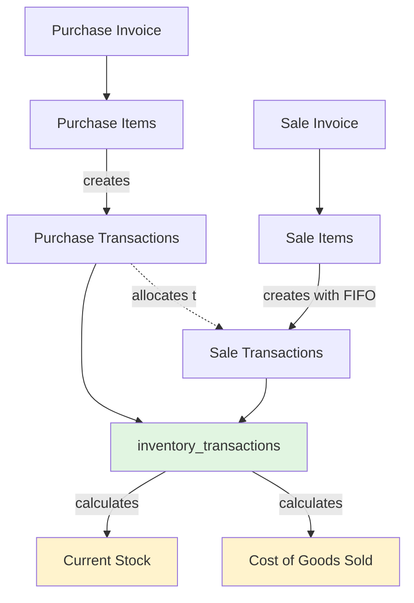
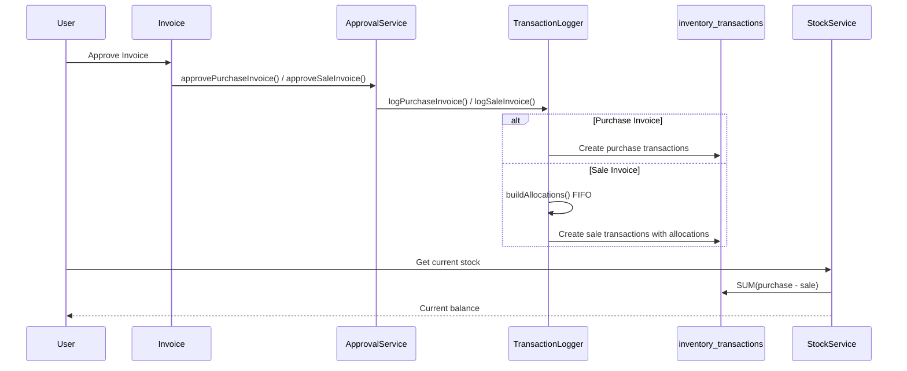

# 08 - Hệ Thống Quản Lý Tồn Kho

> Quản lý tồn kho dựa trên ledger transaction với phân bổ FIFO (First-In-First-Out)

---

## 📋 Mục lục

- [Tổng quan](#tổng-quan)
- [Kiến trúc hệ thống](#kiến-trúc-hệ-thống)
- [Cấu trúc Database](#cấu-trúc-database)
- [Các loại Transaction](#các-loại-transaction)
- [Quy trình duyệt hóa đơn](#quy-trình-duyệt-hóa-đơn)
- [Phân bổ FIFO](#phân-bổ-fifo)
- [Tính tồn kho](#tính-tồn-kho)
- [Tính giá vốn và lợi nhuận](#tính-giá-vốn-và-lợi-nhuận)
- [Sử dụng Services](#sử-dụng-services)

---

## Tổng quan

### Đặc điểm chính

Hệ thống inventory **KHÔNG sử dụng** cột `products.quantity` để track tồn kho. Thay vào đó:

✅ **Transaction-based Ledger**
- Mọi nhập/xuất được ghi vào bảng `inventory_transactions`
- Tồn kho được tính **real-time** từ ledger
- Không cập nhật trực tiếp vào bảng products

✅ **FIFO Allocation (First-In-First-Out)**
- Hàng mua trước được bán trước
- Mỗi lần bán đều được phân bổ về purchase items cụ thể
- Tính giá vốn chính xác theo FIFO

✅ **Item-level Tracking**
- Track ở mức `purchase_item_id` ↔ `sale_item_id`
- Biết chính xác hàng bán xuất phát từ lô hàng mua nào
- Hỗ trợ chuyển đổi sản phẩm (conversion)

---

## Kiến trúc hệ thống



### Luồng dữ liệu



---

## Cấu trúc Database

### Bảng inventory_transactions

```sql
CREATE TABLE inventory_transactions (
    id BIGINT PRIMARY KEY,
    company_id BIGINT NOT NULL,
    product_id BIGINT NOT NULL,
    
    -- Loại giao dịch
    transaction_type ENUM('purchase', 'sale', 'conversion_in', 'conversion_out', 'undetermined'),
    
    -- References
    purchase_id BIGINT NULL,           -- References purchase_invoices
    sale_id BIGINT NULL,               -- References sale_invoices  
    purchase_item_id BIGINT NULL,      -- References purchase_items
    sale_item_id BIGINT NULL,          -- References sale_items
    conversion_item_id BIGINT NULL,    -- References conversion_items
    
    -- Số lượng
    quantity DECIMAL(15,4) NOT NULL,
    
    -- Audit
    approved_by BIGINT NOT NULL,
    approved_at TIMESTAMP NOT NULL,
    created_at TIMESTAMP,
    updated_at TIMESTAMP,
    
    KEY idx_company_product (company_id, product_id),
    KEY idx_purchase_item (purchase_item_id),
    KEY idx_sale_item (sale_item_id)
);
```

### Relationships

```php
// InventoryTransaction Model
public function purchaseItem() {
    return $this->belongsTo(PurchaseItem::class);
}

public function saleItem() {
    return $this->belongsTo(SaleItem::class);
}

public function purchaseInvoice() {
    return $this->belongsTo(PurchaseInvoice::class, 'purchase_id');
}

public function saleInvoice() {
    return $this->belongsTo(SaleInvoice::class, 'sale_id');
}
```

---

## Các loại Transaction

### 1. Purchase (Mua hàng vào)

**Khi nào tạo:** Khi duyệt purchase invoice

```php
InventoryTransaction::create([
    'company_id' => $companyId,
    'product_id' => $productId,
    'transaction_type' => 'purchase',
    'purchase_id' => $invoiceId,
    'purchase_item_id' => $itemId,
    'quantity' => 100,  // Số dương
    'approved_by' => $userId,
    'approved_at' => now(),
]);
```

**Ảnh hưởng:** Tăng tồn kho (+)

### 2. Sale (Bán hàng ra)

**Khi nào tạo:** Khi duyệt sale invoice

```php
InventoryTransaction::create([
    'company_id' => $companyId,
    'product_id' => $productId,
    'transaction_type' => 'sale',
    'sale_id' => $invoiceId,
    'sale_item_id' => $saleItemId,
    'purchase_item_id' => $allocatedPurchaseItemId,  // FIFO allocation
    'quantity' => 50,  // Số dương (nhưng trừ khi tính)
    'approved_by' => $userId,
    'approved_at' => now(),
]);
```

**Ảnh hưởng:** Giảm tồn kho (-)

### 3. Conversion In/Out (Chuyển đổi sản phẩm)

**conversion_out:** Sản phẩm trước khi chuyển đổi (giảm tồn kho -)  
**conversion_in:** Sản phẩm sau khi chuyển đổi (tăng tồn kho +)

**Ví dụ:** Chuyển 10 kg nguyên liệu thành 8 sp thành phẩm

```php
// Nguyên liệu giảm
InventoryTransaction::create([
    'transaction_type' => 'conversion_out',
    'product_id' => $rawMaterialId,
    'quantity' => 10,
]);

// Thành phẩm tăng  
InventoryTransaction::create([
    'transaction_type' => 'conversion_in',
    'product_id' => $finishedProductId,
    'quantity' => 8,
]);
```

### 4. Undetermined (Tự sản xuất/Điều chỉnh)

Dùng cho hàng tự sản xuất hoặc điều chỉnh không rõ nguồn gốc

**Ảnh hưởng:** Tăng tồn kho (+)

---

## Quy trình duyệt hóa đơn

### Duyệt Purchase Invoice (Hóa đơn MUA)

```php
// app/Livewire/Main/Invoices/Purchase/PurchaseInvoiceDetail.php
public function approve() {
    $approvalService = app(\App\Services\Utils\InvoiceApprovalService::class);
    
    try {
        $approvalService->approvePurchaseInvoice(
            $this->invoice->company_id,
            $this->invoice->id,
            Auth::id()
        );
        
        session()->flash('success', 'Đã duyệt hóa đơn mua');
    } catch (\Exception $e) {
        session()->flash('error', $e->getMessage());
    }
}
```

**Quy trình bên trong:**

```php
// app/Services/Utils/InvoiceApprovalService.php
public function approvePurchaseInvoice(int $companyId, int $purchaseInvoiceId, int $approvedBy) {
    return DB::transaction(function() use ($companyId, $purchaseInvoiceId, $approvedBy) {
        $invoice = PurchaseInvoice::findOrFail($purchaseInvoiceId);
        
        // 1. Kiểm tra điều kiện duyệt
        $this->checkAttachmentRequirement($invoice, $companyId);
        $this->checkPaymentVoucherRequirement($invoice, $companyId);
        
        // 2. Ghi log inventory transactions (tạo purchase transactions)
        $this->transactionLogger->logPurchaseInvoice($invoice, $approvedBy);
        
        // 3. Cập nhật trạng thái approved
        $invoice->update([
            'status' => 'approved',
            'approved_at' => now(),
            'approved_by' => $approvedBy,
        ]);
        
        return $invoice;
    });
}
```

### Duyệt Sale Invoice (Hóa đơn BÁN)

```php
// app/Livewire/Main/Invoices/Sale/SalesInvoiceDetail.php
public function approve() {
    $approvalService = app(\App\Services\Utils\InvoiceApprovalService::class);
    
    try {
        $approvalService->approveSaleInvoice(
            $this->invoice->company_id,
            $this->invoice,
            Auth::id()
        );
        
        session()->flash('success', 'Đã duyệt hóa đơn bán');
    } catch (\Exception $e) {
        // Lỗi thường là: không đủ tồn kho
        session()->flash('error', $e->getMessage());
    }
}
```

**Quy trình bên trong với FIFO:**

```php
// app/Services/Utils/InvoiceApprovalService.php
public function approveSaleInvoice(int $companyId, SaleInvoice $invoice, int $approvedBy) {
    return DB::transaction(function() use ($companyId, $invoice, $approvedBy) {
        // 1. Kiểm tra điều kiện
        $this->checkAttachmentRequirement($invoice, $companyId);
        $this->checkPaymentVoucherRequirement($invoice, $companyId);
        
        // 2. Ghi log với FIFO allocation (quan trọng!)
        // Sẽ throw exception nếu không đủ hàng
        $this->transactionLogger->logSaleInvoice($invoice, $approvedBy);
        
        // 3. Tính lợi nhuận dựa trên FIFO cost
        $profit = $this->calculateAndUpdateProfit($invoice);
        
        // 4. Cập nhật trạng thái
        $invoice->update([
            'status' => 'approved',
            'approved_at' => now(),
            'approved_by' => $approvedBy,
            'profit' => $profit,
        ]);
        
        return $invoice;
    });
}
```

---

## Phân bổ FIFO

### Nguyên tắc FIFO

**First-In-First-Out:** Hàng mua trước được bán trước

```
Mua 20/12: 100 sp @ 10,000đ
Mua 22/12: 50 sp @ 12,000đ

Bán 23/12: 120 sp
→ Phân bổ: 
  - 100 sp từ lô 20/12 (giá vốn 10,000đ)
  - 20 sp từ lô 22/12 (giá vốn 12,000đ)
```

### Thuật toán buildAllocations()

```php
// app/Services/Utils/InventoryTransactionLogger.php
protected function buildAllocations(int $companyId, int $productId, float $quantityNeeded) {
    // 1. Lấy tất cả purchase transactions (order by approved_at ASC)
    $purchaseTransactions = InventoryTransaction::query()
        ->where('company_id', $companyId)
        ->where('product_id', $productId)
        ->whereIn('transaction_type', ['purchase', 'undetermined', 'conversion_in'])
        ->orderBy('approved_at')  // FIFO: lấy cái cũ nhất trước
        ->lockForUpdate()
        ->get();
    
    if ($purchaseTransactions->isEmpty()) {
        throw new RuntimeException("Không có tồn kho");
    }
    
    // 2. Tính số lượng đã bán của mỗi purchase_item
    $saleRows = InventoryTransaction::query()
        ->where('transaction_type', 'sale')
        ->where('product_id', $productId)
        ->get()
        ->groupBy('purchase_item_id')
        ->map(fn($rows) => $rows->sum('quantity'));
    
    // 3. Phân bổ FIFO
    $allocations = [];
    $remaining = $quantityNeeded;
    
    foreach ($purchaseTransactions as $purchaseTx) {
        $purchaseItemId = $purchaseTx->purchase_item_id;
        $alreadySold = $saleRows[$purchaseItemId] ?? 0;
        $available = $purchaseTx->quantity - $alreadySold;
        
        if ($available <= 0) continue;
        
        $take = min($available, $remaining);
        
        $allocations[] = [
            'purchase_item_id' => $purchaseItemId,
            'quantity' => $take,
        ];
        
        $remaining -= $take;
        
        if ($remaining <= 0) break;
    }
    
    if ($remaining > 0) {
        throw new RuntimeException("Không đủ tồn kho. Thiếu: {$remaining}");
    }
    
    return $allocations;
}
```

### Ví dụ phân bổ

**Tình huống:**

```sql
-- Purchase transactions
purchase_item_id=1: 100 sp, approved_at='2024-01-10'
purchase_item_id=2: 50 sp, approved_at='2024-01-15'

-- Đã bán trước đó
sale transactions từ purchase_item_id=1: 30 sp

-- Tồn kho available:
purchase_item_id=1: 70 sp (100 - 30)
purchase_item_id=2: 50 sp
```

**Bán 80 sp:**

```php
allocations = [
    ['purchase_item_id' => 1, 'quantity' => 70],  // Lấy hết từ lô cũ
    ['purchase_item_id' => 2, 'quantity' => 10],  // Lấy 10 từ lô mới
]
```

**Kết quả:** Tạo 2 sale transactions:

```sql
INSERT INTO inventory_transactions VALUES
(transaction_type='sale', sale_item_id=123, purchase_item_id=1, quantity=70),
(transaction_type='sale', sale_item_id=123, purchase_item_id=2, quantity=10);
```

---

## Tính tồn kho

### Công thức

```
Tồn kho = SUM(purchase + conversion_in + undetermined) 
          - SUM(sale + conversion_out)
```

### Sử dụng InventoryStockService

```php
use App\Services\Utils\InventoryStockService;

$stockService = app(InventoryStockService::class);

// Tính tồn kho 1 sản phẩm
$stock = $stockService->getStock($companyId, $productId);
// => 125.5

// Tính tồn kho nhiều sản phẩm
$stockMap = $stockService->calculateStockBalance($companyId, [101, 102, 103]);
// => [101 => 50.0, 102 => 0.0, 103 => 200.5]

// Tính tồn kho tất cả sản phẩm
$allStock = $stockService->calculateStockBalance($companyId);
// => [101 => 50.0, 102 => 0.0, 103 => 200.5, ...]
```

### Implementation bên trong

```php
// app/Services/Utils/InventoryStockService.php
public function calculateStockBalance(int $companyId, ?array $productIds = null) {
    $query = InventoryTransaction::query()
        ->selectRaw("
            product_id,
            SUM(
                CASE
                    WHEN transaction_type IN ('purchase', 'undetermined', 'conversion_in') 
                    THEN quantity
                    WHEN transaction_type IN ('sale', 'conversion_out') 
                    THEN -ABS(quantity)
                    ELSE 0
                END
            ) as balance
        ")
        ->where('company_id', $companyId)
        ->groupBy('product_id');
    
    if ($productIds !== null) {
        $query->whereIn('product_id', $productIds);
    }
    
    return $query->pluck('balance', 'product_id')
        ->map(fn($value) => (float) ($value ?? 0))
        ->all();
}
```

### Xem tồn kho chi tiết (Stock Breakdown)

```php
$breakdown = $stockService->getStockBreakdown($companyId, $productId);

// Kết quả:
[
    [
        'purchase_item_id' => 1,
        'purchase_number' => 'PMH-001',
        'total_quantity' => 100,
        'sold_quantity' => 30,
        'available_quantity' => 70,
        'unit_cost_gross' => 10000,
        'approved_at' => '2024-01-10',
    ],
    [
        'purchase_item_id' => 2,
        'purchase_number' => 'PMH-002',
        'total_quantity' => 50,
        'sold_quantity' => 0,
        'available_quantity' => 50,
        'unit_cost_gross' => 12000,
        'approved_at' => '2024-01-15',
    ],
]
```

---

## Tính giá vốn và lợi nhuận

### COGS (Cost of Goods Sold) theo FIFO

```php
// app/Services/Utils/InvoiceApprovalService.php
protected function calculateAndUpdateProfit(SaleInvoice $invoice) {
    $invoice->loadMissing(['items', 'transferCurrency']);
    
    $totalRevenue = 0;
    $totalCost = 0;
    
    foreach ($invoice->items as $saleItem) {
        // Doanh thu
        $revenue = $saleItem->quantity * $saleItem->unit_price_gross;
        $totalRevenue += $revenue;
        
        // Giá vốn: lấy từ inventory transactions (FIFO)
        $allocations = InventoryTransaction::where('sale_item_id', $saleItem->id)
            ->with('purchaseItem')
            ->get();
        
        $cost = 0;
        foreach ($allocations as $allocation) {
            $costPerUnit = $allocation->purchaseItem->unit_cost_gross ?? 0;
            $cost += $allocation->quantity * $costPerUnit;
        }
        
        $totalCost += $cost;
    }
    
    // Chuyển đổi về VND nếu cần
    $profit = $this->currencyHelper->convertToVND(
        $totalRevenue - $totalCost,
        $invoice->currency,
        $invoice->transfer_rate,
        $invoice->approved_at
    );
    
    $invoice->update(['profit' => $profit]);
    
    return $profit;
}
```

###Ví dụ tính lợi nhuận

**Purchase history:**

```
20/12: Mua 100 sp @ 10,000đ/sp
22/12: Mua 50 sp @ 12,000đ/sp
```

**Sale invoice 23/12:**

```
Bán 120 sp @ 15,000đ/sp
```

**Tính toán:**

```php
// Doanh thu
Revenue = 120 * 15,000 = 1,800,000đ

// Giá vốn FIFO
COGS = (100 * 10,000) + (20 * 12,000) = 1,240,000đ

// Lợi nhuận
Profit = 1,800,000 - 1,240,000 = 560,000đ
```

---

## Sử dụng Services

### Check tồn kho trước khi tạo sale invoice

```php
use App\Services\Utils\InventoryStockService;

public function checkAvailability() {
    $stockService = app(InventoryStockService::class);
    
    foreach ($this->items as $item) {
        $available = $stockService->getStock(
            Auth::user()->company_id,
            $item['product_id']
        );
        
        if ($available < $item['quantity']) {
            throw new \Exception(
                "Sản phẩm {$item['product_name']} chỉ còn {$available}, không đủ {$item['quantity']}"
            );
        }
    }
}
```

### Lấy danh sách purchase items còn hàng

```php
use App\Services\Utils\InventoryStockService;

$stockService = app(InventoryStockService::class);

$availableItems = $stockService->getAvailablePurchaseItems(
    $companyId,
    $productId = 101,  // Filter theo product_id
    $keyword = 'ABC',  // Filter theo product_name
    $includeZeroStock = false  // Không hiển thị lô hết hàng
);

// Kết quả:
[
    [
        'purchase_item_id' => 1,
        'purchase_number' => 'PMH-001',
        'product_id' => 101,
        'product_name' => 'Sản phẩm ABC',
        'total_quantity' => 100,
        'sold_quantity' => 30,
        'available_quantity' => 70,
        'unit_cost_gross' => 10000,
        'currency' => 'VND',
    ],
]
```

### Auto-check nếu có thể duyệt

```php
use App\Services\Utils\InventoryAllocator;

$allocator = app(InventoryAllocator::class);

$result = $allocator->tryAutoAllocate($companyId, $saleInvoice);

if ($result['can_auto_approve']) {
    // Đủ hàng, có thể duyệt
    $approvalService->approveSaleInvoice(...);
} else {
    // Không đủ hàng
    $missingItems = collect($result['items'])
        ->filter(fn($item) => !$item['is_sufficient']);
    
    foreach ($missingItems as $item) {
        echo "Thiếu {$item['quantity_missing']} {$item['product_name']}\n";
    }
}
```

---

## Low Stock Warning

```php
// app/Services/AI/Functions/GetLowStockProducts.php
// Sản phẩm có tồn kho thấp hơn min_stock_level

use App\Services\Utils\InventoryStockService;

$stockService = app(InventoryStockService::class);
$products = Product::where('company_id', $companyId)
    ->whereNotNull('min_stock_level')
    ->get();

$stockMap = $stockService->calculateStockBalance(
    $companyId,
    $products->pluck('id')->toArray()
);

$lowStockProducts = $products->filter(function($product) use ($stockMap) {
    $currentStock = $stockMap[$product->id] ?? 0;
    return $currentStock <= $product->min_stock_level;
});
```

---

## Troubleshooting

### Lỗi: "Không đủ tồn kho"

**Nguyên nhân:** FIFO allocation không tìm đủ purchase transactions

**Kiểm tra:**

```sql
-- 1. Check tồn kho tổng
SELECT
    product_id,
    SUM(CASE
        WHEN transaction_type IN ('purchase', 'conversion_in', 'undetermined') THEN quantity
        WHEN transaction_type IN ('sale', 'conversion_out') THEN -quantity
    END) as balance
FROM inventory_transactions
WHERE company_id = ? AND product_id = ?
GROUP BY product_id;

-- 2. Check chi tiết theo lô
SELECT
    pit.id as purchase_item_id,
    pit.quantity as total_qty,
    COALESCE(SUM(sit.quantity), 0) as sold_qty,
    pit.quantity - COALESCE(SUM(sit.quantity), 0) as available
FROM inventory_transactions pit
LEFT JOIN inventory_transactions sit 
    ON sit.purchase_item_id = pit.purchase_item_id 
    AND sit.transaction_type = 'sale'
WHERE pit.transaction_type = 'purchase'
    AND pit.company_id = ?
    AND pit.product_id = ?
GROUP BY pit.id
ORDER BY pit.approved_at;
```

### Stock không khớp với thực tế

**Nguyên nhân:** Có transaction bị lỗi hoặc duplicate

**Fix:** Xem transaction log

```php
$transactions = InventoryTransaction::where('product_id', $productId)
    ->orderBy('approved_at', 'desc')
    ->get();

foreach ($transactions as $tx) {
    echo "{$tx->approved_at} | {$tx->transaction_type} | {$tx->quantity}\n";
}
```

---

## Các bước tiếp theo

✅ Inventory system understood!

**Tiếp tục:**
- [Phiếu Thu Chi](09-payment-vouchers.md)
- [Quét Email](10-email-scanning-system.md)
- [AI Chatbot](11-ai-chatbot.md)

---

<p align="center">
  <strong>Quản Lý Kho Với FIFO! 📦</strong>
</p>
