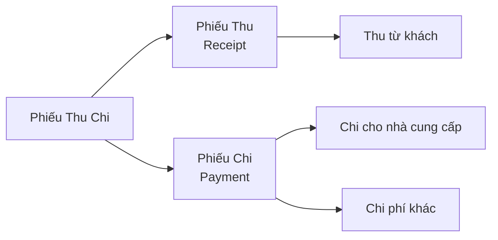

# 09 - Phiếu Thu Chi

> Quản lý phiếu thu, phiếu chi và công nợ

---

## Tổng Quan

### Loại Phiếu



---

## Cấu Trúc Database

```sql
payment_vouchers
  - id
  - company_id
  - voucher_number      -- Mã phiếu (auto)
  - voucher_type        -- 'receipt' hoặc 'payment'
  - voucher_date        -- Ngày lập phiếu
  - amount              -- Số tiền
  - currency            -- VND, USD, EUR...
  - payment_method      -- cash, transfer, card
  - customer_id         -- Nếu thu từ khách (nullable)
  - supplier_id         -- Nếu chi cho NCC (nullable)
  - invoice_id          -- Liên kết hóa đơn (nullable)
  - category            -- Loại thu/chi
  - description         -- Nội dung
  - payment_proof       -- Ảnh chứng từ
  - status              -- pending, approved, cancelled
  - created_by
  - approved_by
```

---

## Tạo Phiếu Thu

### Phiếu Thu Từ Khách Hàng

```php
// app/Livewire/Main/PaymentVouchers/ReceiptForm.php
public function save() {
    $validated = $this->validate([
        'customerId' => 'required|exists:customers,id',
        'amount' => 'required|numeric|min:1',
        'currency' => 'required|string',
        'paymentMethod' => 'required|string',
        'voucherDate' => 'required|date',
        'description' => 'required|string',
        'proofImage' => 'nullable|image|max:5120', // 5MB
    ]);
    
    DB::transaction(function() use ($validated) {
        // Lưu ảnh chứng từ
        $proofPath = null;
        if ($this->proofImage) {
            $proofPath = $this->proofImage->store('payment-proofs', 'private');
        }
        
        // Tạo phiếu thu
        $receipt = PaymentVoucher::create([
            'company_id' => Auth::user()->company_id,
            'voucher_number' => $this->generateVoucherNumber('receipt'),
            'voucher_type' => 'receipt',
            'voucher_date' => $validated['voucherDate'],
            'amount' => $validated['amount'],
            'currency' => $validated['currency'],
            'payment_method' => $validated['paymentMethod'],
            'customer_id' => $validated['customerId'],
            'description' => $validated['description'],
            'payment_proof' => $proofPath,
            'status' => 'pending',
            'created_by' => Auth::id(),
        ]);
        
        // Ghi log
        AuditLog::create([
            'model_type' => PaymentVoucher::class,
            'model_id' => $receipt->id,
            'action' => 'created',
        ]);
    });
    
    return redirect()->route('vouchers.receipt')
        ->with('message', 'Tạo phiếu thu thành công!');
}

private function generateVoucherNumber($type) {
    $prefix = $type === 'receipt' ? 'PT' : 'PC';
    $date = now()->format('Ymd');
    
    // Đếm số phiếu trong ngày
    $count = PaymentVoucher::where('voucher_type', $type)
        ->whereDate('created_at', now())
        ->count() + 1;
    
    return "{$prefix}-{$date}-" . str_pad($count, 4, '0', STR_PAD_LEFT);
    // Ví dụ: PT-20250124-0001
}
```

---

## Tạo Phiếu Chi

### Phiếu Chi Cho Nhà Cung Cấp

```php
public function save() {
    $validated = $this->validate([
        'supplierId' => 'nullable|exists:suppliers,id',
        'amount' => 'required|numeric|min:1',
        'currency' => 'required|string',
        'paymentMethod' => 'required|string',
        'category' => 'required|string', // goods, service, salary, other
        'description' => 'required|string',
    ]);
    
    PaymentVoucher::create([
        'company_id' => Auth::user()->company_id,
        'voucher_number' => $this->generateVoucherNumber('payment'),
        'voucher_type' => 'payment',
        'voucher_date' => now(),
        'amount' => $validated['amount'],
        'currency' => $validated['currency'],
        'payment_method' => $validated['paymentMethod'],
        'supplier_id' => $validated['supplierId'],
        'category' => $validated['category'],
        'description' => $validated['description'],
        'status' => 'pending',
        'created_by' => Auth::id(),
    ]);
}
```

### Danh Mục Chi Phí

```php
// Config categories
$paymentCategories = [
    'goods' => 'Mua hàng hóa',
    'service' => 'Dịch vụ',
    'salary' => 'Lương nhân viên',
    'rent' => 'Thuê mặt bằng',
    'utility' => 'Điện nước',
    'tax' => 'Thuế',
    'marketing' => 'Marketing',
    'other' => 'Khác',
];
```

---

## Liên Kết Với Hóa Đơn

### Thu Tiền Theo Hóa Đơn Bán

```php
// Từ trang chi tiết hóa đơn
public function createReceipt() {
    $invoice = $this->invoice; // SaleInvoice
    
    return PaymentVoucher::create([
        'company_id' => $invoice->company_id,
        'voucher_type' => 'receipt',
        'customer_id' => $invoice->customer_id,
        'invoice_id' => $invoice->id,  // Liên kết
        'amount' => $invoice->grand_total,
        'currency' => $invoice->currency,
        'description' => "Thu tiền hóa đơn #{$invoice->sale_number}",
        'status' => 'pending',
    ]);
}
```

### Chi Tiền Theo Hóa Đơn Mua

```php
public function createPayment() {
    $invoice = $this->invoice; // PurchaseInvoice
    
    return PaymentVoucher::create([
        'company_id' => $invoice->company_id,
        'voucher_type' => 'payment',
        'supplier_id' => $invoice->supplier_id,
        'invoice_id' => $invoice->id,
        'amount' => $invoice->grand_total,
        'currency' => $invoice->currency,
        'description' => "Thanh toán hóa đơn #{$invoice->purchase_number}",
        'status' => 'pending',
    ]);
}
```

---

## Duyệt Phiếu Thu Chi

### Workflow Duyệt

```php
public function approve() {
    if (!Auth::user()->hasPermission('vouchers.approve')) {
        abort(403);
    }
    
    DB::transaction(function() {
        $this->voucher->update([
            'status' => 'approved',
            'approved_by' => Auth::id(),
            'approved_at' => now(),
        ]);
        
        // Nếu có liên kết hóa đơn, cập nhật trạng thái thanh toán
        if ($this->voucher->invoice_id) {
            $invoice = $this->voucher->invoice;
            $invoice->update(['payment_status' => 'paid']);
        }
        
        // Cập nhật công nợ (nếu dùng)
        $this->updateDebt();
    });
}

private function updateDebt() {
    if ($this->voucher->voucher_type === 'receipt' && $this->voucher->customer_id) {
        // Giảm công nợ khách hàng
        CustomerDebt::where('customer_id', $this->voucher->customer_id)
            ->decrement('amount', $this->voucher->amount);
    } elseif ($this->voucher->voucher_type === 'payment' && $this->voucher->supplier_id) {
        // Giảm công nợ nhà cung cấp
        SupplierDebt::where('supplier_id', $this->voucher->supplier_id)
            ->decrement('amount', $this->voucher->amount);
    }
}
```

---

## AI Trích Xuất Thông Tin Thanh Toán

### Scan Ảnh Chuyển Khoản

```php
// app/Services/AI/PaymentProofAIService.php
public function extractPaymentInfo(string $imagePath): array {
    $gemini = app(GeminiService::class);
    
    $prompt = "
    Phân tích ảnh chứng từ chuyển khoản này và trích xuất thông tin:
    - Số tiền
    - Ngân hàng
    - Số tài khoản người nhận
    - Nội dung chuyển khoản
    - Ngày giờ giao dịch
    
    Trả về JSON format: {amount, bank, receiver_account, message, datetime}
    ";
    
    $response = $gemini->analyzeImage($imagePath, $prompt);
    
    return json_decode($response, true);
}

// Sử dụng khi upload ảnh
public function updatedProofImage() {
    if ($this->proofImage) {
        $tempPath = $this->proofImage->store('temp');
        
        // AI extract
        $info = app(PaymentProofAIService::class)
            ->extractPaymentInfo(storage_path('app/' . $tempPath));
        
        // Auto-fill form
        if ($info && isset($info['amount'])) {
            $this->amount = $info['amount'];
            $this->description = $info['message'] ?? '';
            // ...
        }
    }
}
```

---

## Báo Cáo Thu Chi

### Báo Cáo Tổng Hợp

```php
public function getCashFlowReport($fromDate, $toDate) {
    $receipts = PaymentVoucher::where('company_id', Auth::user()->company_id)
        ->where('voucher_type', 'receipt')
        ->where('status', 'approved')
        ->whereBetween('voucher_date', [$fromDate, $toDate])
        ->sum('amount');
    
    $payments = PaymentVoucher::where('company_id', Auth::user()->company_id)
        ->where('voucher_type', 'payment')
        ->where('status', 'approved')
        ->whereBetween('voucher_date', [$fromDate, $toDate])
        ->sum('amount');
    
    return [
        'total_receipts' => $receipts,      // Tổng thu
        'total_payments' => $payments,      // Tổng chi
        'net_cash_flow' => $receipts - $payments,  // Dòng tiền ròng
    ];
}
```

### Báo Cáo Theo Loại

```php
public function getPaymentsByCategory($month, $year) {
    return PaymentVoucher::where('company_id', Auth::user()->company_id)
        ->where('voucher_type', 'payment')
        ->where('status', 'approved')
        ->whereMonth('voucher_date', $month)
        ->whereYear('voucher_date', $year)
        ->groupBy('category')
        ->selectRaw('category, SUM(amount) as total')
        ->get()
        ->mapWithKeys(function($item) {
            return [$item->category => $item->total];
        });
        
    // Result: ['goods' => 50000000, 'salary' => 30000000, ...]
}
```

---

## Quản Lý Công Nợ

### Tính Công Nợ Khách Hàng

```php
public function getCustomerDebt($customerId) {
    // Tổng hóa đơn bán chưa thanh toán
    $totalUnpaid = SaleInvoice::where('customer_id', $customerId)
        ->where('status', 'approved')
        ->where('payment_status', '!=', 'paid')
        ->sum('grand_total');
    
    // Tổng đã thu
    $totalReceived = PaymentVoucher::where('customer_id', $customerId)
        ->where('voucher_type', 'receipt')
        ->where('status', 'approved')
        ->sum('amount');
    
    // Công nợ = Tổng hóa đơn - Đã thu
    $debt = $totalUnpaid - $totalReceived;
    
    return [
        'total_invoices' => $totalUnpaid,
        'total_received' => $totalReceived,
        'debt' => max(0, $debt),  // Không âm
    ];
}
```

### Lịch Sử Thu Chi Với Đối Tác

```php
public function getPartnerPaymentHistory($partnerId, $partnerType = 'customer') {
    $query = PaymentVoucher::where('company_id', Auth::user()->company_id);
    
    if ($partnerType === 'customer') {
        $query->where('customer_id', $partnerId)
              ->where('voucher_type', 'receipt');
    } else {
        $query->where('supplier_id', $partnerId)
              ->where('voucher_type', 'payment');
    }
    
    return $query->with(['invoice', 'createdBy', 'approvedBy'])
        ->orderByDesc('voucher_date')
        ->get()
        ->map(function($voucher) {
            return [
                'voucher_number' => $voucher->voucher_number,
                'date' => $voucher->voucher_date->format('d/m/Y'),
                'amount' => number_format($voucher->amount, 0, ',', '.') . ' ₫',
                'method' => $this->getPaymentMethodLabel($voucher->payment_method),
                'status' => $voucher->status,
                'description' => $voucher->description,
            ];
        });
}
```

---

## Xuất Excel/PDF

### Export Danh Sách Phiếu Thu Chi

```php
// app/Exports/PaymentVouchersExport.php
class PaymentVouchersExport implements FromQuery, WithHeadings {
    private $type;
    private $fromDate;
    private $toDate;
    
    public function query() {
        return PaymentVoucher::query()
            ->where('company_id', Auth::user()->company_id)
            ->where('voucher_type', $this->type)
            ->whereBetween('voucher_date', [$this->fromDate, $this->toDate])
            ->orderByDesc('voucher_date');
    }
    
    public function headings(): array {
        return [
            'Mã phiếu',
            'Ngày',
            'Số tiền',
            'Phương thức',
            'Đối tác',
            'Nội dung',
            'Trạng thái',
        ];
    }
}

// Export
public function exportExcel() {
    return Excel::download(
        new PaymentVouchersExport($this->filters),
        'phieu-thu-chi.xlsx'
    );
}
```

---

## Quick Reference

### Workflow

```
Tạo phiếu (Pending) → Duyệt → Approved
                     ↓
                   Công nợ giảm
                   Invoice payment status = paid
```

### Công Thức

```
Công nợ KH = Tổng hóa đơn bán - Tổng đã thu
Công nợ NCC = Tổng hóa đơn mua - Tổng đã chi
Dòng tiền ròng = Tổng thu - Tổng chi
```

---

## Tiếp Theo

✅ Phiếu thu chi đã hiểu!

**Tiếp tục:**
- [Quét Email](10-email-scanning-system.md)
- [AI Chatbot](11-ai-chatbot.md)
- [Thông Báo](12-notification-system.md)

---

<p align="center">
  <strong>Quản Lý Thu Chi Thành Thạo! 💰</strong>
</p>
