# 10 - Hệ Thống Quét Email

> Tự động nhận và xử lý hóa đơn từ Gmail với keyword filtering và real-time notifications

---

## Tổng Quan

Hệ thống quét email tự động:
- ✅ Nhận email realtime qua **Google Pub/Sub Webhook**
- ✅ **Notify user ngay lập tức** khi có email mới
- ✅ **Keyword filtering** - Chỉ xử lý email có từ khóa hóa đơn
- ✅ **Fallback logic** - Quét inbox khi history API fail
- ✅ Auto-import invoice từ XML attachments
- ✅ Quét thủ công với cấu hình linh hoạt

### Workflow Overview

```mermaid
sequenceDiagram
    participant Gmail
    participant PubSub as Google Pub/Sub
    participant Webhook as /api/gmail/webhook
    participant Job as ProcessNewGmailMessage
    participant User
    
    Gmail->>PubSub: New email arrives
    PubSub->>Webhook: Push notification (historyId)
    Webhook->>Webhook: Deduplicate (cache)
    Webhook->>Job: Dispatch job (queued)
    Webhook-->>PubSub: 200 OK (fast response)
    
    Job->>Gmail: Fetch histories
    alt History API Success
        Gmail-->>Job: Email changes
    else History 404 (historyId too old)
        Job->>Gmail: Fallback: Fetch latest INBOX
Gmail-->>Job: Latest 5-200 emails
    end
    
    Job->>User: Notify ALL new emails
    Job->>Job: Check keywords
    alt Has keyword
        Job->>Job: Check XML attachment
        alt Has XML
            Job->>DB: Import invoice
        else No XML
            Job->>User: ⚠️ Warning notification
        end
    else No keyword
        Job->>Job: Skip processing
    end
```



---

## Setup Google Cloud

### 1. Google Cloud Console

```bash
# URL: https://console.cloud.google.com

# 1. Tạo project mới
Project ID: quanlyhoadon-476603

# 2. Enable APIs
- Gmail API
- Cloud Pub/Sub API

# 3. Tạo OAuth 2.0 Credentials
Type: Web application
Authorized redirect URIs:
  - https://api2.konnn04.live/auth/google/callback
  - http://localhost:8000/auth/google/callback

# 4. Tạo Pub/Sub Topic
Topic name: mail-checker
```

### 2. Environment Configuration

```dotenv
# .env
GOOGLE_PROJECT_ID=quanlyhoadon-476603
GOOGLE_CLIENT_ID=xxx.apps.googleusercontent.com
GOOGLE_CLIENT_SECRET=GOCSPX-xxx
GOOGLE_REDIRECT_URI=https://api2.konnn04.live/auth/google/callback
GOOGLE_PUBSUB_TOPIC=mail-checker
```

---

## Gmail OAuth Flow

### Routes

```php
// routes/integrations.php

// Webhook (Public API route - no auth)
Route::post('/api/gmail/webhook', [GmailWebhookController::class, 'handle'])
    ->withoutMiddleware(['web'])
    ->name('api.gmail.webhook');

// OAuth (Web routes - authenticated)
Route::middleware(['auth', 'company.context', 'permission:company.manage'])->group(function () {
    Route::get('/auth/google/redirect', [GmailOAuthController::class, 'redirect']);
    Route::get('/auth/google/callback', [GmailOAuthController::class, 'callback']);
    Route::post('/auth/google/disconnect', [GmailOAuthController::class, 'disconnect']);
});
```

### OAuth Controller

```php
// app/Http/Controllers/GmailOAuthController.php

public function redirect() {
    $socialite = Socialite::driver('google');
    
    return $socialite
        ->scopes([
            'https://www.googleapis.com/auth/gmail.readonly',
            'https://www.googleapis.com/auth/gmail.modify',
        ])
        ->redirect();
}

public function callback(Request $request) {
    $googleUser = Socialite::driver('google')->user();
    $user = Auth::user();
    $companyId = $user->company_id;
    
    // Get or create config
    $config = Config::firstOrCreate(['company_id' => $companyId]);
    
    // Save tokens
    $config->gmail_refresh_token = $googleUser->refreshToken ?? $config->gmail_refresh_token;
    $config->gmail_access_token = $googleUser->token;
    $config->gmail_account_email = $googleUser->getEmail();
    $config->gmail_token_expires_at = now()->addSeconds($googleUser->expiresIn ?? 3600);
    
    // Reset watch if new account
    $isNewAccount = $old Email !== $newEmail;
    if ($isNewAccount) {
        $config->gmail_watch_topic = null;
        $config->gmail_last_history_id = '-1';
    }
    
    $config->save();
    
    // Start Gmail Watch (deferred)
    if ($isNewAccount) {
        StartGmailWatch::dispatch($config->id)
            ->afterResponse()
            ->onQueue('gmail');
    }
    
    // Auto-scan emails after 30s
    $rescanLimit = (int) $config->getSetting('automation_settings.rescan_email_limit', 50);
    RescanAllEmailsJob::dispatch($companyId, $rescanLimit, false)
        ->delay(now()->addSeconds(30))
        ->onQueue('gmail');
    
    return redirect()->route('settings', ['tab' => 'automation']);
}
```

---

## Gmail Watch Setup

### StartGmailWatch Job

```php
// app/Jobs/StartGmailWatch.php

public function handle(GmailService $gmailService) {
    $config = Config::withoutGlobalScopes()->find($this->configId);
    
    $client = $gmailService->buildGoogleClient($config);
    $gmail = new Gmail($client);
    
    // Setup watch request
    $topic = 'projects/' . env('GOOGLE_PROJECT_ID') . '/topics/' . env('GOOGLE_PUBSUB_TOPIC');
    
    $watchRequest = new WatchRequest();
    $watchRequest->setTopicName($topic);
    $watchRequest->setLabelIds(['INBOX']); // Only inbox
    
    $response = $gmail->users->watch('me', $watchRequest);
    
    // Save watch info
    $config->gmail_watch_topic = $topic;
    $config->gmail_last_watched_at = now();
    $config->gmail_last_history_id = $response->getHistoryId();
    $config->save();
}
```

**Watch expires after 7 days** - Google will stop sending notifications. Cần renew định kỳ hoặc khi reconnect Gmail.

---

## Webhook Handler

### GmailWebhookController

```php
// app/Http/Controllers/GmailWebhookController.php

public function handle(Request $request) {
    $startTime = microtime(true);
    
    // Decode Pub/Sub message
    $payload = json_decode($request->getContent(), true);
    $message = $payload['message'] ?? null;
    $decoded = json_decode(base64_decode($message['data']), true);
    
    $historyId = $decoded['historyId'] ?? null;
    $emailAddress = $decoded['emailAddress'] ?? null;
    
    // Find company by email
    $config = Config::withoutGlobalScopes()
        ->whereRaw('LOWER(gmail_account_email) = ?', [strtolower($emailAddress)])
        ->first();
    $companyId = $config?->company_id;
    
    if ($companyId) {
        // Deduplication using cache (5 minutes)
        $cacheKey = "gmail_webhook_history_{$companyId}_{$historyId}";
        
        if (Cache::has($cacheKey)) {
            Log::info('Gmail Webhook: DUPLICATE SKIPPED');
            return response()->json(['status' => 'ok']);
        }
        
        Cache::put($cacheKey, true, now()->addMinutes(5));
        
        // Dispatch job immediately (no afterResponse to avoid delays)
        ProcessNewGmailMessage::dispatch((int) $companyId, (string) $historyId)
            ->onQueue('gmail');
        
        Log::info('Gmail Webhook: JOB QUEUED', [
            'elapsed_ms' => round((microtime(true) - $startTime) * 1000, 2),
        ]);
    }
    
    // ALWAYS return 200 OK quickly
    return response()->json(['status' => 'ok'], 200);
}
```

**Key Points**:
- ✅ Fast response (< 50ms) prevents Google retries
- ✅ Deduplication prevents duplicate processing
- ✅ No `afterResponse()` - dispatch immediately

---

## Email Processing Jobs

### 1. ProcessNewGmailMessage (Webhook Trigger)

```php
// app/Jobs/ProcessNewGmailMessage.php

public function handle(GmailService $gmailService) {
    $config = Config::withoutGlobalScopes()->where('company_id', $this->companyId)->first();
    $client = $gmailService->buildGoogleClient($config);
    $service = new Gmail($client);
    
    try {
        // Fetch histories from last checkpoint
        $historyList = $service->users_history->listUsersHistory('me', [
            'startHistoryId' => $config->gmail_last_history_id,
            'historyTypes' => ['messageAdded'],
            'labelId' => 'INBOX',
        ]);
        
        // Process each message
        foreach ($historyList->getHistory() as $history) {
            $messagesAdded = $history->getMessagesAdded() ?? [];
            
            foreach ($messagesAdded as $messageAdded) {
                $messageId = $messageAdded->getMessage()->getId();
                
                // Process: notify, filter, import
                $this->processMessage($service, $messageId, $company);
           }
        }
        
        // Update checkpoint
        $config->gmail_last_history_id = (string) $this->historyId;
        $config->save();
        
    } catch (GoogleServiceException $e) {
        if ($e->getCode() === 404) {
            // History not found (historyId too old)
            Log::warning('ProcessNewGmailMessage: using fallback');
            
            // Fallback: fetch latest inbox messages
            $this->processLatestInboxMessages($service);
            
            $config->gmail_last_history_id = (string) $this->historyId;
            $config->save();
        }
    }
}

protected function processMessage(Gmail $service, string $messageId, Company $company): void {
    $message = $service->users_messages->get('me', $messageId, ['format' => 'full']);
    [$subject, $fromEmail, $fromName, $snippet] = $this->parseMessageHeaders($message);
    [$hasXml, $attachmentNames, $parts, $xmlCount] = $this->detectAttachments($message);
    
    // 1. ALWAYS notify user first
    $this->notifyEmail($messageId, $subject, $fromEmail, ...);
    
    // 2. Check keyword filter AFTER notification
    if (!$this->shouldProcessEmail($subject)) {
        Log::debug('Email skipped (keyword filter)');
        ProcessedEmail::create(['status' => 'skipped']);
        return;
    }
    
    // 3. Process if has keyword
    if ($hasXml) {
        // Extract and import invoice
        $xmlContents = $this->extractXmlContents($service, $messageId, $parts);
        $this->importInvoices(...);
    } else {
        // Warn user: has keyword but no XML
        $this->notifyNoXmlFound($subject, $fromEmail, $messageId, $links);
    }
}
```

### 2. RescanAllEmailsJob (Manual Scan)

Same logic as ProcessNewGmailMessage but:
- Fetch latest N emails from INBOX (configurable: 5-200)
- Stop when hitting already-processed email
- Used for initial scan and manual rescan

```php
// Dispatch từ Settings > Automation
RescanAllEmailsJob::dispatch(
    $company->id,
    $this->rescan_email_limit,  // From settings (default: 50)
    $this->allow_rescan_processed  // Re-process already scanned emails?
)->onQueue('gmail');
```

---

## Keyword Filtering

### Configuration

```php
// config/setting.php
'email_scan_keywords' => [
    'type' => 'array',
    'default' => ['hóa đơn', 'invoice', 'bill', 'receipt'],
    'description' => 'Keywords to filter emails (case-insensitive)',
],
```

### shouldProcessEmail() Method

```php
protected function shouldProcessEmail(?string $subject): bool {
    $keywords = Config::getSetting('automation_settings.email_scan_keywords', []);
    
    if (empty($keywords)) {
        return true; // Process all if no keywords
    }
    
    $subjectLower = mb_strtolower($subject, 'UTF-8');
    
    foreach ($keywords as $keyword) {
        if (mb_stripos($subjectLower, mb_strtolower($keyword, 'UTF-8')) !== false) {
            return true;
        }
    }
    
    return false;
}
```

**Flow**:
1. Notify user (ALL emails)
2. Check keywords
3. Skip if no match
4. Process if match

---

## Notifications

### 1. New Email Notification

```php
protected function notifyEmail(...) {
    CompanyNotification::create([
        'company_id' => $this->companyId,
        'type' => 'info',
        'title' => 'Email mới từ: ' . $fromEmail,
        'body' => $subject,
        'data' => [
            'message_id' => $messageId,
            'from' => $fromEmail,
            'attachments' => $attachmentNames,
        ],
    ]);
    
    event(new CompanyNotificationCreated($this->companyId, null, 'info'));
}
```

### 2. No XML Warning

```php
protected function notifyNoXmlFound(...) {
    CompanyNotification::create([
        'company_id' => $this->companyId,
        'type' => 'warning',
        'title' => 'Email hóa đơn không có file XML',
        'body' => "Email từ {$fromEmail} có tiêu đề '{$subject}' chứa từ khóa hóa đơn nhưng không có file XML đính kèm. Vui lòng kiểm tra thủ công.",
    ]);
    
    event(new CompanyNotificationCreated($this->companyId, null, 'warning'));
}
```

---

## Settings UI

### Automation Settings

```php
// resources/views/livewire/main/settings/automation-settings.blade.php

<div>
    <!-- Rescan Email Limit -->
    <input wire:model="rescan_email_limit" 
           type="number" min="5" max="200" />
    <p class="text-sm">Số lượng email quét tối đa (5-200)</p>
    
    <!-- Email Scan Keywords -->
    <div x-data="{
        keywords: @entangle('email_scan_keywords'),
        newKeyword: '',
        addKeyword() {
            if (this.newKeyword.trim()) {
                this.keywords.push(this.newKeyword.trim());
                this.newKeyword = '';
            }
        },
        removeKeyword(index) {
            this.keywords.splice(index, 1);
        }
    }">
        <!-- Keyword tags -->
        <div class="flex flex-wrap gap-2">
            <template x-for="(keyword, index) in keywords" :key="index">
                <span class="badge">
                    <span x-text="keyword"></span>
                    <button @click="removeKeyword(index)">×</button>
                </span>
            </template>
        </div>
        
        <!-- Add keyword -->
        <input type="text" x-model="newKeyword" 
               @keydown.enter.prevent="addKeyword()" 
               placeholder="Nhập từ khóa (vd: hóa đơn, invoice)" />
        <button @click="addKeyword()">Thêm</button>
    </div>
    
    <p class="text-xs text-slate-500">
        Chỉ quét email có tiêu đề chứa ít nhất 1 từ khóa. Để trống để quét tất cả.
    </p>
</div>
```

---

## Queue Worker

### Start Worker

```bash
php artisan queue:work --queue=gmail,default --tries=3 --timeout=3600
```

**Critical**: Worker phải chạy liên tục để xử lý webhook jobs. Restart worker khi:
- Deploy code mới
- Update `.env`
- Fix bugs

---

## Troubleshooting

### 1. Webhook không nhận được

```bash
# Check route
php artisan route:list | grep webhook
# Should show: POST  api/gmail/webhook

# Check logs
tail -f storage/logs/laravel.log | grep "Gmail Webhook"

# Test locally
curl -X POST http://localhost:8000/api/gmail/webhook \
  -H "Content-Type: application/json" \
  -d '{"message":{"data":"eyJoaXN0b3J5SWQiOiIxMjM0NSIsImVtYWlsQWRkcmVzcyI6InRlc3RAZ21haWwuY29tIn0="}}'
```

### 2. Config Not Found Error

```bash
# Check if Config uses Global Scope
# Fix: Use withoutGlobalScopes() in jobs

$config = Config::withoutGlobalScopes()
    ->where('company_id', $this->companyId)
    ->first();
```

### 3. History API 404 Error

**Expected behavior** - Falls back to `processLatestInboxMessages()` automatically.

Check logs:
```
ProcessNewGmailMessage: history not found (historyId too old), using fallback
```

---

## Quick Reference

### Complete Email Flow

```
1. Gmail receives email
2. Google Pub/Sub → /api/gmail/webhook
3. Webhook deduplicates & dispatches job
4. ProcessNewGmailMessage:
   - Fetch histories (or fallback to latest inbox)
   - For each message:
     a. Notify user (ALL emails)
     b. Check keywords
     c. Skip if no match
     d. If match + has XML → Import invoice
     e. If match + no XML → Warn user
5. Update checkpoint (gmail_last_history_id)
```

### Key Files

| File | Purpose |
|------|---------|
| `GmailOAuthController.php` | OAuth connect/disconnect |
| `GmailWebhookController.php` | Receive Pub/Sub notifications |
| `ProcessNewGmailMessage.php` | Process webhook triggers |
| `RescanAllEmailsJob.php` | Manual/scheduled scan |
| `StartGmailWatch.php` | Setup Gmail push notifications |
| `config/setting.php` | Email scan settings |
| `automation-settings.blade.php` | Settings UI |

---

## Next Steps

✅ Email scanning system documented!

**Continue:**
- [AI Chatbot](11-ai-chatbot.md)
- [Notification System](12-notification-system.md)
- [Cache System](13-cache-system.md)

---

<p align="center">
  <strong>Email Automation Mastered! 📧</strong>
</p>
