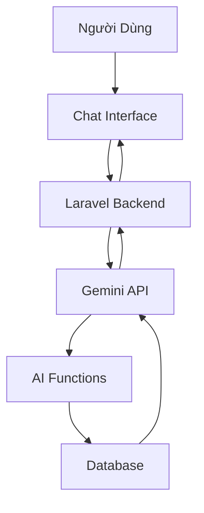

# 11 - AI Chatbot (Gemini)

> Trợ lý AI thông minh hỗ trợ 24/7

---

## Tổng Quan

### Gemini AI Integration



---

## Setup Gemini API

### Bước 1: Lấy API Key

```
1. Truy cập: https://ai.google.dev
2. Đăng nhập Google Account
3. Get API Key
4. Copy key
```

### Bước 2: Cấu Hình

```dotenv
# .env
GEMINI_API_KEY="your-api-key-here"
GEMINI_MODEL="gemini-2.0-flash-exp"  # Hoặc gemini-pro
```

### Bước 3: Enable Trong Settings

```php
// Company Settings
$company->config->updateSetting('ai_settings', [
    'enabled' => true,
    'gemini_api_key' => $apiKey,  // Hoặc dùng env
    'model' => 'gemini-2.0-flash-exp',
]);
```

---

## Gemini Service

### Client Wrapper

```php
// app/Services/AI/Gemini/GeminiService.php
class GeminiService {
    private $apiKey;
    private $model;
    
    public function __construct() {
        $this->apiKey = config('services.gemini.api_key');
        $this->model = config('services.gemini.model', 'gemini-2.0-flash-exp');
    }
    
    public function chat(string $message, array $context = []): string {
        $url = "https://generativelanguage.googleapis.com/v1beta/models/{$this->model}:generateContent";
        
        $payload = [
            'contents' => [
                [
                    'role' => 'user',
                    'parts' => [
                        ['text' => $this->buildPrompt($message, $context)]
                    ]
                ]
            ],
            'generationConfig' => [
                'temperature' => 0.7,
                'maxOutputTokens' => 2048,
            ],
        ];
        
        $response = Http::post($url . '?key=' . $this->apiKey, $payload);
        
        if ($response->successful()) {
            $data = $response->json();
            return $data['candidates'][0]['content']['parts'][0]['text'] ?? 'Xin lỗi, tôi không hiểu.';
        }
        
        throw new \Exception('Gemini API Error: ' . $response->body());
    }
    
    private function buildPrompt(string $message, array $context): string {
        $systemGuide = Storage::get('ai/system-guide.md');
        
        $prompt = "Bạn là trợ lý AI cho hệ thống quản lý hóa đơn.\n\n";
        $prompt .= "HƯỚNG DẪN HỆ THỐNG:\n{$systemGuide}\n\n";
        
        if (!empty($context['company_name'])) {
            $prompt .= "Công ty hiện tại: {$context['company_name']}\n";
        }
        
        if (!empty($context['user_role'])) {
            $prompt .= "Vai trò người dùng: {$context['user_role']}\n";
        }
        
        $prompt .= "\nCÂU HỎI: {$message}\n\n";
        $prompt .= "Trả lời bằng tiếng Việt, ngắn gọn và hữu ích.";
        
        return $prompt;
    }
}
```

---

## Function Calling

### Định Nghĩa Functions

```php
// app/Services/AI/Functions/SearchProducts.php
class SearchProducts extends AIFunction {
    public function getName(): string {
        return 'search_products';
    }
    
    public function getDescription(): string {
        return 'Tìm kiếm sản phẩm theo từ khóa';
    }
    
    public function getParameters(): array {
        return [
            'type' => 'object',
            'properties' => [
                'keyword' => [
                    'type' => 'string',
                    'description' => 'Từ khóa tìm kiếm (tên hoặc SKU)',
                ],
                'limit' => [
                    'type' => 'integer',
                    'description' => 'Số lượng kết quả (mặc định 10)',
                ],
            ],
            'required' => ['keyword'],
        ];
    }
    
    public function execute(array $params): array {
        $keyword = $params['keyword'];
        $limit = $params['limit'] ?? 10;
        
        $products = Product::where('company_id', Auth::user()->company_id)
            ->where(function($q) use ($keyword) {
                $q->where('name', 'like', "%{$keyword}%")
                  ->orWhere('sku', 'like', "%{$keyword}%");
            })
            ->limit($limit)
            ->get();
        
        return $products->map(function($p) {
            return [
                'name' => $p->name,
                'sku' => $p->sku,
                'quantity' => $p->quantity,
                'price' => $p->sold_price,
                'unit' => $p->unit,
            ];
        })->toArray();
    }
}
```

### Register Functions

```php
// app/Services/AI/AIFunctionRegistry.php
class AIFunctionRegistry {
    private $functions = [];
    
    public function __construct() {
        $this->registerDefaults();
    }
    
    private function registerDefaults() {
        $this->register(new SearchProducts());
        $this->register(new SearchInvoices());
        $this->register(new SearchCustomers());
        $this->register(new GetInventoryReport());
        $this->register(new GetFinancialSummary());
        // ... more functions
    }
    
    public function register(AIFunction $function) {
        $this->functions[$function->getName()] = $function;
    }
    
    public function get(string $name): ?AIFunction {
        return $this->functions[$name] ?? null;
    }
    
    public function all(): array {
        return $this->functions;
    }
}
```

---

## Chat Controller

### API Endpoint

```php
// app/Http/Controllers/AIChatController.php
class AIChatController extends Controller {
    public function chat(Request $request) {
        $message = $request->input('message');
        
        if (empty($message)) {
            return response()->json(['error' => 'Message required'], 400);
        }
        
        try {
            $gemini = app(GeminiService::class);
            
            // Build context
            $context = [
                'company_name' => Auth::user()->company->company_name,
                'user_role' => Auth::user()->role->name,
                'user_name' => Auth::user()->fullname,
            ];
            
            // Check if need function calling
            if ($this->needsFunctionCall($message)) {
                $response = $this->handleWithFunctions($message, $context);
            } else {
                $response = $gemini->chat($message, $context);
            }
            
            return response()->json([
                'success' => true,
                'response' => $response,
            ]);
            
        } catch (\Exception $e) {
            return response()->json([
                'success' => false,
                'error' => 'AI service error: ' . $e->getMessage(),
            ], 500);
        }
    }
    
    private function needsFunctionCall($message): bool {
        $keywords = [
            'tìm', 'search', 'kiếm', 'tra cứu',
            'báo cáo', 'report', 'thống kê',
            'tồn kho', 'inventory', 'stock',
        ];
        
        foreach ($keywords as $keyword) {
            if (stripos($message, $keyword) !== false) {
                return true;
            }
        }
        
        return false;
    }
    
    private function handleWithFunctions($message, $context) {
        $gemini = app(GeminiService::class);
        $registry = app(AIFunctionRegistry::class);
        
        // Ask Gemini which function to call
        $functionPrompt = "Câu hỏi: {$message}\n\n";
        $functionPrompt .= "Functions available:\n";
        
        foreach ($registry->all() as $func) {
            $functionPrompt .= "- {$func->getName()}: {$func->getDescription()}\n";
        }
        
        $functionPrompt .= "\nWhich function should I call? Return JSON: {\"function\": \"name\", \"params\": {...}}";
        
        $functionCall = $gemini->chat($functionPrompt, $context);
        $callData = json_decode($functionCall, true);
        
        if ($callData && isset($callData['function'])) {
            $function = $registry->get($callData['function']);
            
            if ($function) {
                $result = $function->execute($callData['params'] ?? []);
                
                // Format result for user
                $finalPrompt = "Dữ liệu:\n" . json_encode($result, JSON_PRETTY_PRINT | JSON_UNESCAPED_UNICODE);
                $finalPrompt .= "\n\nCâu hỏi ban đầu: {$message}";
                $finalPrompt .= "\n\nHãy trả lời câu hỏi dựa trên dữ liệu trên.";
                
                return $gemini->chat($finalPrompt, $context);
            }
        }
        
        // Fallback
        return $gemini->chat($message, $context);
    }
}
```

---

## Chat UI (Livewire)

### Component

```php
// app/Livewire/Components/AIChat.php
class AIChat extends Component {
    public $messages = [];
    public $currentMessage = '';
    public $isLoading = false;
    
    public function mount() {
        // Load chat history from session
        $this->messages = session('ai_chat_history', []);
    }
    
    public function sendMessage() {
        if (empty($this->currentMessage)) {
            return;
        }
        
        $userMessage = $this->currentMessage;
        $this->currentMessage = '';
        
        // Add user message
        $this->messages[] = [
            'role' => 'user',
            'content' => $userMessage,
            'timestamp' => now()->format('H:i'),
        ];
        
        $this->isLoading = true;
        
        // Call AI
        $response = Http::post(route('ai.chat'), [
            'message' => $userMessage,
        ])->json();
        
        $this->isLoading = false;
        
        // Add AI response
        if ($response['success']) {
            $this->messages[] = [
                'role' => 'assistant',
                'content' => $response['response'],
                'timestamp' => now()->format('H:i'),
            ];
        } else {
            $this->messages[] = [
                'role' => 'assistant',
                'content' => 'Xin lỗi, đã có lỗi xảy ra.',
                'timestamp' => now()->format('H:i'),
            ];
        }
        
        // Save to session
        session(['ai_chat_history' => $this->messages]);
        
        // Scroll to bottom
        $this->dispatch('chat-message-sent');
    }
    
    public function clearHistory() {
        $this->messages = [];
        session()->forget('ai_chat_history');
    }
    
    public function render() {
        return view('livewire.components.ai-chat');
    }
}
```

### Blade View

```blade
{{-- resources/views/livewire/components/ai-chat.blade.php --}}
<div class="fixed bottom-4 right-4 z-50">
    {{-- Chat Button --}}
    <button 
        @click="open = !open"
        class="bg-blue-600 text-white rounded-full p-4 shadow-lg hover:bg-blue-700">
        <i class="bi bi-chat-dots text-2xl"></i>
    </button>
    
    {{-- Chat Window --}}
    <div 
        x-data="{ open: false }"
        x-show="open"
        x-transition
        class="bg-white rounded-lg shadow-xl w-96 h-[600px] flex flex-col mb-4">
        
        {{-- Header --}}
        <div class="bg-blue-600 text-white p-4 rounded-t-lg flex justify-between items-center">
            <h3 class="font-bold">🤖 AI Assistant</h3>
            <button @click="open = false" class="text-white">
                <i class="bi bi-x-lg"></i>
            </button>
        </div>
        
        {{-- Messages --}}
        <div class="flex-1 overflow-y-auto p-4 space-y-4" id="chat-messages">
            @foreach($messages as $msg)
                <div class="flex {{ $msg['role'] === 'user' ? 'justify-end' : 'justify-start' }}">
                    <div class="max-w-[80%] {{ $msg['role'] === 'user' ? 'bg-blue-500 text-white' : 'bg-gray-100' }} rounded-lg p-3">
                        <div class="prose prose-sm">
                            {!! Str::markdown($msg['content']) !!}
                        </div>
                        <span class="text-xs opacity-70">{{ $msg['timestamp'] }}</span>
                    </div>
                </div>
            @endforeach
            
            @if($isLoading)
                <div class="flex justify-start">
                    <div class="bg-gray-100 rounded-lg p-3">
                        <i class="bi bi-three-dots animate-pulse"></i> Đang suy nghĩ...
                    </div>
                </div>
            @endif
        </div>
        
        {{-- Input --}}
        <form wire:submit="sendMessage" class="p-4 border-t">
            <div class="flex gap-2">
                <input 
                    type="text" 
                    wire:model="currentMessage"
                    placeholder="Nhập câu hỏi..."
                    class="flex-1 rounded-lg border px-4 py-2"
                    autofocus>
                <button 
                    type="submit"
                    class="bg-blue-600 text-white px-4 py-2 rounded-lg hover:bg-blue-700"
                    :disabled="isLoading">
                    <i class="bi bi-send"></i>
                </button>
            </div>
        </form>
    </div>
</div>

<script>
// Auto scroll to bottom
Livewire.on('chat-message-sent', () => {
    const el = document.getElementById('chat-messages');
    el.scrollTop = el.scrollHeight;
});
</script>
```

---

## System Guide

### Knowledge Base

```markdown
<!-- app/Services/AI/data/system-guide.md -->
# Hướng Dẫn Hệ Thống - AI Assistant

## Modules Chính

### Khách Hàng
- Tạo mới: /customers/create
- Danh sách: /customers
- Tìm kiếm: Dùng function search_customers

### Hóa Đơn
- Hóa đơn bán: /invoices/sale
- Hóa đơn mua: /invoices/purchase
- Trạng thái: pending (chờ), approved (đã duyệt)

### Sản Phẩm
- Quản lý kho: /products
- Tồn kho: Xem quantity field
- Tìm kiếm: Dùng function search_products

## Câu Hỏi Thường Gặp

### "Tìm sản phẩm X"
→ Dùng search_products với keyword

### "Báo cáo doanh thu tháng này"
→ Dùng get_financial_summary với from_date, to_date

### "Tồn kho còn bao nhiêu"
→ Dùng get_inventory_report

## Permissions
- Admin: Full access
- Manager: View + Approve
- Staff: View only
```

---

## Available AI Functions

### 1. search_products
Tìm sản phẩm theo tên/SKU

### 2. search_customers
Tìm khách hàng

### 3. search_suppliers
Tìm nhà cung cấp

### 4. search_invoices
Tìm hóa đơn theo số, ngày, đối tác

### 5. get_inventory_report
Báo cáo tồn kho hiện tại

### 6. get_financial_summary
Báo cáo tài chính (doanh thu, chi phí, VAT)

### 7. get_low_stock_products
Sản phẩm sắp hết hàng

### 8. find_unpaid_invoices
Hóa đơn chưa thanh toán

---

## Quick Reference

### Workflow

```
User Message → Backend → 
  Gemini API → 
    (Optional) Function Call → 
      Database Query → 
    Format Response → 
  Return to User
```

### Best Practices

- Luôn validate user input
- Rate limit requests (tránh spam)
- Log AI conversations (audit)
- Cung cấp fallback responses
- Handle errors gracefully

---

## Tiếp Theo

✅ AI Chatbot đã hiểu!

