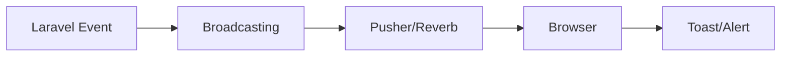

# 12 - Hệ Thống Thông Báo

> Real-time notifications với Pusher/Reverb

---

## Tổng Quan

### Kiến Trúc



---

## Setup Broadcasting

### Cấu Hình Pusher

```dotenv
# .env
BROADCAST_DRIVER=pusher

PUSHER_APP_ID="your-app-id"
PUSHER_APP_KEY="your-app-key"
PUSHER_APP_SECRET="your-app-secret"
PUSHER_APP_CLUSTER="ap1"  # Asia Pacific

# Frontend
VITE_PUSHER_APP_KEY="${PUSHER_APP_KEY}"
VITE_PUSHER_APP_CLUSTER="${PUSHER_APP_CLUSTER}"
```

### Broadcasting Config

```php
// config/broadcasting.php
'connections' => [
    'pusher' => [
        'driver' => 'pusher',
        'key' => env('PUSHER_APP_KEY'),
        'secret' => env('PUSHER_APP_SECRET'),
        'app_id' => env('PUSHER_APP_ID'),
        'options' => [
            'cluster' => env('PUSHER_APP_CLUSTER'),
            'host' => env('PUSHER_HOST') ?: 'api-'.env('PUSHER_APP_CLUSTER', 'mt1').'.pusher.com',
            'port' => env('PUSHER_PORT', 443),
            'scheme' => env('PUSHER_SCHEME', 'https'),
            'encrypted' => true,
            'useTLS' => true,
        ],
    ],
],
```

---

## Channels

### Private Channel Theo Company

```php
// routes/channels.php
Broadcast::channel('company.{companyId}', function ($user, $companyId) {
    // User chỉ join channel của công ty mình
    return (int) $user->company_id === (int) $companyId;
});

// User channel
Broadcast::channel('user.{userId}', function ($user, $userId) {
    return (int) $user->id === (int) $userId;
});
```

---

## Tạo Events

### Invoice Approved Event

```php
// app/Events/InvoiceApproved.php
class InvoiceApproved implements ShouldBroadcast {
    use Dispatchable, InteractsWithSockets, SerializesModels;
    
    public $invoice;
    
    public function __construct($invoice) {
        $this->invoice = $invoice;
    }
    
    // Channel to broadcast on
    public function broadcastOn() {
        return new PrivateChannel('company.' . $this->invoice->company_id);
    }
    
    // Event name
    public function broadcastAs() {
        return 'invoice.approved';
    }
    
    // Data to send
    public function broadcastWith() {
        return [
            'invoice_id' => $this->invoice->id,
            'invoice_number' => $this->invoice->sale_number ?? $this->invoice->purchase_number,
            'type' => $this->invoice instanceof SaleInvoice ? 'sale' : 'purchase',
            'grand_total' => $this->invoice->grand_total,
            'message' => "Hóa đơn {$this->invoice->invoice_number} đã được duyệt",
            'timestamp' => now()->toISOString(),
        ];
    }
}
```

### Low Stock Alert Event

```php
// app/Events/LowStockDetected.php
class LowStockDetected implements ShouldBroadcast {
    public $product;
    
    public function __construct($product) {
        $this->product = $product;
    }
    
    public function broadcastOn() {
        return new PrivateChannel('company.' . $this->product->company_id);
    }
    
    public function broadcastAs() {
        return 'stock.low';
    }
    
    public function broadcastWith() {
        return [
            'product_id' => $this->product->id,
            'product_name' => $this->product->name,
            'current_stock' => $this->product->quantity,
            'min_stock' => $this->product->min_stock_level,
            'message' => "Sản phẩm {$this->product->name} sắp hết hàng (còn {$this->product->quantity})",
        ];
    }
}
```

---

## Trigger Events

### Khi Duyệt Hóa Đơn

```php
// app/Livewire/Main/Invoices/SaleInvoiceDetail.php
public function approve() {
    DB::transaction(function() {
        // Update status
        $this->invoice->update(['status' => 'approved']);
        
        // Update inventory
        $this->updateInventory();
        
        // Broadcast event
        broadcast(new InvoiceApproved($this->invoice));
    });
}
```

### Khi Tồn Kho Thấp

```php
// Sau khi trừ tồn kho
$product->decrement('quantity', $quantity);

// Check stock level
if ($product->quantity <= $product->min_stock_level) {
    broadcast(new LowStockDetected($product));
}
```

---

## Frontend - Laravel Echo

### Setup

```javascript
// resources/js/app.js
import Echo from 'laravel-echo';
import Pusher from 'pusher-js';

window.Pusher = Pusher;

window.Echo = new Echo({
    broadcaster: 'pusher',
    key: import.meta.env.VITE_PUSHER_APP_KEY,
    cluster: import.meta.env.VITE_PUSHER_APP_CLUSTER,
    forceTLS: true,
    encrypted: true,
    authEndpoint: '/broadcasting/auth',
    auth: {
        headers: {
            'X-CSRF-TOKEN': document.querySelector('meta[name="csrf-token"]').content
        }
    }
});
```

### Listen to Events

```javascript
// Join company channel
const companyId = document.querySelector('meta[name="company-id"]').content;

window.Echo.private(`company.${companyId}`)
    .listen('.invoice.approved', (e) => {
        console.log('Invoice approved:', e);
        
        // Show toast notification
        showToast('success', e.message);
        
        // Refresh invoice table if on that page
        if (window.location.pathname.includes('/invoices')) {
            Livewire.dispatch('refresh-table');
        }
    })
    .listen('.stock.low', (e) => {
        showToast('warning', e.message);
    });

// Helper function for toast
function showToast(type, message) {
    // Using your toast library (e.g., Toastify)
    Toastify({
        text: message,
        duration: 5000,
        className: `toast-${type}`,
        gravity: "top",
        position: "right",
    }).showToast();
}
```

---

## Livewire Integration

### Listen trong Component

```php
// app/Livewire/Main/Dashboard.php
protected $listeners = [
    'echo-private:company.{companyId},invoice.approved' => 'onInvoiceApproved',
    'echo-private:company.{companyId},stock.low' => 'onStockLow',
];

public function onInvoiceApproved($event) {
    // Refresh dashboard stats
    $this->stats = $this->getStats(Auth::user()->company_id, true);
    
    // Show message
    $this->dispatch('toast', [
        'type' => 'success',
        'message' => $event['message'],
    ]);
}

public function onStockLow($event) {
    $this->dispatch('toast', [
        'type' => 'warning',
        'message' => $event['message'],
    ]);
}
```

### Blade Template

```blade
{{-- Listen to Livewire events --}}
<div 
    x-data="{ 
        showToast(type, message) {
            // Toast implementation
        }
    }"
    @toast.window="showToast($event.detail.type, $event.detail.message)">
    
    {{-- Dashboard content --}}
</div>
```

---

## Database Notifications

### Notification Class

```php
// app/Notifications/InvoiceApprovedNotification.php
class InvoiceApprovedNotification extends Notification {
    public $invoice;
    
    public function via($notifiable) {
        return ['database', 'broadcast'];
    }
    
    public function toDatabase($notifiable) {
        return [
            'invoice_id' => $this->invoice->id,
            'invoice_number' => $this->invoice->invoice_number,
            'type' => 'invoice_approved',
            'message' => "Hóa đơn {$this->invoice->invoice_number} đã được duyệt",
        ];
    }
    
    public function toBroadcast($notifiable) {
        return new BroadcastMessage([
            'invoice_id' => $this->invoice->id,
            'message' => "Hóa đơn {$this->invoice->invoice_number} đã được duyệt",
        ]);
    }
}
```

### Send Notification

```php
// Gửi cho user cụ thể
$user->notify(new InvoiceApprovedNotification($invoice));

// Gửi cho nhiều users
$managers = User::where('role_id', $managerRoleId)->get();
Notification::send($managers, new InvoiceApprovedNotification($invoice));
```

---

## Notification Bell

### Livewire Component

```php
// app/Livewire/Components/NotificationBell.php
class NotificationBell extends Component {
    public $notifications = [];
    public $unreadCount = 0;
    
    public function mount() {
        $this->loadNotifications();
    }
    
    public function loadNotifications() {
        $this->notifications = Auth::user()
            ->notifications()
            ->latest()
            ->limit(10)
            ->get();
            
        $this->unreadCount = Auth::user()
            ->unreadNotifications()
            ->count();
    }
    
    public function markAsRead($notificationId) {
        Auth::user()
            ->notifications()
            ->where('id', $notificationId)
            ->update(['read_at' => now()]);
            
        $this->loadNotifications();
    }
    
    public function markAllAsRead() {
        Auth::user()->unreadNotifications->markAsRead();
        $this->loadNotifications();
    }
    
    public function render() {
        return view('livewire.components.notification-bell');
    }
}
```

### Blade Template

```blade
{{-- resources/views/livewire/components/notification-bell.blade.php --}}
<div class="relative" x-data="{ open: false }">
    {{-- Bell Icon --}}
    <button @click="open = !open" class="relative">
        <i class="bi bi-bell text-xl"></i>
        
        @if($unreadCount > 0)
            <span class="absolute -top-1 -right-1 bg-red-500 text-white text-xs rounded-full w-5 h-5 flex items-center justify-center">
                {{ $unreadCount }}
            </span>
        @endif
    </button>
    
    {{-- Dropdown --}}
    <div 
        x-show="open" 
        @click.away="open = false"
        x-transition
        class="absolute right-0 mt-2 w-80 bg-white rounded-lg shadow-xl z-50">
        
        <div class="p-4 border-b flex justify-between items-center">
            <h3 class="font-bold">Thông báo</h3>
            <button wire:click="markAllAsRead" class="text-sm text-blue-600">
                Đánh dấu đã đọc
            </button>
        </div>
        
        <div class="max-h-96 overflow-y-auto">
            @forelse($notifications as $notification)
                <div 
                    wire:click="markAsRead('{{ $notification->id }}')"
                    class="p-4 border-b hover:bg-gray-50 cursor-pointer
                           {{ is_null($notification->read_at) ? 'bg-blue-50' : '' }}">
                    <p class="text-sm">{{ $notification->data['message'] }}</p>
                    <span class="text-xs text-gray-500">
                        {{ $notification->created_at->diffForHumans() }}
                    </span>
                </div>
            @empty
                <div class="p-4 text-center text-gray-500">
                    Không có thông báo
                </div>
            @endforelse
        </div>
    </div>
</div>
```

---

## Các Loại Thông Báo

### 1. Invoice Events
- ✅ Invoice approved
- ✅ Invoice rejected
- ✅ Invoice created
- ✅ Payment received

### 2. Inventory Events
- ⚠️ Low stock alert
- ⚠️ Out of stock
- ✅ Stock replenished

### 3. System Events
- 👤 New user registered
- 🔐 Role changed
- ⚙️ Settings updated

### 4. Partner Events
- 👥 New customer/supplier
- 📧 Email received
- 💬 Support ticket created

---

## Queue Events

### Background Processing

```php
// app/Events/InvoiceApproved.php
class InvoiceApproved implements ShouldBroadcast, ShouldQueue {
    use Dispatchable, InteractsWithSockets, SerializesModels;
    
    // Broadcast sẽ chạy qua queue
    public $connection = 'redis';
    public $queue = 'broadcasts';
    
    // ...
}
```

```bash
# Start queue worker
php artisan queue:work --queue=broadcasts,default
```

---

## Testing

### Test Broadcasting

```php
// tests/Feature/BroadcastingTest.php
public function test_invoice_approved_broadcasts_to_company_channel() {
    $invoice = SaleInvoice::factory()->create();
    
    Event::fake();
    
    broadcast(new InvoiceApproved($invoice));
    
    Event::assertDispatched(InvoiceApproved::class, function ($event) use ($invoice) {
        return $event->invoice->id === $invoice->id;
    });
}
```

---

## Quick Reference

### Event Flow

```
Action → Event → Broadcast → Pusher → Frontend → UI Update
```

### Best Practices

- ✅ Sử dụng queue cho broadcasts
- ✅ Tạo private channels cho security
- ✅ Store notifications trong DB để xem lại
- ✅ Limit số notifications hiển thị
- ✅ Cleanup old notifications định kỳ

---

## Tiếp Theo

✅ Phase 3 hoàn thành!

**Phase 4 - Advanced:**
- [Cache System](13-cache-system.md)
- [Partner Portal](14-partner-portal.md)
- [Export System](15-export-system.md)

---

<p align="center">
  <strong>Real-time Notifications Thành Thạo! 🔔</strong>
</p>
