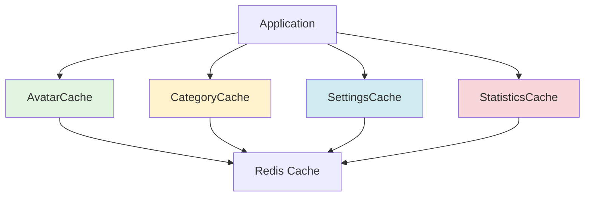

# 13 - Hệ Thống Cache

> Tối ưu hiệu năng với cache helpers và caching strategies

---

## 📋 Mục lục

- [Tổng quan](#tổng-quan)
- [AvatarCache](#avatarcache)
- [CategoryCache](#categorycache)
- [SettingsCache](#settingscache)
- [StatisticsCache](#statisticscache)
- [Cache Key Patterns](#cache-key-patterns)
- [Registry System](#registry-system)
- [Best Practices](#best-practices)

---

## Tổng quan

### Cache Helpers

Hệ thống sử dụng 4 cache helper classes chính:



| Helper | Purpose | TTL | Registry |
|--------|---------|-----|----------|
| **AvatarCache** | Company logos & user avatars | 1 hour | No |
| **CategoryCache** | Product categories | 1 hour | No |
| **SettingsCache** | Company config & settings | 1 hour* | Yes |
| **StatisticsCache** | Dashboard statistics | 20 min* | Yes |

_* TTL có thể config từ database_

---

## AvatarCache

**Class:** `App\Support\AvatarCache`  
**Purpose:** Cache company logos và user avatars để giảm file I/O

### Cấu trúc

```php
class AvatarCache {
    protected const TTL = 3600; // 1 hour
    
    // Company logo
    public static function getCompanyLogo(?int $companyId, ?string $path): ?string
    public static function forgetCompanyLogo(?int $companyId): void
    
    // User avatar
    public static function getUserAvatar(int $userId, ?string $path): string
    public static function forgetUserAvatar(?int $userId): void
}
```

### Cache Keys

```
company_logo:company_{id}
user_avatar:{id}
```

### Sử dụng Company Logo

```php
use App\Support\AvatarCache;

// Get cached logo URL
$logoUrl = AvatarCache::getCompanyLogo(
    $company->id,
    $company->logo_path
);
// => "https://example.com/company-avatars/logo.png"

// Clear cache khi update logo
$company->update(['logo_path' => $newPath]);
AvatarCache::forgetCompanyLogo($company->id);
```

### Sử dụng User Avatar

```php
// Get cached avatar URL
$avatarUrl = AvatarCache::getUserAvatar(
    $user->id,
    $user->avatar
);
// => "https://example.com/storage/avatars/user.jpg"
// Hoặc default: "https://example.com/images/avatar-default.svg"

// Clear cache khi user đổi avatar
$user->update(['avatar' => $newPath]);
AvatarCache::forgetUserAvatar($user->id);
```

### Implementation Details

**Legacy path support:**
```php
// Xử lý cả old và new paths
if (str_starts_with($path, 'company-avatars/')) {
    return asset($path);  // New: public directory
}
return asset('storage/' . $path);  // Old: storage disk
```

---

## CategoryCache

**Class:** `App\Support\CategoryCache`  
**Purpose:** Cache category data (master data ít thay đổi)

### Cấu trúc

```php
class CategoryCache {
    private const CACHE_TTL = 3600; // 1 hour
    private const CACHE_KEY_PREFIX = 'categories';
    
    // Getters
    public static function getAllForCompany(int $companyId): Collection
    public static function findById(int $companyId, int $categoryId): ?Category
    public static function getMappedByIdForCompany(int $companyId): Collection
    
    // Cache invalidation
    public static function clearCompanyCache(int $companyId): void
    public static function clearCategoryCache(int $companyId, int $categoryId): void
    
    // Cache warming
    public static function warmUpCache(int $companyId): void
}
```

### Cache Keys

```
categories:company:{id}:all
categories:company:{id}:id:{categoryId}
```

### Sử dụng Trong Dropdown

```php
use App\Support\CategoryCache;

// Trong Livewire component
public function getCategoriesProperty() {
    return CategoryCache::getAllForCompany(
        Auth::user()->company_id
    );
}

// Trong Blade
@foreach($this->categories as $category)
    <option value="{{ $category->id }}">{{ $category->name }}</option>
@endforeach
```

### Lookup Nhanh Theo ID

```php
// Get mapped collection (keyed by ID)
$categories = CategoryCache::getMappedByIdForCompany($companyId);

// Fast lookup
$category = $categories->get($productCategoryId);
// Thay vì: Category::find($productCategoryId) // N+1 query risk
```

### Find by ID

```php
// Tìm 1 category cụ thể (cached)
$category = CategoryCache::findById($companyId, $categoryId);

if ($category) {
    echo $category->name;
}
```

### Cache Invalidation

```php
// Khi tạo/update/xóa category
use App\Support\CategoryCache;

class CategoryService {
    public function updateCategory(int $categoryId, array $data) {
        $category = Category::findOrFail($categoryId);
        $category->update($data);
        
        // Clear cache
        CategoryCache::clearCategoryCache(
            $category->company_id,
            $category->id
        );
    }
    
    public function deleteCategory(int $categoryId) {
        $category = Category::findOrFail($categoryId);
        $companyId = $category->company_id;
        
        $category->delete();
        
        // Clear toàn bộ category cache của company
        CategoryCache::clearCompanyCache($companyId);
    }
}
```

### Warm-up Cache

```php
// Useful sau deployments hoặc cache flush
CategoryCache::warmUpCache($companyId);
```

### Pattern-based Clearing (Redis)

```php
// clearCompanyCache() sử dụng Redis pattern deletion
if (config('cache.default') === 'redis') {
    $pattern = "categories:company:{$companyId}:id:*";
    $keys = Cache::getStore()->getRedis()->keys($pattern);
    if (!empty($keys)) {
        Cache::getStore()->getRedis()->del($keys);
    }
}
```

---

## SettingsCache

**Class:** `App\Support\SettingsCache`  
**Purpose:** Cache company config và individual settings

### Cấu trúc

```php
class SettingsCache {
    public const DEFAULT_MINUTES = 60;
    public const DEFAULT_TTL = 3600; // 1 hour
    
    // Config object caching
    public static function rememberConfig(int $companyId, callable $callback, ?int $ttl = null): ?Config
    public static function getConfig(int $companyId): ?Config
    public static function putConfig(int $companyId, Config $config, ?int $ttl = null): void
    
    // Individual setting caching
    public static function getSetting(?int $companyId, string $key, $default = null)
    
    // Cache invalidation
    public static function forgetConfig(int $companyId): void
    public static function forgetSetting(?int $companyId, string $key): void
    public static function flush(int $companyId): void
}
```

### Cache Keys

```
settings:config:{companyId}                    // Config object
settings:value:{companyId}:{md5(key)}         // Individual setting
settings:registry:{companyId}                  // Registry tracker
```

### Tại Sao Dùng MD5 Hash?

```php
// Nested keys có thể dài và có ký tự đặc biệt
$key = 'notification_settings.email.invoice_approved.enabled';

// MD5 hash để tạo cache key ngắn gọn
$cacheKey = "settings:value:1:" . md5($key);
// => "settings:value:1:a3b2c1d4e5f6..."
```

### Sử dụng Config Object

```php
use App\Support\SettingsCache;

// Get config (cached)
$config = SettingsCache::getConfig($companyId);

if ($config) {
    $settings = $config->settings;
}

// Remember với callback
$config = SettingsCache::rememberConfig($companyId, function() use ($companyId) {
    return Config::where('company_id', $companyId)->first();
});
```

### Sử dụng Individual Setting

```php
// Get specific setting (2-tier cache)
$soundEnabled = SettingsCache::getSetting(
    $companyId,
    'notification_settings.sound_enabled',
    false // default
);

// Xử lý null companyId (user chưa có company)
$value = SettingsCache::getSetting(
    null,
    'some.setting',
    'default_value'
);
// => Returns default_value
```

### How getSetting() Works

```php
public static function getSetting(?int $companyId, string $key, $default = null) {
    if ($companyId === null) {
        return $default;
    }
    
    // 1. Check setting-specific cache
    $settingKey = "settings:value:{$companyId}:" . md5($key);
    $cached = Cache::get($settingKey);
    if ($cached !== null) {
        return $cached;  // Cache hit!
    }
    
    // 2. Get from config cache
    $config = self::getConfig($companyId);
    if (!$config) {
        return $default;
    }
    
    // 3. Extract value
    $value = $config->getSetting($key, $default);
    
    // 4. Cache the value
    Cache::put($settingKey, $value, self::resolveTtl($companyId));
    
    return $value;
}
```

### Config Serialization

```php
// Lưu as array để tránh serialization issues
public static function putConfig(int $companyId, Config $config, ?int $ttl = null) {
    $key = "settings:config:{$companyId}";
    Cache::put($key, $config->toArray(), $ttl ?? self::resolveTtl($companyId));
}

// Reconstruct model khi get
public static function getConfig(int $companyId): ?Config {
    $cached = Cache::get("settings:config:{$companyId}");
    
    if (is_array($cached)) {
        $config = new Config();
        $config->fill($cached);
        $config->exists = true;
        return $config;
    }
    
    return null;
}
```

### TTL Configuration

```php
// TTL có thể config từ database per company
protected static function resolveTtl(int $companyId): int {
    $minutes = self::DEFAULT_MINUTES; // 60
    
    $config = Config::where('company_id', $companyId)->first();
    if ($config) {
        $minutes = (int) $config->getSetting(
            'system_settings.settings_cache_minutes',
            self::DEFAULT_MINUTES
        );
    }
    
    return max(1, $minutes) * 60; // Convert to seconds
}
```

### Cache Invalidation

```php
use App\Support\SettingsCache;

// Khi update config
class ConfigService {
    public function updateSetting(int $companyId, string $key, $value) {
        $config = Config::where('company_id', $companyId)->first();
        $settings = $config->settings ?? [];
        
        data_set($settings, $key, $value);
        $config->update(['settings' => $settings]);
        
        // Clear caches
        SettingsCache::forgetSetting($companyId, $key);
        SettingsCache::forgetConfig($companyId);
    }
    
    // Hoặc flush toàn bộ
    public function resetAllSettings(int $companyId) {
        SettingsCache::flush($companyId);
    }
}
```

### Registry System

```php
// SettingsCache tracks tất cả cached keys trong registry
protected static function registerKey(int $companyId, string $key, ?int $ttl) {
    $registryKey = "settings:registry:{$companyId}";
    $keys = Cache::get($registryKey, []);
    
    if (!in_array($key, $keys)) {
        $keys[] = $key;
        Cache::put($registryKey, $keys, 86400); // 24h
    }
}

// Khi flush(), delete all tracked keys
public static function flush(int $companyId) {
    $registryKey = "settings:registry:{$companyId}";
    $keys = Cache::pull($registryKey, []);
    
    foreach ($keys as $key) {
        Cache::forget($key);
    }
}
```

---

## StatisticsCache

**Class:** `App\Support\StatisticsCache`  
**Purpose:** Cache dashboard statistics với TTL configurable

### Cấu trúc

```php
class StatisticsCache {
    public const DEFAULT_MINUTES = 20;
    public const DEFAULT_TTL = 1200; // 20 minutes
    
    public static function remember(int $companyId, string $suffix, callable $callback, ?int $ttl = null)
    public static function put(int $companyId, string $suffix, mixed $value, ?int $ttl = null): void
    public static function get(int $companyId, string $suffix, mixed $default = null): mixed
    public static function forget(int $companyId, string $suffix): void
    public static function flush(int $companyId): void
}
```

### Cache Keys

```
statistics:{companyId}:{suffix}
statistics:registry:{companyId}
```

### Sử dụng Trong Dashboard

```php
use App\Support\StatisticsCache;

// Livewire Dashboard component
public function getDashboardStats() {
    $companyId = Auth::user()->company_id;
    
    return StatisticsCache::remember(
        $companyId,
        'dashboard_overview',
        function() use ($companyId) {
            // Heavy calculations
            $revenue = SaleInvoice::where('company_id', $companyId)
                ->where('status', 'approved')
                ->sum('grand_total');
            
            $cost = PurchaseInvoice::where('company_id', $companyId)
                ->where('status', 'approved')
                ->sum('grand_total');
            
            $profit = SaleInvoice::where('company_id', $companyId)
                ->where('status', 'approved')
                ->sum('profit');
            
            return [
                'revenue' => $revenue,
                'cost' => $cost,
                'profit' => $profit,
                'profit_margin' => $revenue > 0 ? ($profit / $revenue) * 100 : 0,
            ];
        },
        // TTL: null = use configured TTL from database
    );
}
```

### Put & Get

```php
// Put value vào cache
StatisticsCache::put($companyId, 'monthly_revenue_2024_12', 1500000);

// Get value từ cache
$revenue = StatisticsCache::get($companyId, 'monthly_revenue_2024_12', 0);
```

### TTL Configuration

```php
// TTL đọc từ database setting
protected static function resolveTtl(int $companyId): int {
    $minutes = self::DEFAULT_MINUTES; // 20
    
    $config = Config::where('company_id', $companyId)->first();
    if ($config) {
        $minutes = (int) $config->getSetting(
            'system_settings.cache_refresh_minutes',
            self::DEFAULT_MINUTES
        );
    }
    
    return max(1, $minutes) * 60;
}
```

### Manual Refresh

```php
// Button để user refresh stats manually
public function refreshStats() {
    $companyId = Auth::user()->company_id;
    
    // Forget specific stat
    StatisticsCache::forget($companyId, 'dashboard_overview');
    
    // Hoặc flush all
    // StatisticsCache::flush($companyId);
    
    $this->dispatch('toast', [
        'message' => 'Đã làm mới thống kê'
    ]);
}
```

### Cache Invalidation on Data Change

```php
// Khi duyệt hóa đơn
use App\Support\StatisticsCache;

public function approveInvoice() {
    DB::transaction(function() {
        $this->invoice->update(['status' => 'approved']);
        
        $companyId = $this->invoice->company_id;
        
        // Clear related stats
        StatisticsCache::forget($companyId, 'dashboard_overview');
        StatisticsCache::forget($companyId, 'monthly_stats_' . now()->year);
        StatisticsCache::forget($companyId, 'yearly_profit');
        
        // Hoặc flush toàn bộ nếu nhiều stats bị affect
        // StatisticsCache::flush($companyId);
    });
}
```

### Registry System

```php
// Tương tự SettingsCache, StatisticsCache cũng track keys
protected static function registerKey(int $companyId, string $key, ?int $ttl) {
    $registryKey = "statistics:registry:{$companyId}";
    $keys = Cache::get($registryKey, []);
    
    if (!in_array($key, $keys)) {
        $keys[] = $key;
        Cache::put($registryKey, $keys, 86400);
    }
}
```

---

## Cache Key Patterns

### Summary Bảng

| Helper | Pattern | Example |
|--------|---------|---------|
| **AvatarCache** | `company_logo:company_{id}` | `company_logo:company_1` |
| | `user_avatar:{id}` | `user_avatar:42` |
| **CategoryCache** | `categories:company:{id}:all` | `categories:company:1:all` |
| | `categories:company:{id}:id:{catId}` | `categories:company:1:id:5` |
| **SettingsCache** | `settings:config:{id}` | `settings:config:1` |
| | `settings:value:{id}:{md5}` | `settings:value:1:a3b2c1...` |
| | `settings:registry:{id}` | `settings:registry:1` |
| **StatisticsCache** | `statistics:{id}:{suffix}` | `statistics:1:dashboard_overview` |
| | `statistics:registry:{id}` | `statistics:registry:1` |

### Naming Convention

✅ **Good Patterns:**
```
{type}:company:{id}:{specific}
{type}:{id}:{suffix}
{type}:value:{id}:{hash}
```

❌ **Avoid:**
```
cache_1_stats          // Không rõ ràng
company1_categories    // Thiếu namespace
stats:all              // Không có company_id
```

---

## Registry System

### Tại Sao Cần Registry?

**Problem:** Khi clear cache cho một company, làm sao biết tất cả cache keys liên quan?

**Solution:** Registry system tracks tất cả cache keys được tạo

### Cách Hoạt Động

```php
// 1. Khi tạo cache, register key
public static function remember(int $companyId, string $suffix, callable $callback) {
    $key = "statistics:{$companyId}:{$suffix}";
    
    // Register vào registry
    self::registerKey($companyId, $key);
    
    return Cache::remember($key, $ttl, $callback);
}

// 2. Registry lưu array of keys
protected static function registerKey(int $companyId, string $key) {
    $registryKey = "statistics:registry:{$companyId}";
    $keys = Cache::get($registryKey, []);
    
    if (!in_array($key, $keys)) {
        $keys[] = $key;
        Cache::put($registryKey, $keys, 86400); // 24h TTL for registry
    }
}

// 3. Khi flush, delete all tracked keys
public static function flush(int $companyId) {
    $registryKey = "statistics:registry:{$companyId}";
    $keys = Cache::pull($registryKey, []); // Get and delete
    
    foreach ($keys as $key) {
        Cache::forget($key);
    }
}
```

### Use Cases

**SettingsCache:**
- Track all config và setting caches
- Flush khi company settings change dramatically

**StatisticsCache:**
- Track all statistics keys
- Flush when doing data migrations or bulk updates

---

## Best Practices

### 1. Chọn Helper Phù Hợp

```php
// ✅ AvatarCache - Static assets ít thay đổi
$logo = AvatarCache::getCompanyLogo($companyId, $logoPath);

// ✅ CategoryCache - Master data
$categories = CategoryCache::getAllForCompany($companyId);

// ✅ SettingsCache - Config data
$setting = SettingsCache::getSetting($companyId, 'key', $default);

// ✅ StatisticsCache - Computed data có thể outdated
$stats = StatisticsCache::remember($companyId, 'dashboard', $callback);

// ❌ Không nên cache data realtime
// StatisticsCache::remember(..., 'current_online_users', ...); // BAD
```

### 2. TTL Hierarchy

```
Short-lived (5-20 phút):
- StatisticsCache (dashboard stats)
- Real-time counters
  
Medium (1 giờ):
- AvatarCache (logos, avatars)
- CategoryCache (master data)
- SettingsCache (config)
  
Long-lived (24 giờ):
- Rarely-changed reference data
```

### 3. Cache Invalidation Strategy

```php
// ❌ BAD: Quên clear cache
public function updateCategory($id, $data) {
    Category::find($id)->update($data);
    // Missing: CategoryCache::clearCategoryCache(...)
}

// ✅ GOOD: Always clear related caches
public function updateCategory($id, $data) {
    $category = Category::findOrFail($id);
    $category->update($data);
    
    CategoryCache::clearCategoryCache(
        $category->company_id,
        $category->id
    );
}

// ✅ BETTER: Use model events
class Category extends Model {
    protected static function booted() {
        static::saved(function($category) {
            CategoryCache::clearCategoryCache(
                $category->company_id,
                $category->id
            );
        });
    }
}
```

### 4. Warm-up Strategy

```php
// Warm-up sau deployment
Artisan::command('cache:warmup', function() {
    $companies = Company::all();
    
    foreach ($companies as $company) {
        // Warm-up categories
        CategoryCache::warmUpCache($company->id);
        
        // Warm-up settings
        SettingsCache::getConfig($company->id);
        
        $this->info("Warmed up cache for company {$company->id}");
    }
});
```

### 5. Avoid Over-caching

```php
// ❌ BAD: Cache data thay đổi liên tục
Cache::remember('current_time', 3600, fn() => now());
Cache::remember('random_number', 3600, fn() => rand());

// ❌ BAD: Cache quá to
Cache::remember('all_invoices', 3600, fn() => Invoice::with('items')->get());

// ✅ GOOD: Cache data ổn định
CategoryCache::getAllForCompany($companyId);
SettingsCache::getConfig($companyId);
```

---

## Laravel Cache Basics

### Artisan Commands

```bash
# Clear all caches
php artisan cache:clear
php artisan config:clear
php artisan route:clear
php artisan view:clear

# Optimize for production
php artisan optimize
php artisan config:cache
php artisan route:cache
php artisan view:cache

# Clear all at once
php artisan optimize:clear
```

### Redis Configuration

```dotenv
# .env
CACHE_DRIVER=redis
REDIS_CLIENT=phpredis
REDIS_HOST=127.0.0.1
REDIS_PASSWORD=null
REDIS_PORT=6379
```

### Test Connection

```bash
php artisan tinker
>>> Cache::put('test', 'value', 60);
=> true
>>> Cache::get('test');
=> "value"
>>> Cache::forget('test');
=> true
```

---

## Troubleshooting

### Cache không hoạt động

```bash
# Check cache driver
php artisan tinker
>>> config('cache.default');
=> "redis"

# Test Redis connection
>>> Cache::getStore()->getRedis()->ping();
=> "+PONG"
```

### Registry keys bị leak

```php
// Nếu registry TTL ngắn hơn cache TTL, keys sẽ bị orphaned
// Solution: Registry TTL = 24h (lớn hơn all cache TTLs)
Cache::put($registryKey, $keys, 86400); // 24h
```

### Clear cache không work

```php
// Pattern deletion chỉ work với Redis
if (config('cache.default') !== 'redis') {
    // Fallback: manual foreach
    $allCategories = Category::where('company_id', $companyId)->get();
    foreach ($allCategories as $cat) {
        CategoryCache::clearCategoryCache($companyId, $cat->id);
    }
}
```

---

## Tiếp theo

✅ Cache system đã hiểu!

**Các chủ đề liên quan:**
- [Statistics Dashboard](16-statistics-dashboard.md)
- [Performance Optimization](17-performance.md)

---

<p align="center">
  <strong>Caching Thành Thạo! ⚡</strong>
</p>
