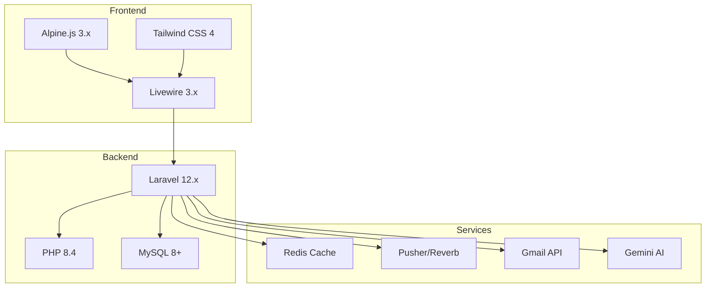

# QLHoaDonWebVer2 - Technical Documentation

> 📚 Tài liệu kỹ thuật toàn diện cho hệ thống quản lý hóa đơn điện tử

**Ngày viết:** December 24, 2025  

---
## 📖 Cấu trúc tài liệu

### 🏁 Phase 1: Foundation (Thành lập)

| # | File | Description |
|---|------|-------------|
| 1 | [**Setup & Installation**](01-setup-and-installation.md) | Hướng dẫn cài đặt từ A-Z |
| 2 | [**Architecture Overview**](02-architecture-overview.md) | Kiến trúc tổng quan, MVC + Livewire |
| 3 | [**Development Workflow**](03-development-workflow.md) | Quy trình phát triển, tạo module mới |

### 🔐 Phase 2: Core Systems

| # | File | Description |
|---|------|-------------|
| 4 | [**Auth & Middleware**](04-auth-and-middleware.md) | Web/API authentication, permissions |
| 5 | [**Core Modules**](05-core-modules.md) | Dashboard, Profile, Settings, Roles |
| 6 | [**Business Modules**](06-business-modules.md) | Customers, Suppliers, Products, Contracts |
| 7 | [**Invoice System**](07-invoice-system.md) | Hóa đơn mua/bán, workflow, approval |

### 📦 Phase 3: Specialized Systems


| # | File | Description |
|---|------|-------------|
| 8 | [**Inventory System**](08-inventory-system.md) | Tồn kho, movements, warehouse |
| 9 | [**Payment Vouchers**](09-payment-vouchers.md) | Phiếu thu/chi, currency conversion |
| 10 | [**Email Scanning**](10-email-scanning-system.md) | Gmail integration, auto-parse invoices |
| 11 | [**AI Chatbot**](11-ai-chatbot.md) | Gemini AI, function calling |
| 12 | [**Notifications**](12-notification-system.md) | Real-time với Pusher/Reverb |

### 🚀 Phase 4: Advanced Topics

| # | File | Description |
|---|------|-------------|
| 13 | [**Cache System**](13-cache-system.md) | SettingsCache, optimization |
| 14 | [**Partner Portal**](14-partner-portal.md) | Cổng đối tác, limited access |
| 15 | [**Export System**](15-export-system.md) | Excel, PDF generation |
| 16 | [**Statistics**](16-statistics-dashboard.md) | Dashboard, charts, analytics |
| 17 | [**Components**](17-components-and-utilities.md) | Reusable components, utilities |
| 18 | [**DataTables**](18-livewire-datatables.md) | Laravel Livewire Tables guide |

### 🧩 Phase 5: Extended Features

| # | File | Description |
|---|------|-------------|
| 19 | [**Warranty System**](19-warranty-system.md) | Hệ thống bảo hành & hạn sử dụng |
| 20 | [**Currency System**](20-currency-system.md) | Tỷ giá & chuyển đổi tiền tệ |
| 21 | [**Product Conversion**](21-product-conversion-system.md) | Chuyển đổi và lắp ráp sản phẩm |
| 22 | [**Banking & VietQR**](22-banking-and-vietqr.md) | Tích hợp ngân hàng & VietQR API |

---

## 🚀 Quick Start

### Thiết lập ban đầu

1. **Setup môi trường** → [01-setup-and-installation.md](01-setup-and-installation.md)
2. **Hiểu kiến trúc** → [02-architecture-overview.md](02-architecture-overview.md)
3. **Quy trình dev** → [03-development-workflow.md](03-development-workflow.md)

### Cần tìm hiểu tính năng cụ thể?

- **Hóa đơn** → [07-invoice-system.md](07-invoice-system.md)
- **Tồn kho** → [08-inventory-system.md](08-inventory-system.md)
- **AI Chatbot** → [11-ai-chatbot.md](11-ai-chatbot.md)
- **API** → [04-auth-and-middleware.md](04-auth-and-middleware.md)
- **Bảo hành** → [19-warranty-system.md](19-warranty-system.md)
- **Tỷ giá** → [20-currency-system.md](20-currency-system.md)

---

## 🛠 Các công nghệ sử dụng



**Core Technologies:**
- **Backend:** Laravel 12, PHP 8.4, MySQL 8+
- **Frontend:** Livewire 3, Alpine.js, Tailwind CSS
- **Real-time:** Pusher, Laravel Reverb
- **API:** Laravel Sanctum, JWT Auth
- **AI:** Google Gemini
- **Cache:** Redis
- **Queue:** Laravel Queue
- **Email:** Gmail API

---

## 📋 Architecture Patterns

### Service Layer Pattern

```
Request (Web/API)
    ↓
Controller / Livewire Component
    ↓
Service Layer (Business Logic)
    ↓
Model (Eloquent ORM)
    ↓
Database
```

**Examples:**
- `CustomerForm.php` → `CustomerService.php` → `Customer` model
- `InvoicesController.php` → `InvoiceService.php` → `Invoice` model

### Multi-Tenancy

**Automatic isolation mọi query:**
```php
// Tất cả models đều có company_id scope
$customers = Customer::all(); // Tự động WHERE company_id = current_company
```

**Middleware chain:**
```
auth → company.context → ensure.not_customer → permission:*
```

---

## 🔑 Một số khái niệm chính

### 1. Company Scoping (Phạm vi công ty tự động)
Mọi dữ liệu đều isolated theo `company_id`. Tự động áp dụng qua Global Scopes.

### 2. Hệ thống phân quyền
50+ granular permissions. RBAC (Role-Based Access Control) với custom permissions cho từng role.

### 3. Service Layers (Các tầng dịch vụ)
Business logic tập trung trong Services. Controllers/Livewire components chỉ xử lý HTTP/UI logic.

### 4. Livewire Components
Các component full-stack với quản lý state. Không cần API riêng cho giao diện người dùng.

### 5. Real-time Updates (Cập nhật thời gian thực)
Pusher/Reverb cho notifications, inventory updates, dashboard stats.

---

## 📚 Các tài liệu tham khảo liên quan

### Official Documentation
- [Laravel 12 Docs](https://laravel.com/docs/12.x)
- [Livewire 3 Docs](https://livewire.laravel.com/docs/quickstart)
- [Tailwind CSS](https://tailwindcss.com/docs)
- [Alpine.js](https://alpinejs.dev/)

### Tools & Libraries
- [Laravel Livewire Tables](https://rappasoft.com/docs/laravel-livewire-tables)
- [Google Gemini API](https://ai.google.dev/docs)
- [Gmail API](https://developers.google.com/gmail/api)
- [Pusher Docs](https://pusher.com/docs)

### Community
- [Laravel News](https://laravel-news.com/)
- [Livewire Discord](https://discord.gg/livewire)
- [Laracasts](https://laracasts.com/)

---

## ⚠️ Important Notes

> [!WARNING]
> - `.env` credentials KHÔNG được commit
> - Production keys phải dùng `.env.production`
> - Test trên staging trước khi deploy production

> [!IMPORTANT]
> - Luôn chạy migrations trước khi pull code mới
> - Clear cache sau khi update code: `php artisan cache:clear`
> - Queue workers cần restart sau deploy: `supervisorctl restart laravel-worker:*`

> [!TIP]
> - Dùng Laravel Debugbar (dev only) để debug queries
> - Livewire DevTools trong browser để inspect components
> - `php artisan optimize:clear` khi gặp lỗi lạ

---

### Debug Checklist
```bash
# Khi gặp lỗi, chạy theo thứ tự:
php artisan optimize:clear
php artisan config:clear
php artisan route:clear
php artisan view:clear
composer dump-autoload
npm run build

# Nếu vẫn lỗi:
php artisan migrate:fresh --seed  # ⚠️ CHỈ trên local
```

---

## Cấu trúc thư mục tài liệu

```
QLHoaDonWebVer2
├─ Dockerfile
├─ README.md
├─ app
│  ├─ Console
│  │  └─ Commands
│  ├─ Events
│  │  ├─ CompanyNotificationCreated.php
│  │  └─ CustomerNotificationCreated.php
│  ├─ Exports
│  │  ├─ *Export.php
│  ├─ Http
│  │  ├─ Controllers
│  │  │  ├─ AIChatController.php
│  │  │  ├─ Api
│  │  │  │  ├─ ...Controller.php
│  │  │  ├─ BroadcastingAuthController.php
│  │  │  ├─ DebugController.php
│  │  │  ├─ ExportController.php
│  │  │  ├─ FileController.php
│  │  │  ├─ FileServingController.php
│  │  │  ├─ GmailOAuthController.php
│  │  │  ├─ GmailWebhookController.php
│  │  │  ├─ InvoiceFileController.php
│  │  │  ├─ LogViewerController.php
│  │  │  ├─ PaymentVoucherController.php
│  │  │  ├─ PingController.php
│  │  │  ├─ StatisticsExportController.php
│  │  │  └─ SupportFileController.php
│  │  ├─ Middleware
│  │  │  ├─ Authenticate.php
│  │  │  ├─ CheckPermission.php
│  │  │  ├─ EnsureCompanyContext.php
│  │  │  ├─ EnsureCustomerAccount.php
│  │  │  ├─ EnsureNotCustomer.php
│  │  │  ├─ EnsureUserHasCompany.php
│  │  │  ├─ ForceJsonResponse.php
│  │  │  ├─ Guest.php
│  │  │  └─ TrackUserSession.php
│  │  ├─ Requests
│  │  └─ Services
│  │     ├─ Api
│  │     │  └─ AuthService.php
│  │     └─ AuthService.php
│  ├─ Jobs
│  │  ├─ ProcessNewGmailMessage.php
│  │  ├─ RescanAllEmailsJob.php
│  │  ├─ StartGmailWatch.php
│  │  └─ StopGmailWatch.php
│  ├─ Livewire
│  │  ├─ Auth
│  │  ├─ Components
│  │  ├─ Main
│  ├─ Mail
│  │  └─ VerificationCodeMail.php
│  ├─ Models
│  │  ├─ Traits
│  │  │  ├─ HasAuditLog.php
│  │  │  └─ HasCompanyScope.php
│  │  ├─ ....php
│  ├─ Notifications
│  │  └─ ResetPasswordNotification.php
│  ├─ Observers
│  │  ├─ CategoryObserver.php
│  │  └─ ConfigObserver.php
│  ├─ Providers
│  │  ├─ AppServiceProvider.php
│  │  └─ VoltServiceProvider.php
│  ├─ Rules
│  │  ├─ ValidClientSecret.php
│  │  ├─ ValidEmail.php
│  │  └─ ValidPhoneNumber.php
│  ├─ Services
│  │  ├─ AI
│  │  │  ├─ AIChatOrchestrator.php
│  │  │  ├─ AIFunctionExecutor.php
│  │  │  ├─ AIFunctionRegistry.php
│  │  │  ├─ Functions
│  │  │  │  ├─ *.php
│  │  │  ├─ Gemini
│  │  │  │  ├─ GeminiClient.php
│  │  │  │  └─ PaymentVoucherExtractor.php
│  │  │  ├─ PaymentVoucherAIService.php
│  │  │  └─ data
│  │  │     ├─ README.md
│  │  │     └─ system-guide.md
│  │  ├─ App
│  │  │  ├─ *.php
│  │  ├─ DTO
│  │  │  └─ FileDTO.php
│  │  ├─ FileQueryService.php
│  │  ├─ FileStatisticsService.php
│  │  ├─ Payments
│  │  │  └─ PaymentVoucherService.php
│  │  └─ Utils
│  │     ├─ AuditLogger.php
│  │     ├─ CategoryTaggingService.php
│  │     ├─ CurrencyHelper.php
│  │     ├─ FinancialSummaryService.php
│  │     ├─ FormatService.php
│  │     ├─ GmailService.php
│  │     ├─ InventoryAllocator.php
│  │     ├─ InventoryStockService.php
│  │     ├─ InventoryTransactionLogger.php
│  │     ├─ InvoiceApprovalService.php
│  │     ├─ InvoiceImportService.php
│  │     ├─ InvoiceXmlParser.php
│  │     ├─ ProductConversionService.php
│  │     ├─ RoleHierarchyService.php
│  │     ├─ SaleItemAllocationService.php
│  │     ├─ SidebarService.php
│  │     ├─ VerificationCodeService.php
│  │     └─ VietQRService.php
│  └─ Support
│     ├─ AvatarCache.php
│     ├─ CategoryCache.php
│     ├─ SessionHelper.php
│     ├─ SettingsCache.php
│     ├─ StatisticsCache.php
│     └─ VietnameseTextNormalizer.php
├─ artisan
├─ bootstrap
│  ├─ app.php
│  ├─ cache
│  │  ├─ packages.php
│  │  └─ services.php
│  └─ providers.php
├─ composer.json
├─ composer.lock
├─ config
│  ├─ app.php
│  ├─ auth.php
│  ├─ cache.php
│  ├─ database.php
│  ├─ filesystems.php
│  ├─ jwt.php
│  ├─ l5-swagger.php
│  ├─ livewire-tables.php
│  ├─ livewire.php
│  ├─ logging.php
│  ├─ mail.php
│  ├─ permissions.php
│  ├─ queue.php
│  ├─ services.php
│  ├─ session.php
│  └─ setting.php
├─ database
│  ├─ factories
│  ├─ migrations
│  │  *.php
│  └─ seeders
│     ├─ CategorySeeder.php
│     ├─ CompanyAndUserFromDumpSeeder.php
│     ├─ DatabaseSeeder.php
│     └─ data.json
├─ down
├─ lang
├─ package-lock.json
├─ package.json
├─ phpstan.neon
├─ phpunit.xml
├─ pint.json
├─ public
│  ├─ .htaccess
│  ├─ .user.ini
│  ├─ apple-touch-icon.png
│  ├─ audio
│  ├─ build
│  │  └─ manifest.json
│  ├─ css
│  ├─ favicon.ico
│  ├─ favicon.svg
│  ├─ images
│  ├─ index.php
│  ├─ info.php
│  ├─ js
│  │  ├─ file-upload-handler.js
│  │  ├─ highlight.min.js
│  │  ├─ lib
│  │  ├─ marked.min.js
│  │  ├─ theme.js
│  │  └─ validation-handler.js
│  ├─ robots.txt
│  ├─ storage
├─ vite.config.js
└─ workflows
   ├─ lint.yml
   └─ tests.yml

```
---
